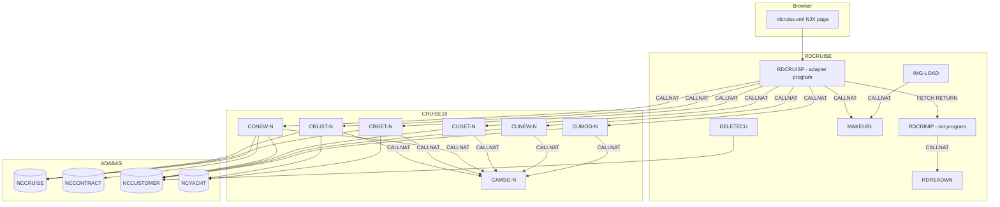

# Call-Routine Map

Derived from the `CALLNAT`, `FETCH` and `INCLUDE` statements in the Natural
sources (grep the sources for `CALLNAT` to re-verify).

## Overview

## Caller → callee table

| Caller | Statement | Callee | Parameters |
|--------|-----------|--------|------------|
| `RDCRUISP` | `FETCH RETURN` | `RDCRINIP` | — |
| `RDCRINIP` | `CALLNAT` | `RDREADWN` | welcome-text buffers |
| `RDCRUISP` | `CALLNAT` | `CUGET-N` | `P-COM P-RESPONSE P-SELECTION P-CUSTOMER-DATA` |
| `RDCRUISP` | `CALLNAT` | `CONEW-N` | `P-COM P-RESPONSE P-CONTRACT-DATA P-NEW-CONTRACTID` |
| `RDCRUISP` | `CALLNAT` | `CUMOD-N` | `P-COM P-RESPONSE P-SELECTION P-CUSTOMER-DATA` |
| `RDCRUISP` | `CALLNAT` | `CUNEW-N` | `P-COM P-RESPONSE P-SELECTION P-CUSTOMER-DATA` |
| `RDCRUISP` | `CALLNAT` | `CRGET-N` | `P-COM P-RESPONSE P-SELETION P-NUMBER-OF-RECORDS P-CRUISE-DATA(1) V-SELCRUISEID` |
| `RDCRUISP` | `CALLNAT` | `CRLIST-N` | `P-COM P-RESPONSE P-SELETION P-NUMBER-OF-RECORDS P-CRUISE-DATA(*)` |
| `RDCRUISP` | `CALLNAT` | `MAKEURL` | `XCIOBJECTS(*) P-CRUISE-DATA.PICTURE(1) #MYURL` |
| `IMG-LOAD` | `CALLNAT` | `MAKEURL` | `XCIOBJECTS(*) IMG-DATA IMG-URL-PROP` |
| every CRUISE16 service | `CALLNAT` | `CAMSG-N` | `MSG-GROUP-PARA` |
| every CRUISE16 service | `INCLUDE` | `ERRLOG-I` | `ON ERROR` logging copycode |

Notes:

* `IMG-LOAD` calls in `RDCRUISP` are present but commented out in the current
  source (image loading is optional demo setup).
* `CAMSG-N` is the single message-translation choke point: every service
  subprogram routes its `MSG-NR` through it before returning
  `P-RSPCODE`/`P-RSPTXT` to the adapter.
