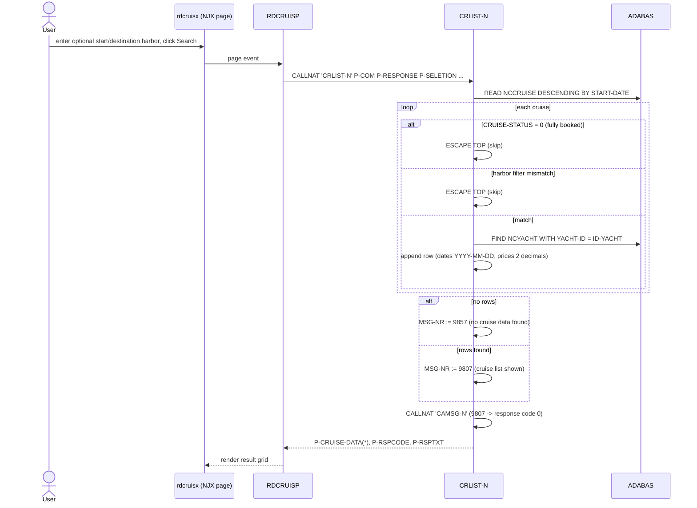
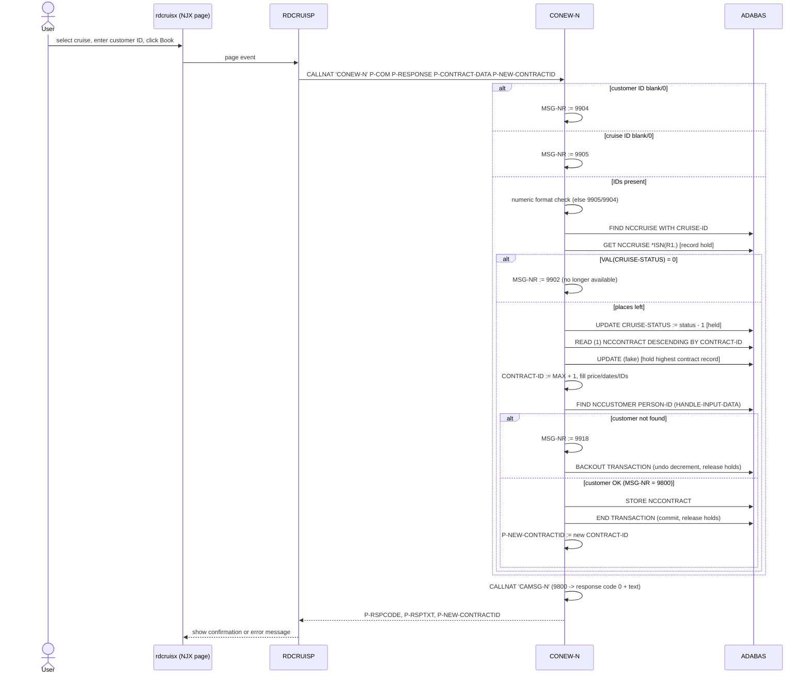

# End-to-End Transaction Flows

The two core user journeys are *finding a cruise* and *booking a cruise*.
Both start on the NJX page (`rdcruisx.xml`), are handled by the adapter
program `RDCRUISP` (library `RDCRUISE`), and execute business logic in
library `CRUISE16` against ADABAS.

## 1. Cruise listing (CRLIST-N)



## 2. Booking a cruise (CONEW-N, refactored)



### Message-code outcomes

| Code | Meaning | Response code after CAMSG-N |
|------|---------|------------------------------|
| 9800 | Booking successful | 0 |
| 9807 | Cruise list shown | 0 |
| 9857 | No cruise data found | 9857 |
| 9902 | Cruise no longer available | 9902 |
| 9904 | Customer number input missing | 9904 |
| 9905 | Cruise number input missing | 9905 |
| 9918 | Customer number not found | 9918 |
| 9999 | Student-mode placeholder (`#STUDENT`) | 9999 |

## 3. Customer maintenance (CUGET-N / CUNEW-N / CUMOD-N)

```
User action            RDCRUISP CALLNAT      ADABAS access
-----------            -----------------     -------------------------------
Log in / show data ->  CUGET-N               FIND NCCUSTOMER PERSON-ID
Register           ->  CUNEW-N               READ(1) DESC PERSON-ID + UPDATE
                                             (hold) -> MAX+1 -> STORE -> ET
Change my data     ->  CUMOD-N               FIND + UPDATE (held) -> ET
```

`CUNEW-N`'s ID generation is the model for the contract-ID fix in `CONEW-N`
— see [concurrency-refactor.md](concurrency-refactor.md).
