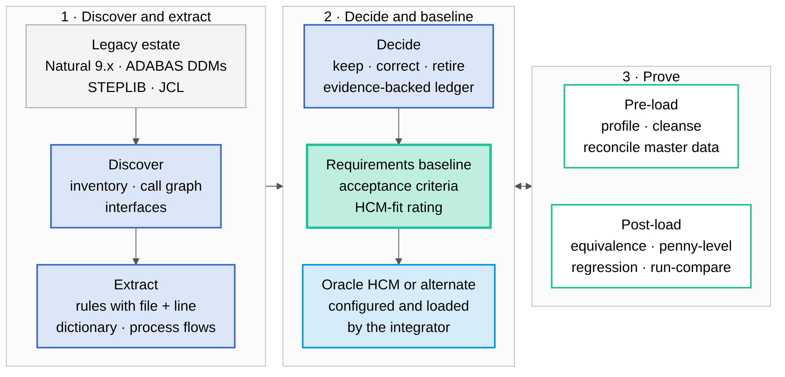

# From Natural and ADABAS to Oracle HCM: a requirements-first modernization baseline

*How Cognition extracts, validates, and hands over the business logic of a Software AG Natural / ADABAS payroll estate so a systems integrator can implement it in Oracle HCM — without converting a line of code*

**Prepared for:** SMX and the Department of the Interior, Interior Business Center (IBC) — Federal Personnel and Payroll System (FPPS) modernization

---

## The challenge and our approach

**FPPS is a Software AG Natural estate, and the path to a modern HCM runs through its requirements, not through its syntax.** FPPS is roughly 7 million lines of Natural 9.x across more than 100,000 modules on ADABAS 8.6 and z/OS 2.5, driven by about 7,800 JCL jobs. It is not COBOL, and it will not be "converted." The destination is Oracle HCM or an alternate HCM platform — a configured product, not a rewritten program. What the implementing integrator needs is the thing that has historically been the most expensive and least reliable part of any such program: a complete, verified statement of what the legacy system actually does, what it must keep doing, and what should be left behind.

Direct code conversion — pointing a general-purpose AI tool at legacy source and asking for a new language — has already been tried against this class of system and does not produce that statement. It reproduces accidents alongside intent, carries dead paths forward, and hands the integrator a second system to reverse-engineer. A traditional interview-driven requirements engagement for an estate of this size has been quoted at roughly $30 million and would take years.

**Our approach is requirements-first extraction, proven on a real Natural/ADABAS application before it is proposed for FPPS.** Devin reads the Natural sources, ADABAS data definitions, STEPLIB configuration, and deployment descriptors; extracts every rule, data element, process, and interface with a citation to the exact source line; separates the logic that must be carried from the logic that must not; and packages the result as a requirements baseline with acceptance criteria and executable reconciliation harnesses. Everything in this package was produced from the Sunny Islands Cruise sample — a public Software AG Natural for AJAX / ADABAS application that structurally mirrors FPPS — on synthetic data. No production system, production data, or FPPS source was touched or is required to reproduce it.

**Devin is a force multiplier for the payroll and integration experts, not a replacement for them.** The AI does the exhaustive, repeatable work — reading every module, citing every line, regenerating every artifact when the source changes — and surfaces only the exceptions that need human judgement. The integrator's analysts and the agency's subject-matter experts keep ownership of every design decision and every sign-off.

**FIGURE 1. The requirements-first path. Legacy sources are read, never rewritten; the requirements baseline drives both HCM configuration and the pre- and post-load tests that prove it, and every test exception feeds back into the baseline — all on synthetic data.**

Every statement below carries a maturity label. **Demonstrated** means it runs in the repository today and its output is checked in and reproducible. **Designed** means the method is specified against the sample but has not yet been executed at FPPS scale. **Roadmap** means it depends on inputs the repository does not contain — real FPPS JCL, Natural Predict/XRef exports, runtime traces, or subject-matter-expert sign-off.

---

## What was built: three core work streams

### Discover and extract (Demonstrated)

**You cannot scope, price, or configure what you cannot see.** The package opens with a discoverability baseline — module inventory, call graph, and interface map across the business-logic and presentation libraries — generated from the sources rather than drawn by hand. On that map sits the business-rule catalogue: sixty rule entries, each stated in the plain language a payroll analyst uses for an eligibility or validation edit, each citing file and line in the real Natural source, each carrying a confidence score, an HCM analog, and a disposition. The four ADABAS data definitions become a field-level data dictionary — the definition of master data that HCM Data Loader mapping starts from — and the transaction flows become BPMN-oriented process definitions an Oracle HCM configuration team can map directly.

### Baseline and decide (Demonstrated for the sample; Designed at FPPS scale)

**The requirements baseline is the strategic prize.** It restates the extracted behaviour as twenty-nine numbered requirements — functional, data, integrity, interface, and non-functional — with fifty-nine Given/When/Then acceptance criteria, an HCM-fit rating for each (standard, configured, extension, integration, or out of scope), and generated cross-checks that fail the build if a rule loses its requirement or a requirement loses its rule. Alongside it sits the artifact most modernization programs never produce: a migration-disposition ledger of what **not** to build. A static analyzer over the Natural sources finds the unreferenced objects, unreachable paths, never-emitted message codes, never-populated interface fields, and commented-out logic; the ledger binds every finding to evidence, a confidence score, a proposed disposition, and an SME sign-off column, so nothing is retired by guesswork and nothing dead is re-implemented at Oracle HCM prices.

### Prove (Demonstrated on synthetic data)

**Testing is the deliverable.** Before load, a master-data cleansing harness profiles the legacy data, applies cleansing rules, and reconciles the result so that dirty master data — the leading cause of failed HCM loads — is caught on the legacy side. After load, an equivalence harness compares the HCM's own output files to the legacy behaviour transaction by transaction: control totals, penny-level amounts, record-level audit trail, and an exception report, demonstrated on a clean batch and a deliberately broken batch. A regression suite and JCL run-compare generator protect the pay run during and after cut-over. The Python in these harnesses validates the HCM; it is never the target of a rewrite.

---

## The rule a naive converter loses

**Differentiator: the booking service CONEW-N, the sample's analog of a pay or personnel transaction.** It originally read the cruise availability counter outside a record hold and generated the contract identifier as "highest existing value plus one" without holding the highest record. Under concurrent users it silently oversells the cruise and raises duplicate-key errors. A line-by-line converter carries that defect into the new platform unchanged, because the code is syntactically correct. Requirements-first extraction surfaces it as what it is: an *integrity requirement* — a held test-and-set on a balance and a platform-generated identifier — that Oracle HCM satisfies by configuration, not by translated code. In a payroll, this is exactly the class of defect that silently corrupts a pay run and is discovered by an employee, not by a test.

The same extraction found what the sample must **not** carry: twenty of its thirty-one catalogued message codes are never emitted by executable code, including a hard-coded chain of 2015–2020 year edits; the user, password, and language parameters passed to every service are never set, so the "security" contract is inert and the German message catalogue is unreachable; and a first-name field is read from one variable and written from another, so typed first names are never persisted. Each is a static candidate with a confidence score, not a verdict — runtime evidence and SME confirmation close each one — and each is a line an HCM program should never pay to build.

---

## A complete audit trail

**Every claim in the package traces to a source line, and every generated number is checked against its generator.** Rules cite file and line in the real Natural source; requirements cite rules; acceptance criteria cite requirements. The disposition ledger claims every analyzer finding exactly once, and the regression suite regenerates every artifact in memory and fails on drift. For a CIO who has watched a modernization attempt fail on undocumented behaviour, this is the difference between "the vendor says the requirements are complete" and "anyone with the repository can prove it."

---

## An evolving knowledge base

**The analyzer, the ledger schema, and the acceptance-test patterns are reusable assets, not a one-time report.** Each FPPS library tranche runs through the same pipeline; each SME decision recorded in a ledger row becomes a rule the next tranche inherits; each reconciliation exception corrects either the baseline or the HCM configuration, and the harness records which. At FPPS scale the static candidates gain confidence from Natural Predict/XRef exports, JCL and scheduler evidence, and profiler traces and ADABAS logs across a full pay year (Roadmap). The result is a living requirements baseline that the SI configures against and the agency owns after go-live, with DeepWiki as the codebase intelligence layer over the legacy estate and Devin Review governing every change.

---

## Roadmap, responsibilities, and outcomes

**Phase 0 — sample proof (Demonstrated, this package).** End-to-end pipeline on the Sunny Islands Cruise application, reproducible from the repository with one test command. **Phase 1 — FPPS pilot tranche (Designed).** One Natural library tranche and its ADABAS files, on masked or synthetic data within the agency's boundary; the same generators and drift gates; first SME-signed dispositions; a measured rate of rules per module to price the full estate honestly. **Phase 2 — estate-wide baseline (Roadmap).** Parallel Devin sessions across the remaining libraries and the JCL inventory, feeding the Oracle HCM configuration workbooks and HCM Data Loader mappings. **Phase 3 — HCM acceptance (Roadmap).** Equivalence and penny-level reconciliation against the HCM's outputs for each parallel pay period, closing the baseline before cut-over.

| Work stream | Cognition (sub-prime, AI software-engineering scope) | SMX / Navancio (prime, payroll and SI backbone) |
|---|---|---|
| Discovery, rules, data dictionary, process flows | Owns — generation, traceability, confidence scoring | Validates payroll semantics; names the HCM analog |
| Requirements baseline and disposition ledger | Owns — drafting, evidence binding, drift gates | Owns SME sign-off, agency requirements governance |
| Master-data cleansing and reconciliation | Owns — harness build and execution on synthetic/masked data | Owns data-sharing agreements, extracts, load execution |
| Equivalence, regression, and run-compare | Owns — harness build, exception analysis | Owns HCM output extraction, defect triage in the HCM |
| HCM configuration, HDL loads, integrations, ATO | Advises; supports FedRAMP High boundary evidence | Owns |

**Honest scope.** Cognition expects to own roughly 50–60 percent of the program's AI software-engineering scope as sub-prime — the extraction, baseline, evidence, and validation-harness work above. Payroll subject-matter expertise, the authority-to-operate path, HCM configuration, and the systems-integration backbone belong with SMX and Navancio.

**Outcome.** The integrator receives a requirements baseline it can configure against, a disposition ledger that keeps dead and defective logic out of the new platform, and executable harnesses that let the agency verify the HCM's output for itself — from synthetic data, reproducible by anyone with the repository, in a fraction of the time and cost of an interview-driven requirements program.

---

## About Cognition

Cognition AI builds production-grade autonomous software engineering systems, empowering thousands of developers across the largest organizations in the U.S. Government — NASA JPL, the Social Security Administration, and every Department of War branch: U.S. Army, U.S. Navy, U.S. Air Force, U.S. Marine Corps — as well as the defense industrial base, including Palantir, Anduril, Lockheed Martin, and BAE Systems. The platform is security-first by design: FedRAMP High authorized (via Palantir FedStart on AWS GovCloud) and DoD IL4, IL5, and IL6 compliant.

At the core is Devin: cloud-based autonomous software engineering that plans and executes complex, multi-step engineering work across real codebases — autonomous, parallel, and effectively infinite in scale — in production with customers today.

Devin anchors the broader Cognition platform — DeepWiki for codebase intelligence, CLI and IDE developer tools, and Devin Review for lifecycle, CI, and change management — combined with federal audit and compliance automation (NIST, STIG) and Devin Security Swarm: complex, multi-threaded security analysis and remediation built for the hardest problems in the federal market.

---

*This brief describes work on a public Software AG sample application using synthetic data; statements about FPPS are analogies from the sample, labelled by maturity. Oracle HCM is a trademark of Oracle Corporation; Natural and ADABAS are trademarks of Software AG. Cognition AI, Inc. — cognition.ai*
