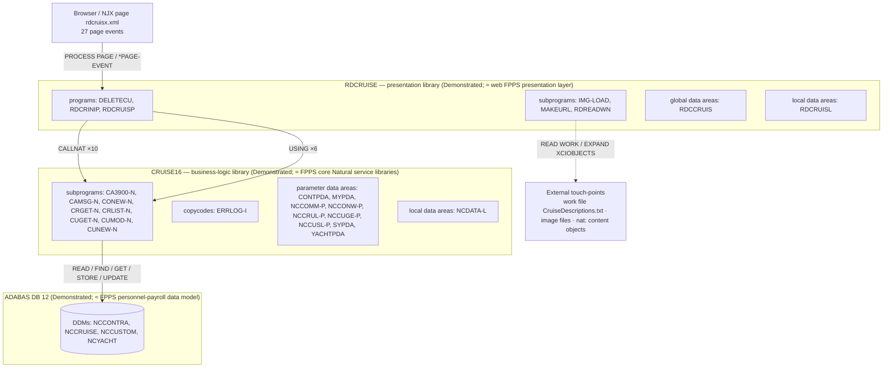
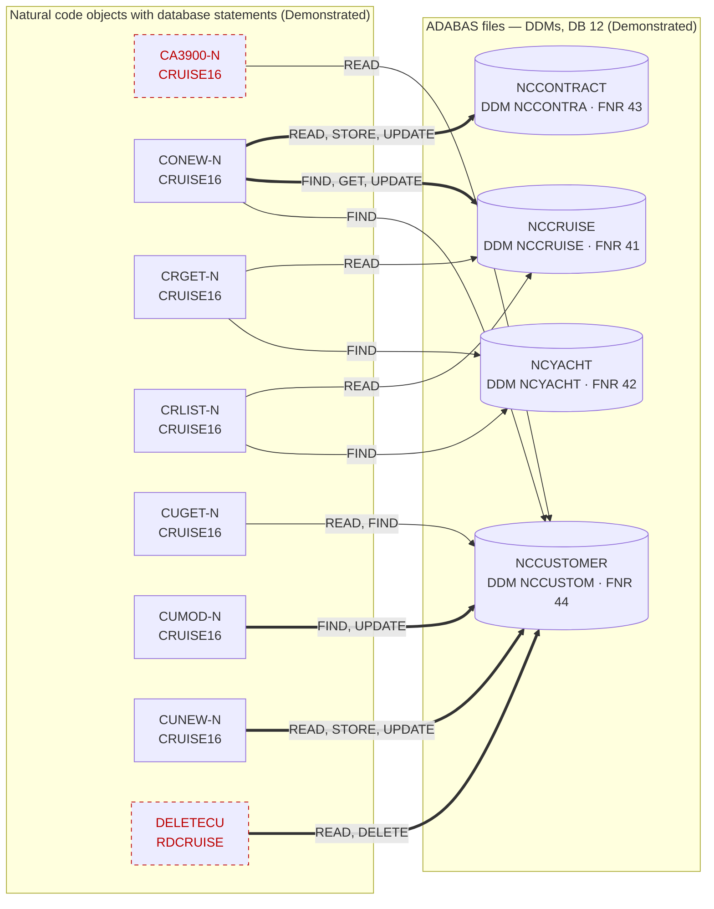

# Diagrams (generated)

Generated by `python3 fpps-hcm-modernization-deliverable/01-discoverability-comprehension-baseline/generate_inventory.py` from `tools/analyze_disposition.py` and `tests/harness/source_parser.py`. **Do not edit by hand** — run the generator; `--check` fails CI-style if this file drifts.

All three diagrams are **Demonstrated**: they are rendered from the analyzer output, not drawn. Dashed red nodes are static candidates (unreferenced in analyzed scope or no UI path); they are not asserted to be unused at runtime.

Exported images in this directory: `architecture.svg`, `architecture.png`, `call-graph.svg`, `call-graph.png`, `data-access.svg`, `data-access.png`.

## Architecture (`architecture.mmd`)

## Call graph (`call-graph.mmd`)

```mermaid
%% Generated by generate_inventory.py — CALLNAT / FETCH / INCLUDE edges (Demonstrated)
flowchart TD
  UI["NJX page rdcruisx.xml<br/>(Demonstrated)"]
  subgraph RDCRUISE["RDCRUISE (Demonstrated)"]
    DELETECU["DELETECU<br/>program"]
    RDCRINIP["RDCRINIP<br/>program"]
    RDCRUISP["RDCRUISP<br/>program"]
    IMG_LOAD["IMG-LOAD<br/>subprogram"]
    MAKEURL["MAKEURL<br/>subprogram"]
    RDREADWN["RDREADWN<br/>subprogram"]
  end
  subgraph CRUISE16["CRUISE16 (Demonstrated)"]
    ERRLOG_I["ERRLOG-I<br/>copycode"]
    CA3900_N["CA3900-N<br/>subprogram"]
    CAMSG_N["CAMSG-N<br/>subprogram"]
    CONEW_N["CONEW-N<br/>subprogram"]
    CRGET_N["CRGET-N<br/>subprogram"]
    CRLIST_N["CRLIST-N<br/>subprogram"]
    CUGET_N["CUGET-N<br/>subprogram"]
    CUMOD_N["CUMOD-N<br/>subprogram"]
    CUNEW_N["CUNEW-N<br/>subprogram"]
  end
  UI -->|PROCESS PAGE| RDCRUISP
  CONEW_N -->|INCLUDE L37| ERRLOG_I
  CONEW_N -->|CALLNAT L143| CAMSG_N
  CRGET_N -->|INCLUDE L35| ERRLOG_I
  CRGET_N -->|CALLNAT L121| CAMSG_N
  CRLIST_N -->|INCLUDE L31| ERRLOG_I
  CRLIST_N -->|CALLNAT L96| CAMSG_N
  CUGET_N -->|INCLUDE L38| ERRLOG_I
  CUGET_N -->|CALLNAT L82| CAMSG_N
  CUMOD_N -->|INCLUDE L26| ERRLOG_I
  CUMOD_N -->|CALLNAT L72| CAMSG_N
  CUNEW_N -->|INCLUDE L25| ERRLOG_I
  CUNEW_N -->|CALLNAT L62| CAMSG_N
  IMG_LOAD -->|CALLNAT L28| MAKEURL
  RDCRINIP -->|CALLNAT L26| RDREADWN
  RDCRUISP -->|FETCH ×5 L62,274,287,300,312| RDCRINIP
  RDCRUISP -->|CALLNAT L514| CUGET_N
  RDCRUISP -->|CALLNAT L581| CONEW_N
  RDCRUISP -->|CALLNAT L626| CUMOD_N
  RDCRUISP -->|CALLNAT L672| CUNEW_N
  RDCRUISP -->|CALLNAT ×5 L716,827,857,887,917| CRGET_N
  RDCRUISP -->|CALLNAT ×5 L734,844,874,904,934| MAKEURL
  RDCRUISP -->|CALLNAT L765| CRLIST_N
  classDef candidate stroke-dasharray: 5 5,stroke:#b00,color:#b00;
  class CA3900_N,DELETECU,IMG_LOAD candidate;
  classDef entry fill:#e8f0fe,stroke:#1a56db;
  class RDCRUISP,UI entry;
```

## Data-access map (`data-access.mmd`)

