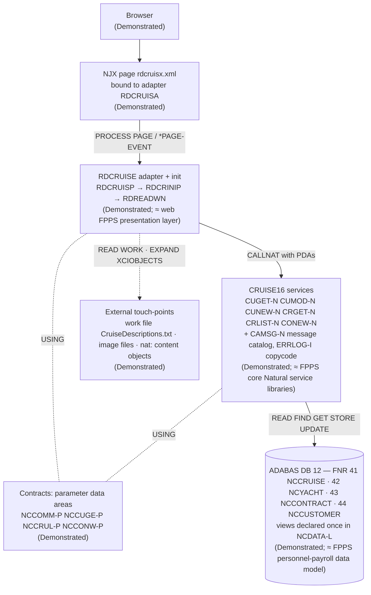

# Discoverability and comprehension baseline — report

A narrated walk-through of the two Natural libraries in the Sunny Islands Cruise sample (`CRUISE16` business logic, `RDCRUISE` Natural for AJAX presentation): what every object is for, how the layers fit, where execution enters, which ADABAS files each object touches, and the order in which the call graph says the business behaviour should be extracted for an HCM implementation.

| | |
|---|---|
| **Audience** | Department CIO/CTO staff and the payroll systems-integrator (SI) scoping an Oracle HCM (or alternate HCM) implementation |
| **Evidence base** | The shipped sources under `SunnyIslands/Natural-Libraries/` and `SunnyIslands/User-Interface-Components/`, read by `tools/analyze_disposition.py` and `tests/harness/source_parser.py` |
| **Maturity** | **Demonstrated** for every statement about the sample; FPPS statements are analogies and are marked as such |
| **Companion artifacts** | [`module-inventory.md`](module-inventory.md) (generated), [`diagrams/`](diagrams/README.md) (generated Mermaid + exports), [`../06-interface-dependency-mapping/`](../06-interface-dependency-mapping/) (edge list, deployment, external interfaces) |

## How to read this report

- Numbers, lists, and object sets in this directory are produced by `generate_inventory.py` (a Python *generation harness*, not part of any modernization target). Blocks marked "generated" below are rewritten by that script and checked by its `--check` mode; the prose around them is authored and cites the exact source lines it relies on.
- Every reach/usage statement is a **static candidate**: "unreferenced in analyzed scope", "unreachable from the UI adapter", "stand-alone program; no UI path". None of it proves runtime behaviour. A Natural SME confirms each candidate before it becomes a disposition (see `../10-migration-disposition-dead-code/`).
- Analogies follow the hub table: booking ≈ pay/personnel transaction; message-code edits ≈ payroll validation edits and error catalogue; DDMs ≈ personnel-payroll data model; record-hold / test-and-set / serialized MAX+1 key ≈ pay-run integrity; `CRUISE16` ≈ FPPS core Natural service libraries; `RDCRUISE` ≈ web FPPS presentation layer.

## The estate at a glance

<!-- generated:control-totals -->
| Measure | Value |
|---|---|
| Natural objects in `CRUISE16` + `RDCRUISE` | 31 |
| Code objects (subprogram / program / copycode) | 15 |
| Static references (CALLNAT / FETCH / INCLUDE / USING) | 62 |
| Dynamic invocations (unresolvable statically) | 0 |
| Source lines, all objects | 3005 |
| Executable lines, programs and subprograms | 1329 |
| Page events declared in `rdcruisx.xml` | 27 |
| Objects unreferenced in analyzed scope | `CA3900-N`, `CONTPDA`, `IMG-LOAD`, `MYPDA`, `NCCUSL-P`, `SYPDA`, `YACHTPDA` |
| Stand-alone programs with no UI path | `DELETECU` |

| Library | program | subprogram | copycode | global data area | local data area | parameter data area | DDM | Total |
|---|---|---|---|---|---|---|---|---|
| `CRUISE16` | 0 | 8 | 1 | 0 | 1 | 9 | 4 | 23 |
| `RDCRUISE` | 3 | 3 | 0 | 1 | 1 | 0 | 0 | 8 |
<!-- /generated:control-totals -->

The full per-object table (type, LOC, executable LOC, callers, callees, DDM files touched with verbs, reach status, source path) is in [`module-inventory.md`](module-inventory.md).

## Layering

Four layers, one direction of dependency. The browser talks to a Natural for AJAX page; the page is bound to one generated adapter program; the adapter calls business services through parameter data areas; the services are the only objects that issue ADABAS statements.



| Layer | Objects | Evidence |
|---|---|---|
| Page contract | `rdcruisx.xml` (`natsource="rdcruisa"`) | `SunnyIslands/User-Interface-Components/CruisePages/xml/rdcruisx.xml:2` |
| Adapter and initialisation | `RDCRUISP`, `RDCRINIP`, `RDREADWN`, `MAKEURL`, (`IMG-LOAD`, `DELETECU` as candidates) | `SunnyIslands/Natural-Libraries/RDCRUISE/Programs/RDCRUISP.NSP:105-112` (`PROCESS PAGE USING "RDCRUISA"`, `DECIDE ON FIRST *PAGE-EVENT`) |
| Service contracts | `NCCOMM-P`, `NCCUGE-P`, `NCCRUL-P`, `NCCONW-P` | `SunnyIslands/Natural-Libraries/RDCRUISE/Programs/RDCRUISP.NSP:29-34` (adapter declares the same PDAs the services use) |
| Business services | six `CRUISE16` subprograms plus `CAMSG-N` and `ERRLOG-I` | `module-inventory.md` "`CRUISE16`" table |
| Data | four DDMs, one shared LDA (`NCDATA-L`) holding every view | `SunnyIslands/Natural-Libraries/CRUISE16/Local Data Areas/NCDATA-L.NSL:1-87` |

The layered view generated from the analyzer is `diagrams/architecture.mmd` (exported as `architecture.svg` / `architecture.png`).

## Entry points

| Entry | Kind | What happens | Evidence | Status |
|---|---|---|---|---|
| Page open | NJX page → `RDCRUISP` | Sets language, `FETCH RETURN 'RDCRINIP'` to load texts and menu, `PERFORM INIMENUTEXT`, then `PROCESS PAGE USING "RDCRUISA"` | `RDCRUISE/Programs/RDCRUISP.NSP:58-64`, `:105` | Demonstrated (UI root) |
| Page event | `DECIDE ON FIRST *PAGE-EVENT` in `RDCRUISP` | One `VALUE U'on…'` branch per event; each `PERFORM`s a subroutine and re-renders with `PROCESS PAGE UPDATE FULL` | `RDCRUISE/Programs/RDCRUISP.NSP:112-116`, `:159-163` (`onLoginbutton` → `CUSTLOGIN`), `:171-175` (`onBookingSave` → `UPDATEBOOKING`) | Demonstrated |
| Language switch | `onSetge` / `onSeten` / `onSetpo` / `onSetsp` | Re-`FETCH RETURN 'RDCRINIP'` so texts are reloaded for the new language | `RDCRUISE/Programs/RDCRUISP.NSP:274`, `:287`, `:300`, `:312` | Demonstrated |
| Stand-alone utility | `DELETECU` | Reads one `NCCUSTOMER` record by ISN, `DELETE`, `END TRANSACTION`, writes a confirmation | `RDCRUISE/Programs/DELETECU.NSP:20-28` | Candidate: stand-alone program; no UI path |
| Image loader | `IMG-LOAD` | Builds `/opt/resources/images/CR16-<part>.jpg`, reads it as an unformatted work file, hands the bytes to `MAKEURL` | `RDCRUISE/Subprograms/IMG-LOAD.NSN:21-28` | Candidate: unreferenced in analyzed scope (the adapter calls `MAKEURL` directly with picture data from `CRGET-N`, `RDCRUISP.NSP:734`) |

All paths in this section are relative to `SunnyIslands/Natural-Libraries/`. The event-by-event contract (page line, adapter line, subroutine, service reached) is generated in `../06-interface-dependency-mapping/dependency-map.md`.

## Walk-through: `RDCRUISE` (presentation library)

| Object | Type | Purpose | Key evidence |
|---|---|---|---|
| `RDCRUISP` | program | Generated NJX adapter. Declares the global area `RDCCRUIS`, the page LDA `RDCRUISL`, and the five `CRUISE16` PDAs; initialises the page; dispatches every page event to a subroutine; calls the six services and `MAKEURL` | `RDCRUISP.NSP:24-34` (data), `:58-64` (init), `:112` (dispatch), `:514` (`CUGET-N`), `:581` (`CONEW-N`), `:626` (`CUMOD-N`), `:672` (`CUNEW-N`), `:716` (`CRGET-N`), `:734` (`MAKEURL`), `:765` (`CRLIST-N`) |
| `RDCRINIP` | program | Initialisation fetched by the adapter. Passes `G-LANGUAGE`, calls `RDREADWN` for eight text blocks, copies them into global fields, builds the seven-item multilingual menu | `RDCRINIP.NSP:9-10` (GDA), `:25-34` (`CALLNAT 'RDREADWN'`), `:40-50` (globals, menu) |
| `RDREADWN` | subprogram | Reads the language-tagged description text file as work file 1 and concatenates matching `HDE`/`HD1`… records into the eight output parameters | `RDREADWN.NSN:9-20` (parameters), `:31-36` (language code, `DEFINE WORK FILE 1`, `READ WORK 1`), `:39-44` (record-type filter), `:72-74` (`END-WORK`, `CLOSE WORK 1`) |
| `MAKEURL` | subprogram | Appends a binary content object (content, type, id) to the `XCIOBJECTS` array and returns a `nat:<id>` URL the page can render | `MAKEURL.NSN:40-46` |
| `IMG-LOAD` | subprogram | Alternate image loader that reads a `.jpg` from disk and calls `MAKEURL`; not called from any executable line in the analyzed scope | `IMG-LOAD.NSN:21-28` |
| `DELETECU` | program | Operator utility: delete one customer by ISN | `DELETECU.NSP:20-28` |
| `RDCCRUIS` | global data area | Shared state between `RDCRUISP` and `RDCRINIP` (language, descriptions, menu items, image paths) | `RDCRUISP.NSP:24-25`, `RDCRINIP.NSP:9-10` |
| `RDCRUISL` | local data area | Page-bound fields of the NJX adapter | `RDCRUISP.NSP:29` |

Adapter constants worth noting for an SI: the four "favourite" start harbours and cruise IDs, and the six image file stems, are hard-coded in the adapter's local data (`RDCRUISP.NSP:39-54`). In an HCM these are configuration, not code.

## Walk-through: `CRUISE16` (business-logic library)

| Object | Type | Purpose | Data access | Key evidence |
|---|---|---|---|---|
| `CUGET-N` | subprogram | Customer look-up. If the selector is numeric, `FIND NCCUSTOMER WITH PERSON-ID`; otherwise scan `READ NCCUSTOMER` comparing `EMAIL(1)`. Emits 9924 (no such id) / 9923 (no such e-mail) | `NCCUSTOMER` READ, FIND | `CUGET-N.NSN:56-78`, `:82` |
| `CUMOD-N` | subprogram | Customer update with optimistic concurrency: `FIND` by person id, update only if `TIMESTAMP` still equals the caller's copy, else 9934 | `NCCUSTOMER` FIND, UPDATE | `CUMOD-N.NSN:50-68` |
| `CUNEW-N` | subprogram | Customer create. `READ (1) NCCUSTOMER DESCENDING BY PERSON-ID` with an `UPDATE` to hold the highest record, then MAX+1 and `STORE` | `NCCUSTOMER` READ, UPDATE, STORE | `CUNEW-N.NSN:40-58` |
| `CRGET-N` | subprogram | One cruise by id, joined to its yacht picture | `NCCRUISE` READ; `NCYACHT` (view `YACHT-PICTURE`) FIND | `CRGET-N.NSN:49`, `:101-110`, `:116`, `:121` |
| `CRLIST-N` | subprogram | Cruise list descending by start date, skipping fully booked cruises and applying optional start/destination harbour filters; joins yacht data | `NCCRUISE` READ; `NCYACHT` FIND | `CRLIST-N.NSN:51-62`, `:80-85`, `:96` |
| `CONEW-N` | subprogram | Booking (the pay/personnel-transaction analog). Validates customer and cruise, re-reads the cruise **in hold** (`GET … *ISN`), test-and-set on `CRUISE-STATUS`, holds the highest contract with a fake `UPDATE`, MAX+1 contract id, `STORE NCCONTRACT` | `NCCUSTOMER` FIND; `NCCRUISE` FIND, GET, UPDATE; `NCCONTRACT` READ, UPDATE, STORE | `CONEW-N.NSN:79-100`, `:116`, `:143` |
| `CAMSG-N` | subprogram | Message catalogue: maps a four-digit code and language to text; code 0 → type `S`, otherwise type `I` | none | `CAMSG-N.NSN:9-15` (contract), `:17-23` (first entries), `:185-189` (type rule) |
| `CA3900-N` | subprogram | Reads one `NCCUSTOMER` record and nothing else; no caller in analyzed scope | `NCCUSTOMER` READ | `CA3900-N.NSN:15-16` |
| `ERRLOG-I` | copycode | Included by every service's error handler; its body is entirely commented out (no executable lines) | none | `ERRLOG-I.NSC:8-21` |
| `NCDATA-L` | local data area | The single place the ADABAS views (`NCCONTRACT`, `NCCRUISE`, `NCCUSTOMER`, `NCYACHT`, `YACHT-PICTURE`, `YACHT-PICTURE-UPDATE`) and the message group `MSG-GROUP-PARA` are declared | — | `NCDATA-L.NSL:11`, `:22`, `:39`, `:59`, `:65`, `:71`, `:76` |
| `NCCOMM-P` | parameter data area | Common in/out contract: `P-COM` (language, user, password) and `P-RESPONSE` (code, text) | — | `NCCOMM-P.NSA:9-16` |
| `NCCUGE-P` | parameter data area | Customer selection and customer data | — | `NCCUGE-P.NSA:11-29` |
| `NCCRUL-P` | parameter data area | Cruise selection, record count, cruise array with prices and picture | — | `NCCRUL-P.NSA:10-30` |
| `NCCONW-P` | parameter data area | Booking input (`WEEK-COUNT-IN`, dates, customer and cruise ids) and output `P-NEW-CONTRACTID` | — | `NCCONW-P.NSA:10-18` |
| `CONTPDA`, `MYPDA`, `NCCUSL-P`, `SYPDA`, `YACHTPDA` | parameter data areas | No `USING` reference anywhere in the analyzed scope | — | `module-inventory.md` reach status |
| `NCCONTRA`, `NCCRUISE`, `NCCUSTOM`, `NCYACHT` | DDMs | ADABAS DB 12 files 43, 41, 44, 42 | — | `NCCONTRA.NSD:1-30`; `module-inventory.md` "ADABAS files" table |

Paths in this table are relative to `SunnyIslands/Natural-Libraries/CRUISE16/<type folder>/`.

## Data access

The generated data-access map (`diagrams/data-access.mmd`, exported as `data-access.svg` / `.png`) draws one edge per (code object, ADABAS file) with the verbs found on executable lines. Three facts matter for an HCM data-mapping team:

| Fact | Evidence | Why an SI cares |
|---|---|---|
| Only `CRUISE16` subprograms and the two candidate programs issue database statements; the adapter never does | `module-inventory.md` "DDM files touched" column is empty for `RDCRUISP`, `RDCRINIP`, `RDREADWN`, `MAKEURL` | Business data rules live in one library; presentation can be replaced without touching them |
| Writes are concentrated: `NCCONTRACT` and `NCCRUISE` are written only by `CONEW-N`; `NCCUSTOMER` is written by `CUMOD-N`, `CUNEW-N` (and the `DELETECU` candidate) | `module-inventory.md` "ADABAS files" table | Each writer is one HCM transaction to design (booking → personnel/pay action; customer create/update → person record) |
| Integrity is enforced in code, not in the database: hold-then-update on `NCCRUISE`, serialized MAX+1 on `NCCONTRACT` and `NCCUSTOMER`, timestamp check on `NCCUSTOMER` | `CONEW-N.NSN:79-100`, `CUNEW-N.NSN:40-58`, `CUMOD-N.NSN:50-68` | These become explicit HCM requirements (uniqueness, optimistic locking, no double-posting), not code to translate |

## Extraction waves

The call graph orders the work. A leaf service can be specified and tested without knowing its callers; a caller cannot be specified until its callees are. `generate_inventory.py` derives the waves as "1 + longest CALLNAT/FETCH path to a leaf", and within a wave lists read-only objects before writers:

<!-- generated:waves -->
| Wave | Objects (read-only first, then writers) | Why this order |
|---|---|---|
| 1 | `CAMSG-N`, `MAKEURL`, `RDREADWN` | leaf services: no CALLNAT/FETCH out-edges |
| 2 | `CRGET-N`, `CRLIST-N`, `CUGET-N`, `RDCRINIP`, `CUMOD-N`, `CUNEW-N`, `CONEW-N` | calls only objects in earlier waves |
| 3 | `RDCRUISP` | calls only objects in earlier waves |

Static candidates outside the waves (evidence class in `module-inventory.md`): `CA3900-N` (unreferenced in analyzed scope), `DELETECU` (standalone program; no UI path), `IMG-LOAD` (unreferenced in analyzed scope).
<!-- /generated:waves -->

What each wave means for an HCM implementation (Designed — the sequencing method is specified against the sample; it has not been run at FPPS scale):

| Wave | Sample content | HCM work product | FPPS analogy |
|---|---|---|---|
| 1 | `CAMSG-N` message catalogue; `RDREADWN` text loader; `MAKEURL` content objects | Error/validation message catalogue and lookups (HCM messages, value sets); static content moves to configuration | Payroll validation-edit catalogue and error texts |
| 2 (read-only) | `CUGET-N`, `CRGET-N`, `CRLIST-N`, `RDCRINIP` | Inquiry requirements and field-level data mapping into HCM Data Loader objects | Personnel/pay inquiry services |
| 2 (writers) | `CUMOD-N`, `CUNEW-N`, `CONEW-N` | Transaction requirements with integrity controls (uniqueness, optimistic locking, hold-then-update) expressed as HCM validation and BPM approval rules | Personnel action and pay transaction posting |
| 3 | `RDCRUISP` | Not re-implemented; its event contract becomes the acceptance-test script for the HCM user interface | Web FPPS screens |
| outside | `CA3900-N`, `DELETECU`, `IMG-LOAD` | Disposition review in `../10-migration-disposition-dead-code/`; nothing built until an SME confirms | Unreferenced or utility modules in the estate |

At FPPS scale the same computation runs over Natural Predict/XRef exports rather than a directory of sources; that input does not exist in this repository (Roadmap).

## Sample ↔ FPPS analogy, object by object

| Sample object(s) | FPPS analog | Label |
|---|---|---|
| `CONEW-N` booking | Pay / personnel transaction posting | analogy |
| `CAMSG-N` codes 9800–9999 | Payroll validation edits and error catalogue | analogy |
| `NCCRUISE`, `NCCONTRACT`, `NCCUSTOMER`, `NCYACHT` DDMs | Personnel-payroll data model | analogy |
| Hold / test-and-set / serialized MAX+1 in `CONEW-N`, `CUNEW-N`; timestamp check in `CUMOD-N` | Pay-run integrity controls | analogy |
| `CRUISE16` | FPPS core Natural service libraries | analogy |
| `RDCRUISE` | Web FPPS presentation layer | analogy |
| `RDREADWN` work file, `MAKEURL` content objects | Batch work files and document interfaces around FPPS jobs | analogy (Roadmap: real JCL required) |

## Reproduce

```bash
python3 fpps-hcm-modernization-deliverable/01-discoverability-comprehension-baseline/generate_inventory.py          # rewrite generated outputs
python3 fpps-hcm-modernization-deliverable/01-discoverability-comprehension-baseline/generate_inventory.py --check  # exit 1 on drift
npx -y @mermaid-js/mermaid-cli -i diagrams/call-graph.mmd -o diagrams/call-graph.svg                                # re-export a diagram
```

← [Back to the directory README](README.md) · [Back to the navigation hub](../README.md)
