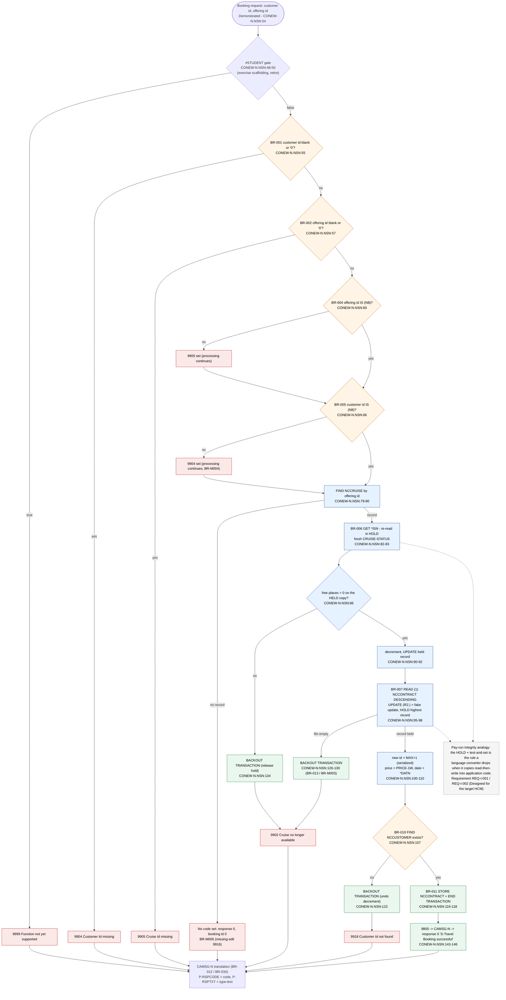
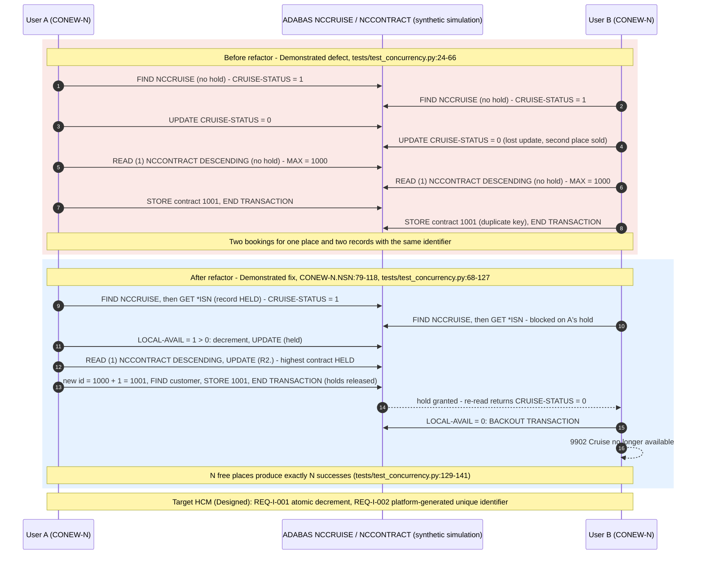
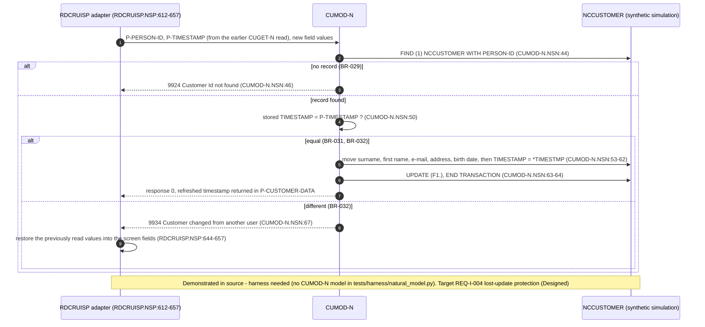
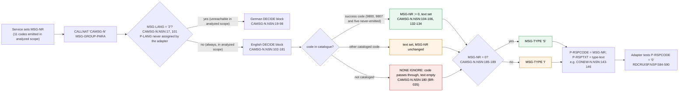

# Diagrams — business-rule extraction

Mermaid source is the artifact of record; each `.mmd` file is reproduced below so the diagrams render on any Markdown viewer with Mermaid support. Rendered `.svg`/`.png` files, where present, were produced with `npx -y @mermaid-js/mermaid-cli -i <file>.mmd -o <file>.svg` from the same source. Every node cites the executable line it represents; labels carry the maturity tag where the behaviour is not Demonstrated in this repository.

| File | Shows | Rules | Maturity |
|---|---|---|---|
| `conew-decision-flow.mmd` | The booking service's validation edits, the held re-read / test-and-set, the serialized MAX+1 identifier and every exit code | BR-001 – BR-013, BR-M003 – BR-M005 | Demonstrated (source and `tests/`) |
| `conew-race-before-after.mmd` | The two concurrency defects of the pre-refactor logic and how the refactor removes them | BR-006, BR-007 | Demonstrated (`tests/test_concurrency.py`) |
| `cumod-optimistic-concurrency.mmd` | Timestamp compare-and-update in the customer modify service and the adapter's stale-value restore | BR-029, BR-031, BR-032 | Demonstrated (source); harness needed for execution |
| `message-code-lifecycle.mmd` | How a four-digit code becomes a response code and typed text, including the success remap to 0 | BR-012, BR-030, BR-033 – BR-035 | Demonstrated (source, `tests/test_source_conformance.py`) |

## Booking decision flow (`conew-decision-flow.mmd`)



Reading the flow as a payroll SI: orange diamonds are validation edits (element-entry style), blue boxes are the integrity requirements (REQ-I-001, REQ-I-002), green boxes are the transaction boundary (REQ-I-003), red boxes are the outcomes that reach the caller. The dashed note marks the two steps a source-to-source converter reproduces as plain read-then-write, which reintroduces the defects shown in the next diagram.

## Concurrency defects and fix (`conew-race-before-after.mmd`)



The identifiers 1000/1001 are illustrative; the executable tests use the synthetic fixture values (500100 → 500101/500102).

## Customer modify: timestamp optimistic concurrency (`cumod-optimistic-concurrency.mmd`)



## Message-code lifecycle (`message-code-lifecycle.mmd`)



## Rendering

```bash
cd fpps-hcm-modernization-deliverable/02-business-rule-extraction/diagrams
for f in *.mmd; do npx -y @mermaid-js/mermaid-cli -i "$f" -o "${f%.mmd}.svg"; done
```

## Synthetic data and scope

Sequence diagrams show the synthetic ADABAS simulation (`tests/harness/adabas_sim.py`) standing in for ADABAS; no production system was accessed. FPPS is referred to only by analogy.

← [Back to the directory README](../README.md) · [Navigation hub](../../README.md)
