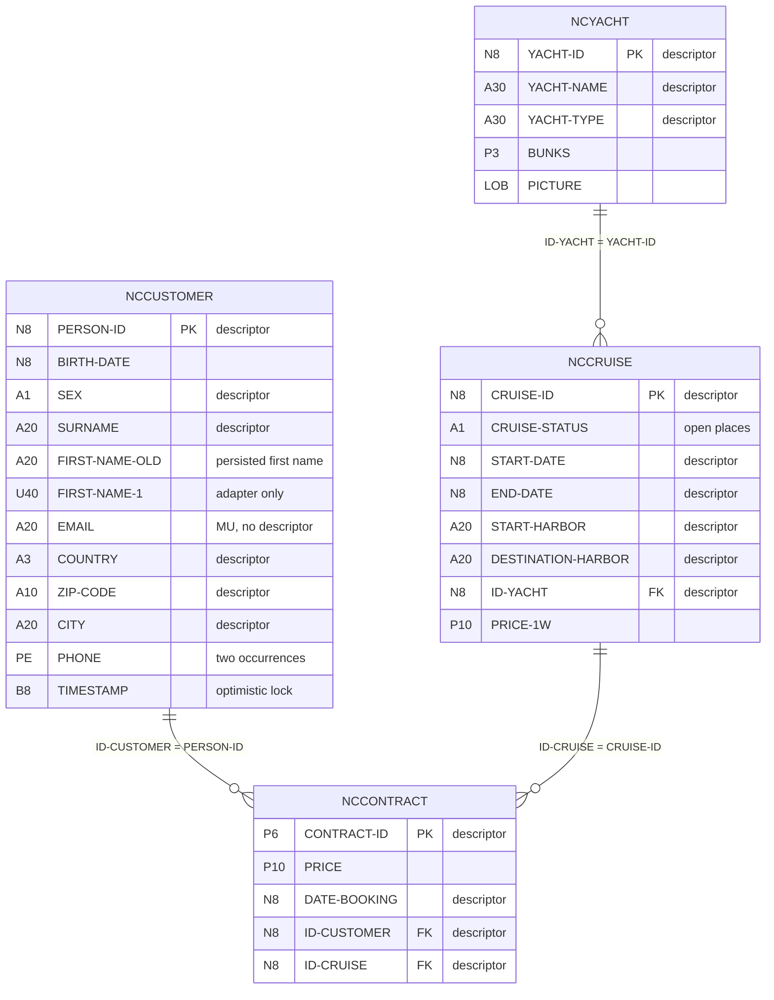
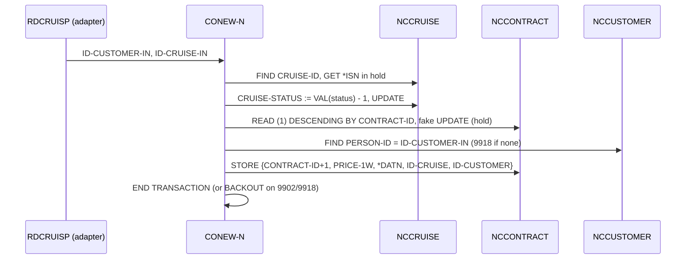
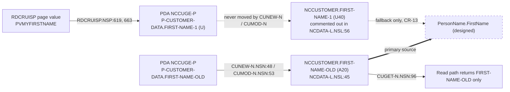

# Data model: the four ADABAS files behind the booking system

This page is the entity-relationship view an SI needs before opening the field-level dictionary (`data-dictionary-hcm.md`). Everything stated about the Sunny Islands Cruise sample is read from the DDMs and the Natural subprograms cited in the traceability table; everything stated about FPPS is an analogy and is labelled (designed).

## File roles

| DDM file | DB/FNR | Sample role | What the code does with it | Payroll analog (designed) |
|---|---|---|---|---|
| `NCCUSTOMER` | 12/44 | Customer master: identity, name, address, contact, audit timestamp | Created (`CUNEW-N`), modified with an optimistic-lock check (`CUMOD-N`), read by id or by first e-mail (`CUGET-N`) | Person / employee master |
| `NCCONTRACT` | 12/43 | Booking: one row per customer x cruise, with price and booking date | Stored once by `CONEW-N` inside the same transaction that decrements the cruise counter; never updated or deleted by analyzed code | Pay / personnel transaction (element entry) |
| `NCCRUISE` | 12/41 | Cruise catalogue: dates, harbors, yacht, prices, open-places counter | Listed by `CRLIST-N` (descending by start date, fully booked rows skipped), detailed by `CRGET-N`, decremented under hold by `CONEW-N` | Position with open headcount / pay element definition |
| `NCYACHT` | 12/42 | Yacht (resource) master with a picture LOB | Joined from the cruise by `CRLIST-N` and `CRGET-N`; not maintained by analyzed code | Organisation / department / location |

## Entity-relationship view

Mermaid source: `diagrams/er-model.mmd` (exports `er-model.png`, `er-model.svg`). Field lists in the diagram are abbreviated to the keys and the fields discussed below; the complete list is generated in `data-dictionary-hcm.md`.

## Keys and descriptors

ADABAS distinguishes three things that an HCM mapping must keep apart.

| Concept | What it is in ADABAS | Where it shows in the sample | HCM Data Loader treatment (designed) |
|---|---|---|---|
| ISN | Internal sequence number: the physical record address assigned by ADABAS on store. Stable for the life of the record, reused after delete, meaningless outside the file. | `GET NCCRUISE *ISN(R1.)` re-reads the found cruise in hold (`CONEW-N.NSN:82`); the simulator models it as the record dictionary key (`tests/harness/adabas_sim.py`) | Never loaded and never used as a source key. Its only use in migration is as a row handle inside the extract run. |
| Business key | A field the application treats as the identity of the entity: `PERSON-ID`, `CONTRACT-ID`, `CRUISE-ID`, `YACHT-ID`. Generated by the application (MAX+1 under record hold), not by ADABAS. | `READ (1) NCCUSTOMER DESCENDING BY PERSON-ID` then `ADD 1` (`CUNEW-N.NSN:41-46`); the same pattern on `CONTRACT-ID` (`CONEW-N.NSN:96-102`) | Becomes the HDL *source key* (`SourceSystemOwner` + `SourceSystemId`), which Oracle recommends for all implementations because it stays stable when user-key attributes change. |
| Descriptor | A field ADABAS indexes (`D` in the DDM). It allows `FIND ... WITH field = value` and `READ ... BY field` but says nothing about uniqueness: `SURNAME`, `COUNTRY`, `ZIP-CODE`, `CITY`, `SEX` are descriptors and are clearly not keys. | `FIND NCCUSTOMER WITH PERSON-ID = #PERSON-ID` (`CUGET-N.NSN:58`); `READ NCCRUISE DESCENDING BY START-DATE` (`CRLIST-N.NSN:51`) | Descriptor status drives *extract* design (which fields can be read in order, which need a full scan) and profiling priority; it does not drive the mapping. |

Two consequences the dictionary makes explicit:

- Uniqueness of `PERSON-ID` and `CONTRACT-ID` is a *convention enforced by the MAX+1 code path under record hold*, not by ADABAS. The cleansing rules CR-12 and CR-14 in 07 therefore test for duplicates rather than assume them away.
- `EMAIL` is a multiple-value field with no descriptor. The login-by-e-mail path in `CUGET-N.NSN:69-74` is a full-file `READ` comparing `EMAIL(1)` only. An extract that needs e-mail lookups must build its own index, and only occurrence 1 has application meaning.

## Relationships via ID-CUSTOMER, ID-CRUISE and ID-YACHT

| Relationship | Cardinality | Where it is established | Where it is validated | Cleansing rule |
|---|---|---|---|---|
| `NCCONTRACT.ID-CUSTOMER` → `NCCUSTOMER.PERSON-ID` | many bookings per customer | `MOVE ID-CUSTOMER-IN-N TO NCCONTRACT.ID-CUSTOMER` (`CONEW-N.NSN:110`) | `FIND NCCUSTOMER PERSON-ID = ID-CUSTOMER-IN-N`, message 9918 when absent (`CONEW-N.NSN:157-162`) | CR-01 |
| `NCCONTRACT.ID-CRUISE` → `NCCRUISE.CRUISE-ID` | many bookings per cruise | `MOVE ID-CRUISE-IN-N TO NCCONTRACT.ID-CRUISE` (`CONEW-N.NSN:109`) | `FIND NCCRUISE WITH NCCRUISE.CRUISE-ID = ID-CRUISE-IN-N` before the counter is decremented (`CONEW-N.NSN:80`) | CR-02 |
| `NCCRUISE.ID-YACHT` → `NCYACHT.YACHT-ID` | many cruises per yacht | Not set by analyzed code (catalogue data) | Resolved on read only: `FIND NCYACHT NCYACHT.YACHT-ID = NCCRUISE.ID-YACHT` (`CRLIST-N.NSN:80-83`); an unresolved yacht silently yields a blank name | CR-03 |

There is no ADABAS-enforced referential integrity: the validation happens in `CONEW-N` at booking time, and only for the two keys the booking supplies. A record inserted by any other route (batch load, utility, an earlier program version) can be orphaned without the application noticing until it is read. That is why 07 profiles orphans before mapping rather than trusting the code path.

### Booking as the transaction that ties the model together

Mermaid source: `diagrams/booking-relationships.mmd` (exports `.png`, `.svg`). On the hub analogy, booking ≈ pay/personnel transaction: the transaction row (`NCCONTRACT`) is only valid in the context of a person (`NCCUSTOMER`) and a position or element (`NCCRUISE`), and the counter on the position (`CRUISE-STATUS`) is the state that concurrency integrity protects.

## First-name lineage

Mermaid source: `diagrams/first-name-lineage.mmd` (exports `.png`, `.svg`). The dictionary maps `FIRST-NAME-OLD` as the primary source of the target first name and `FIRST-NAME-1` as a fallback; rule CR-13 in 07 surfaces the blank, conflicting and derived cases. The analyzer reports `FIRST-NAME-1` as referenced by `RDCRUISP`; that is a name match on the PDA field, so the dictionary states it explicitly rather than letting the column imply the DB field is written.

## Sample-to-FPPS analogy (designed)

| Sample construct | FPPS analog | Why it matters for the mapping workbook |
|---|---|---|
| Four DDMs in one library | Personnel-payroll data model spread across many DDMs and libraries | The same generator pattern (`all_ddms()` + field-usage analyzer + authored annotations) scales by file count; the annotation gate ensures no field is silently unmapped |
| MAX+1 business keys under record hold | Employee and transaction identifiers generated by application code | Source keys for HDL come from the application key, never the ISN; uniqueness must be profiled (CR-12, CR-14) |
| Descriptors without uniqueness | Indexed lookup fields (name, organisation code, pay period) | Descriptor status is an extract-ordering fact, not a mapping fact |
| Two first-name columns, one persisted | Attributes maintained through successive screen generations | Survivor selection from code evidence, not column names |
| Booking validates its two foreign keys only at store time | Pay transactions validated by the online edit path but also loaded by batch | Orphan profiling before mapping (CR-01, CR-02) |

## Traceability

| Claim | Evidence | Evidence class |
|---|---|---|
| File numbers, formats, descriptors | `SunnyIslands/Natural-Libraries/CRUISE16/DDMs/NCCUSTOM.NSD:1-35`, `NCCONTRA.NSD:1-29`, `NCCRUISE.NSD:1-31`, `NCYACHT.NSD:1-32` | DDM listing (parsed by `tests/harness/source_parser.py`) |
| `PERSON-ID` generated MAX+1 under hold | `SunnyIslands/Natural-Libraries/CRUISE16/Subprograms/CUNEW-N.NSN:41-57` | Source statement |
| `CONTRACT-ID` generated MAX+1 under hold; price, booking date and foreign keys set at store | `SunnyIslands/Natural-Libraries/CRUISE16/Subprograms/CONEW-N.NSN:79-124` | Source statement |
| Customer foreign key validated at booking (9918) | `SunnyIslands/Natural-Libraries/CRUISE16/Subprograms/CONEW-N.NSN:151-162` | Source statement |
| Cruise counter decremented under hold; 9902 when none available | `SunnyIslands/Natural-Libraries/CRUISE16/Subprograms/CONEW-N.NSN:80-92`, `:133-136` | Source statement |
| Listing ordered by `START-DATE`, skips `VAL(CRUISE-STATUS) = 0`, joins yacht | `SunnyIslands/Natural-Libraries/CRUISE16/Subprograms/CRLIST-N.NSN:51-85` | Source statement |
| Optimistic-lock check on `TIMESTAMP` (9934) | `SunnyIslands/Natural-Libraries/CRUISE16/Subprograms/CUMOD-N.NSN:44-68` | Source statement |
| Login-by-e-mail scans `EMAIL(1)` with a full READ | `SunnyIslands/Natural-Libraries/CRUISE16/Subprograms/CUGET-N.NSN:56-78` | Source statement |
| `FIRST-NAME-1` adapter-only; `FIRST-NAME-OLD` persisted | `SunnyIslands/Natural-Libraries/RDCRUISE/Programs/RDCRUISP.NSP:619`, `:663`; `CRUISE16/Parameter Data Areas/NCCUGE-P.NSA:21`, `:29`; `CRUISE16/Local Data Areas/NCDATA-L.NSL:44-45`, `:56`; `CUNEW-N.NSN:48`; `CUMOD-N.NSN:53`; `CUGET-N.NSN:96` | Source statement |
| Field-usage counts in the dictionary | `tools/analyze_disposition.py` (`ddm_field_usage`), reproduced in `../10-migration-disposition-dead-code/evidence/disposition-evidence.md` | Static analysis (candidates only) |
| Source keys recommended for all HDL implementations | Oracle, *HCM Data Loader Best Practices*: https://docs.oracle.com/en/cloud/saas/human-resources/fahdl/hcm-data-loader-best-practices.html | Vendor documentation (opened 2026-09-03) |

← [Back to the directory README](README.md) · [Back to the navigation hub](../README.md)
