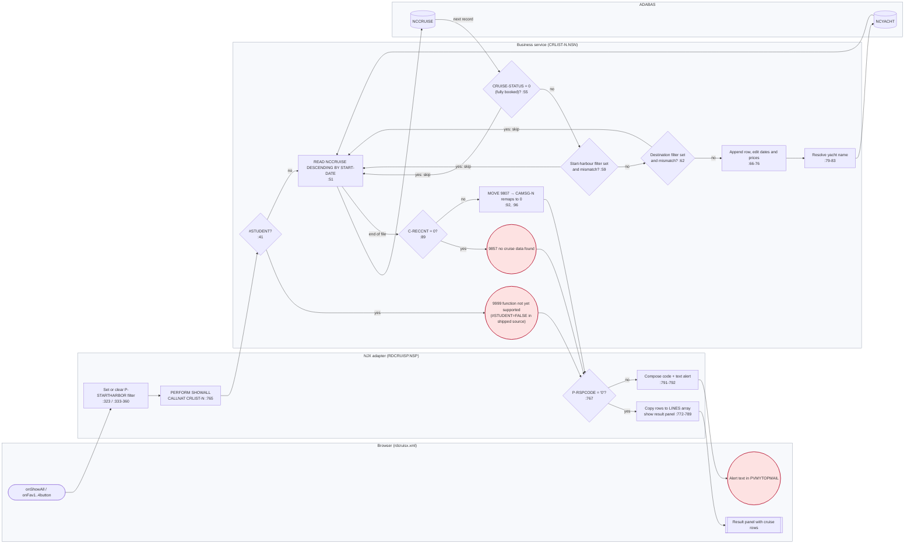
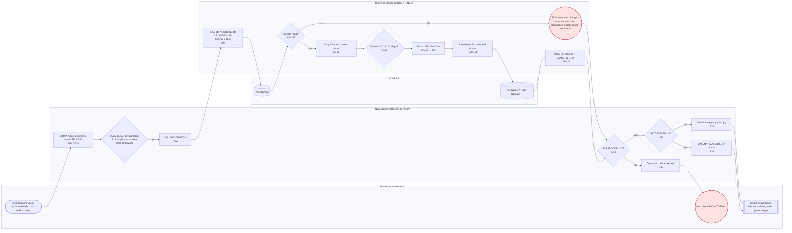
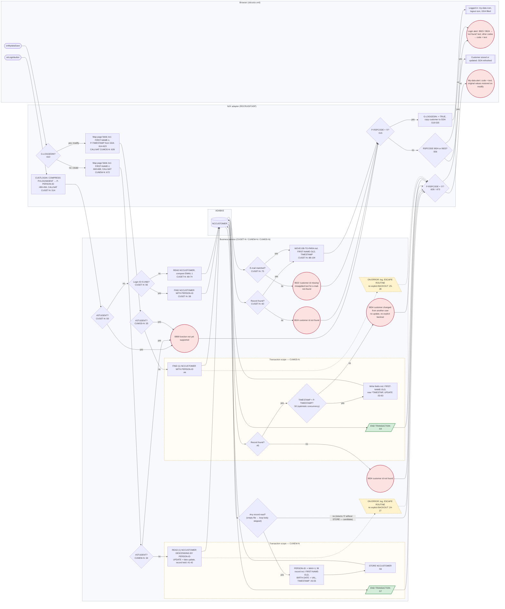
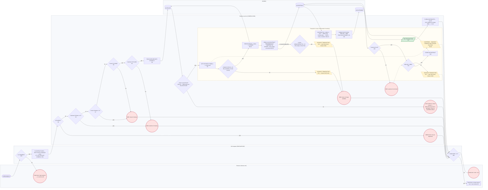

# Process flows (BPMN-oriented)

Four narrated business processes of the Sunny Islands Cruise sample, each drawn as a Mermaid flowchart with four swimlanes (browser, NJX adapter, business service, ADABAS), a gateway for every validation in the executable source, an error end-event for every message code the service can return, and the transaction boundary (`END TRANSACTION` / `BACKOUT TRANSACTION`) drawn as a compensation boundary. Every event, code and line number below is taken from `evidence/process-evidence.md`, which `generate_process_evidence.py` regenerates from source (`--check` guards drift).

FPPS analogy: each flow is the shape of a personnel or payroll transaction in a Software AG Natural 9.x / ADABAS 8.6 estate — a screen event, a dispatching program, a service subprogram that owns the edits, and ADABAS files behind it. The sample facts are facts; the FPPS statements are analogies.

| Property | Value |
|---|---|
| Maturity | Demonstrated for the flows (they are read off shipped source and the `tests/harness/` model runs them today); designed for the BPMN 2.0 XML in `bpmn/` |
| Source of truth | `SunnyIslands/Natural-Libraries/RDCRUISE/Programs/RDCRUISP.NSP` (adapter), `SunnyIslands/Natural-Libraries/CRUISE16/Subprograms/*.NSN` (services), `SunnyIslands/User-Interface-Components/CruisePages/xml/rdcruisx.xml` (page) |
| Generated evidence | `evidence/process-evidence.md`, `evidence/process-evidence.json` |
| Data | Synthetic only (`tests/harness/`); no production system or FPPS source is used |

## Notation

| Shape | Meaning | BPMN 2.0 equivalent |
|---|---|---|
| `([text])` | Start event (UI event raised by the page) | `startEvent` |
| `[text]` | Activity | `task` / `serviceTask` |
| `{text}` | Validation or decision gateway; every `IF`/`DECIDE`/`IF NO RECORDS FOUND` in executable code | `exclusiveGateway` |
| `((nnnn text))` | Error end-event labelled with the `CAMSG-N` message code | `endEvent` + `errorEventDefinition` |
| `[[text]]` | Success end-event | `endEvent` |
| `[/END TRANSACTION/]` | Commit — closes the transaction scope | `transaction` subprocess completes |
| `[\BACKOUT TRANSACTION\]` | Compensation — undoes every `UPDATE`/`STORE` since the last commit and releases record holds | `compensateEventDefinition` / cancel end-event on the `transaction` |
| dotted edge `-.->` | Compensation flow | association to the compensation handler |
| dashed subgraph *Transaction scope* | Statements executed between the first hold (`UPDATE`/`GET` on a held record) and `END TRANSACTION` / `BACKOUT TRANSACTION` | `transaction` subprocess |

Lane names are the same in every diagram: **Browser** (`rdcruisx.xml` controls), **NJX adapter** (`RDCRUISP.NSP` `DECIDE ON FIRST *PAGE-EVENT` branch and its `PERFORM`ed subroutine), **Business service** (CRUISE16 subprogram), **ADABAS** (logical files `NCCRUISE`, `NCCONTRACT`, `NCCUSTOMER`, `NCYACHT`/`YACHT-PICTURE`).

## Event inventory (generated)

The page declares 27 distinct UI events (28 `method=` attributes; the row-grid method `lines.onpvLineClick` is bound to both click and double-click of a result row). The adapter's `DECIDE ON FIRST *PAGE-EVENT` (`RDCRUISP.NSP:112-438`) has 34 branches. Counts and classifications come from `evidence/process-evidence.md` § *UI events → adapter branches → services*.

| Classification (from generator) | Branches | Events | In this document |
|---|---|---|---|
| Dispatches to business service | 14 | `onLoginbutton`, `onMydataSave`, `onBookingSave`, `onHotcruises`, `onShowAll`, `onFav1button`…`onFav4button`, `onShowdetails1`…`onShowdetails4`, `lines.onpvLineClick` | Processes P1–P4 |
| UI state only (visibility / GDA moves) | 10 | `onHome`, `onQuestion`, `onLoginicon`, `onNewdataicon`, `onLoginClose`, `onFavorites`, `onMydataClose`, `onBookingClose`, `onLogouticon`, `onMydataicon` | Presentation-only; noted under each process where they open or close its panel |
| Language switch (`FETCH RETURN 'RDCRINIP'`) | 4 | `onSeten`, `onSetge`, `onSetpo`, `onSetsp` | Presentation-only; sets `G-LANGUAGE` and re-runs the text initialiser (`RDCRUISP.NSP:271-319`) |
| Page refresh only (`PROCESS PAGE UPDATE`) | 4 | `nat:page.end`, `onFacebook`, `onTwitter`, `NONE VALUE` | Presentation-only; no business effect |
| Ignored (`IGNORE`) | 2 | `onCloseMydata` (`RDCRUISP.NSP:261-264`), `onCrdetClose` (`RDCRUISP.NSP:418-426`, replacement logic is commented out) | Unhandled events |
| Session end (`TERMINATE`) | 1 | `onExit` (`RDCRUISP.NSP:429-432`) | Out of process scope |

Reachability notes (static candidates, see `evidence/process-evidence.md` § *Control totals*):

| Finding | Evidence | Reading |
|---|---|---|
| 0 declared events lack an adapter branch | generator: *Declared in UI but not handled in adapter* = none | Every button on the page reaches a handler |
| `onQuestion`, `onExit` have no `method=` attribute | registered in the `DLMENU` dynamic menu, `RDCRUISP.NSP:77-78` | Reachable through the navigation bar (`menuprop="dlmenu"`, `rdcruisx.xml:92`), not a page control |
| `nat:page.end`, `onFacebook`, `onTwitter`, `onCloseMydata`, `onCrdetClose` have no `method=` attribute and no menu entry | generator: *Handled in adapter but neither declared in UI nor in the menu* | Unreachable from the page in analyzed scope; `nat:page.end` is a framework lifecycle event; the other four are presentation scaffolding candidates for retirement |
| Image loading is commented out | 6 `CALLNAT 'IMG-LOAD'` lines are comments, `RDCRUISP.NSP:85-91` | `IMG-LOAD` is presentation-only content infrastructure, unreferenced in executable scope; no business rule depends on it. Detail images instead come from `YACHT-PICTURE.PICTURE` through `MAKEURL` (`RDCRUISP.NSP:730-736`) |

## P1 — List cruises

**Trigger.** *Show all* (`onShowAll`) or one of the four favourite-harbour buttons (`onFav1button`…`onFav4button`). `onShowAll` clears the start-harbour filter (`RDCRUISP.NSP:323`); a favourite button copies its harbour constant into `P-SELETION.P-STARTHARBOR` (`RDCRUISP.NSP:333`, `342`, `351`, `360`). Both then `PERFORM SHOWALL` (`RDCRUISP.NSP:760-795`), which calls `CRLIST-N` (`RDCRUISP.NSP:765`).

**Service.** `CRLIST-N` (`SunnyIslands/Natural-Libraries/CRUISE16/Subprograms/CRLIST-N.NSN`) reads `NCCRUISE` descending by `START-DATE` (`:51`), skips fully booked cruises (`CRUISE-STATUS = 0`, `:53-57`), applies the optional start- and destination-harbour filters (`:59-64`), appends each surviving record to a dynamic output array with edited dates and prices (`:66-76`), resolves the yacht name from `NCYACHT` (`:79-83`), and ends with 9857 when nothing matched or 9807 otherwise (`:88-93`). `CAMSG-N` remaps 9807 to 0 so the adapter reads it as success (`CAMSG-N.NSN:136-138`).

**Transaction boundary.** None — read-only. No `UPDATE`, `STORE`, `END TRANSACTION` or `BACKOUT TRANSACTION` appears in `CRLIST-N` (generator § *Service summary*).

Traceability:

| Gateway / event | Source | Message code | Note |
|---|---|---|---|
| `#STUDENT` training switch | `CRLIST-N.NSN:41-43` | 9999 | `#STUDENT` is `INIT <FALSE>` in `SunnyIslands/Natural-Libraries/CRUISE16/Local Data Areas/NCDATA-L.NSL:86`; the branch is present in executable code but not taken with the shipped configuration |
| Fully booked | `CRLIST-N.NSN:53-57` | — | Skip, not an error: availability is a listing filter, not a validation |
| Start-harbour filter | `CRLIST-N.NSN:59-61` | — | Populated by the favourite buttons only |
| Destination filter | `CRLIST-N.NSN:62-64` | — | `P-DESTHARBOR` is declared in `NCCRUL-P` but never assigned by the adapter (declared but never assigned, `../10-migration-disposition-dead-code/evidence/disposition-evidence.md`); the gateway is always "no" in analyzed scope |
| No rows | `CRLIST-N.NSN:89-90` | 9857 | Only error end-event reachable from the page |
| Rows shown | `CRLIST-N.NSN:92`, `CAMSG-N.NSN:136-138` | 9807 → 0 | Informational code remapped to success |
| Presentation-only around P1 | `onFavorites` (`RDCRUISP.NSP:197-202`) opens the favourites panel without calling a service; the 30-row cap in `SHOWALL` (`RDCRUISP.NSP:785-789`) is a page-size rule, not a business rule | — | Candidate for retirement / HCM list paging |

## P2 — Cruise detail

**Trigger.** A result row (`lines.onpvLineClick`, `RDCRUISP.NSP:408-415`), one of the four offer tiles (`onShowdetails1`…`4`, `RDCRUISP.NSP:367-406`), or *Hot cruises* (`onHotcruises`, `RDCRUISP.NSP:189-195`), whose `INI-OFFERS` subroutine calls `CRGET-N` four times for hard-coded favourite cruise IDs (`RDCRUISP.NSP:827`, `857`, `887`, `917`). The row and tile paths `PERFORM FILL-CRUISEDETAILS` (`RDCRUISP.NSP:703-746`), which converts the selected ID with `VAL` (`:713`) and calls `CRGET-N` (`:716`).

**Service.** `CRGET-N` (`SunnyIslands/Natural-Libraries/CRUISE16/Subprograms/CRGET-N.NSN`) performs `READ (1) NCCRUISE BY CRUISE-ID = P-SELCRUISEID` (`:49`), copies harbours, dates and the three prices (`:55-71`), selects the price by duration (`:73-96`; the `NONE` branch defaults to the two-week price and the 9915 emit is commented out at `:93`), resolves yacht name and picture from `YACHT-PICTURE` (`:100-108`), and emits 9934 when no record was read (`:114-119`).

**Transaction boundary.** None — read-only.

Traceability:

| Gateway / event | Source | Message code | Note |
|---|---|---|---|
| Numeric selection | `RDCRUISP.NSP:713` | — | No explicit validation; the page supplies IDs from its own list, so the gateway is implicit. In an HCM this becomes a typed key, not an edit |
| Record read | `CRGET-N.NSN:49`, `:114-116` | 9934 | Two candidate findings for SME review: (a) the catalog text for 9934 is "Customer changed from another user" (`CAMSG-N.NSN:174-176`) — a semantic mismatch, the code is reused for cruise-not-found; (b) `READ (1) … BY CRUISE-ID = value` is a logical read starting at the key value, so a non-existent ID is expected to return the next higher cruise rather than 9934 (Natural `READ LOGICAL` semantics — confirm on the sample runtime before treating the 9934 path as reachable) |
| Duration → price | `CRGET-N.NSN:73-96` | 9915 (commented out, `:93`) | Inactive validation candidate: "only 1–3 weeks possible". The `NONE` branch silently defaults to the two-week price |
| Picture present | `RDCRUISP.NSP:730-736` | — | Presentation-only; `IMG-LOAD` calls that once populated page images are commented out (`RDCRUISP.NSP:85-91`) |
| `#STUDENT` | — | — | `CRGET-N` has no `#STUDENT` gate (generator § *Service summary*) |
| Presentation-only around P2 | `onCrdetClose` is `IGNORE` (`RDCRUISP.NSP:418-426`); the tiles carry hard-coded images (`RDCRUISP.NSP:370`, `381`, `391`, `401`) | — | Unhandled event; retire in HCM |

## P3 — Customer lookup, create, modify

Three sub-flows share one page panel and one adapter subroutine pair. Whether *Save* creates or modifies is decided by the session flag `G-LOGGEDIN` in `UPDATEMYDATA` (`RDCRUISP.NSP:610`, `:659`).

| Sub-flow | Trigger | Adapter | Service | Codes |
|---|---|---|---|---|
| Lookup (login) | `onLoginbutton` (`RDCRUISP.NSP:159-162`) | `CUSTLOGIN` `:489-568`, `CALLNAT 'CUGET-N'` `:514` | `CUGET-N.NSN` | 9923, 9924, 9999 |
| Create | `onMydataSave` with `G-LOGGEDIN = FALSE` | `UPDATEMYDATA` `:659-698`, `CALLNAT 'CUNEW-N'` `:672` | `CUNEW-N.NSN` | 9999 (no explicit success code) |
| Modify | `onMydataSave` with `G-LOGGEDIN = TRUE` | `UPDATEMYDATA` `:610-657`, `CALLNAT 'CUMOD-N'` `:626` | `CUMOD-N.NSN` | 9924, 9934, 9999 |

**Lookup.** `CUGET-N` (`SunnyIslands/Natural-Libraries/CRUISE16/Subprograms/CUGET-N.NSN`) tests whether the login identifier is numeric (`IS (N8)`, `:56`). If so it `FIND`s by `PERSON-ID` (`:58`) and emits 9924 when nothing is found (`:60-62`); otherwise it scans `NCCUSTOMER` sequentially comparing `EMAIL(1)` (`:69-74`) and emits 9923 when no e-mail matched (`:75-77`). On success `MOVE-DB-TO-PARA` (`:88-104`) returns the record including `FIRST-NAME-OLD` (`:96`) and the ADABAS `TIMESTAMP` (`:102`) that the modify flow later uses for optimistic concurrency. The adapter treats 9923 and 9924 alike as "customer not found" (`RDCRUISP.NSP:556-559`).

**Create.** `CUNEW-N` (`SunnyIslands/Natural-Libraries/CRUISE16/Subprograms/CUNEW-N.NSN`) reads the highest `PERSON-ID` descending (`:41`), issues a fake `UPDATE` to put that record on hold (`:42`), computes MAX+1 (`:43-44`), fills the new record (`:46-55`), `STORE`s it (`:56`) and commits (`END TRANSACTION`, `:57`). The hold on the highest record serialises concurrent creators — the same pattern `CONEW-N` uses for contract IDs.

**Modify.** `CUMOD-N` (`SunnyIslands/Natural-Libraries/CRUISE16/Subprograms/CUMOD-N.NSN`) `FIND`s the customer (`:44`), emits 9924 if absent (`:45-48`), compares the stored `TIMESTAMP` with the one the page received at login (`:50`), and only on a match writes the fields, refreshes the timestamp, `UPDATE`s and commits (`:53-64`); on a mismatch it emits 9934 and leaves the record unchanged (`:65-68`).

**Transaction boundary.** `CUNEW-N` and `CUMOD-N` each end with `END TRANSACTION`; neither contains `BACKOUT TRANSACTION` (generator § *Service summary*). Their `ON ERROR` blocks log and `ESCAPE ROUTINE` (`CUNEW-N.NSN:24-27`, `CUMOD-N.NSN:25-28`) without an explicit backout — release of the held record then depends on the session's next transaction end (candidate for SME confirmation; drawn as an implicit compensation below).

Traceability:

| Gateway / event | Source | Message code | Note |
|---|---|---|---|
| Login ID numeric | `CUGET-N.NSN:56` | — | Selects ID lookup vs e-mail scan; the e-mail scan is a full sequential `READ` of `NCCUSTOMER` (`:69`), acceptable for the sample, a performance candidate at FPPS scale |
| Customer by ID not found | `CUGET-N.NSN:60-62` | 9924 | Adapter shows the generic login-alert text (`RDCRUISP.NSP:556-559`) |
| Customer by e-mail not found | `CUGET-N.NSN:75-77` | 9923 | Catalog text is "Customer Id missing" (`CAMSG-N.NSN:170-171`): misapplied text, same adapter handling as 9924 |
| Create — highest record held | `CUNEW-N.NSN:41-42` | — | Fake `UPDATE` serialises MAX+1 ID generation; analogous to serialised employee/contract numbering in a pay system |
| Create — empty file | `CUNEW-N.NSN:41-58` | — (returns '0') | Candidate: with an empty `NCCUSTOMER` the `READ (1)` loop body never runs, so nothing is stored yet the adapter reports success (`RDCRUISP.NSP:673-689`). Not reachable with the seeded synthetic data; `CONEW-N` has the equivalent guard (`CONEW-N.NSN:126-131`) |
| Create — birth date | `CUNEW-N.NSN:54` vs `CUMOD-N.NSN:59-61` | — | `CUNEW-N` applies `VAL` directly to `BIRTH-DATE`; `CUMOD-N` first strips `-` (`EXAMINE … DELETE`). A `YYYY-MM-DD` value from the page would raise a Natural runtime error on create and fall into `ON ERROR` — candidate defect for SME confirmation |
| Modify — record absent | `CUMOD-N.NSN:45-48` | 9924 | |
| Modify — timestamp mismatch | `CUMOD-N.NSN:50`, `:65-68` | 9934 | Optimistic concurrency; the adapter restores the original values on the page (`RDCRUISP.NSP:648-653`). This is the one place 9934 is used with its catalog meaning |
| Commit | `CUNEW-N.NSN:57`, `CUMOD-N.NSN:64` | — | Single `END TRANSACTION` per service; no `BACKOUT TRANSACTION` in either |
| First-name lineage | `RDCRUISP.NSP:619`, `:663` (page → `FIRST-NAME-1`); `CUNEW-N.NSN:48`, `CUMOD-N.NSN:53`, `CUGET-N.NSN:96` (persist/read `FIRST-NAME-OLD`); `NCDATA-L.NSL:56` (`FIRST-NAME-1` view commented out) | — | The page writes `FIRST-NAME-1` but the services persist and read `FIRST-NAME-OLD`; a first name typed on the page is not what is stored. Mapping/cleansing defect — carried into `process-to-hcm-mapping.md` |
| Presentation-only around P3 | `onLoginicon`, `onNewdataicon`, `onLoginClose`, `onLogouticon`, `onMydataicon`, `onMydataClose` toggle panels and reset GDA fields (`RDCRUISP.NSP:138-157`, `:177-187`, `:204-258`); `onCloseMydata` is `IGNORE` (`:261-264`) | — | Session and panel state; replaced by HCM security session and page navigation |
| `P-COM` credentials | `NCCOMM-P.NSA` (`P-LANG`, `P-USER`, `P-PASSWORD`) are passed on every `CALLNAT` but never assigned by the adapter (`RDCRUISP.NSP:514`, `:581`, `:626`, `:672`, `:716`, `:765`) | — | Legacy interface contract, not an authentication model; must not be copied into HCM security (see mapping document) |

## P4 — Book cruise

**Trigger.** *Book* on the detail panel (`onBookingSave`, `RDCRUISP.NSP:171-174`) → `UPDATEBOOKING` (`RDCRUISP.NSP:572-601`). If the session is not logged in the adapter stops with the login-alert text and calls no service (`:592-597`). Otherwise it builds `P-CONTRACT-DATA` from the session's customer and the displayed cruise (`:577-579`) and calls `CONEW-N` (`:581`).

**Service.** `CONEW-N` (`SunnyIslands/Natural-Libraries/CRUISE16/Subprograms/CONEW-N.NSN`) is the only service with both `END TRANSACTION` and `BACKOUT TRANSACTION` (generator § *Service summary*). Input edits (`:54-71`) precede any database access. The cruise is located with `FIND` (`:80`) and re-read on hold with `GET … *ISN(R1.)` (`:82`), so the availability test-and-set (`:84-92`) is atomic. The highest contract is read descending and put on hold with a fake `UPDATE` (`:96-97`) so MAX+1 (`:99`) is serialised. `HANDLE-INPUT-DATA` (`:151-162`) verifies the customer exists (9918). Only when the pending code is 9800 does the service `STORE` the contract and `END TRANSACTION` (`:115-118`); every other outcome after the hold is a `BACKOUT TRANSACTION` (`:122`, `:129`, `:134`) that releases the held cruise and contract records and undoes the decrement. `ON ERROR` also backs out (`:36-40`).

**Why the boundary matters.** This is the sample's analogue of a pay-run or personnel action: a held availability record (≈ position/encumbrance), a serialised contract number (≈ document/transaction number), and an all-or-nothing commit of the decrement plus the new contract. `../../docs/concurrency-refactor.md:45-76` and `:105-145` describe the race the holds close, and `tests/harness/natural_model.py:172-217` runs both the original and refactored variants against synthetic data.

Traceability:

| Gateway / event | Source | Message code | Note |
|---|---|---|---|
| Logged in | `RDCRUISP.NSP:575`, `:592-597` | — (adapter text `G-LOGINALERTTXT`) | Adapter-side precondition; no service call. In HCM: security session / role check, not a business edit |
| `#STUDENT` | `CONEW-N.NSN:48-50` | 9999 | `INIT <FALSE>` (`NCDATA-L.NSL:86`); branch present, not taken in shipped configuration |
| Customer ID blank or '0' | `CONEW-N.NSN:55-56` | 9904 | Adapter always supplies the GDA customer ID, so the edit is unreachable from the page but reachable for any other caller of the service |
| Cruise ID blank or '0' | `CONEW-N.NSN:57-58` | 9905 | As above |
| Cruise ID `IS (N8)` | `CONEW-N.NSN:60-65` | 9905 | Same code as "missing"; the more specific 9917 "format of cruise id invalid" is cataloged but its emit is commented out (`:181`) |
| Customer ID `IS (N8)` | `CONEW-N.NSN:66-71` | 9904 | Same code as "missing"; 9919 "wrong format for customer id" cataloged, emit commented out (`:174`). Note the format checks do not stop execution — `FIND` at `:80` still runs with a zero key and finds nothing, so the pending code is returned |
| Cruise record found | `CONEW-N.NSN:80`, `:139` | 0 (no code) | Candidate defect, static evidence only: when the cruise id is well-formed but no `NCCRUISE` record matches, the `FIND` body is skipped, `MSG-NR` keeps its `INIT <0000>` (`NCDATA-L.NSL:78`), `CAMSG-N` types code 0 as success (`CAMSG-N.NSN:185-186`) and the adapter shows the contract-stored text with an unreset `P-NEW-CONTRACTID` (`RDCRUISP.NSP:584-586`). The cataloged 9916 "Cruise Id not found" is emitted only in commented code (`CONEW-N.NSN:184-188`). Reachable from the page only if the displayed cruise is deleted between detail and booking; runtime confirmation needed. HCM equivalent: a mandatory existence edit on the referenced object |
| Availability on held record | `CONEW-N.NSN:82-86` | 9902 (`:129-130`) | The `GET` places the record on hold before the test, closing the read-then-update race described in `../../docs/concurrency-refactor.md:45-76` |
| Contract ID serialised | `CONEW-N.NSN:96-99` | — | Fake `UPDATE` holds the highest contract; two concurrent bookings cannot compute the same MAX+1 |
| Customer exists | `CONEW-N.NSN:157-160` | 9918 | Checked after the decrement; the `ELSE` at `:119-122` backs the decrement out |
| Empty contract file | `CONEW-N.NSN:126-131` | 9902 | Defensive guard: releases the held cruise and undoes the decrement when `READ (1)` found no contract at all |
| Commit | `CONEW-N.NSN:115-118` | 9800 → 0 | `STORE` + `END TRANSACTION` + return new ID; `CAMSG-N.NSN:132-134` remaps 9800 to 0 |
| Runtime error | `CONEW-N.NSN:36-40` | — (no `CAMSG-N` call; `P-RSPCODE` left as passed in) | `ERRLOG-I` logs, `BACKOUT TRANSACTION`, `ESCAPE ROUTINE`; the adapter shows whatever code/text the response area held (`RDCRUISP.NSP:587-589`) |
| Inactive edits | `CONEW-N.NSN:164-211` (all comment lines) | 9800, 9915, 9919, 9917, 9916, 9914, 9913, 9912, 9911 | Nine commented-out emits (generator § *Commented-out message emits*); 9911/9913 hard-code the year window 2015–2020 (`CAMSG-N.NSN:65-71`, `:148-153`) — expired time-bound validation candidates |
| Presentation-only around P4 | `onBookingClose` (`RDCRUISP.NSP:232-238`) returns to the home panel | — | Retire |

## Cross-process observations for the HCM team

| Observation | Where seen | Consequence for extraction |
|---|---|---|
| One validation catalog, one choke point | Every service ends with `CALLNAT 'CAMSG-N'`; 31 cataloged codes, 11 emitted in executable lines, 7 remapped to success (`evidence/process-evidence.md`) | Message codes are the validation-rule inventory; `../02-*` owns the catalogue, this document owns where each code fires in the flow |
| Success is "code 0" | `CAMSG-N` resets 9800–9807 to 0; the adapter tests `P-RSPCODE = '0'` (`RDCRUISP.NSP:515`, `:584`, `:628`, `:673`, `:718`, `:767`) | HCM outcome model needs an explicit success/information/error type rather than a zero test |
| Read flows have no transaction boundary | `CRLIST-N`, `CRGET-N`, `CUGET-N` (generator § *Service summary*) | Map to HCM queries/reports; no approval or transaction flow needed |
| Write flows commit once | `CUNEW-N`, `CUMOD-N`: one `END TRANSACTION`, no `BACKOUT`; `CONEW-N`: one `END TRANSACTION`, four `BACKOUT TRANSACTION` | Only booking needs a compensation design in the HCM target; customer maintenance maps to a single-record save with optimistic locking |
| Language and credentials ride on `P-COM` but are never set | `NCCOMM-P.NSA`; disposition evidence *declared but never assigned* | German catalog texts (`CAMSG-N.NSN:17-99`) are unreachable from the page in analyzed scope; do not design HCM translations from the sample's language switch alone |
| Presentation scaffolding | 21 of 34 adapter branches never call a service; 6 commented `IMG-LOAD` lines; 2 `IGNORE` handlers; 5 handlers unreachable from the page | Retire; HCM pages own navigation, images and session state |

← [Back to the capability README](README.md) · [Navigation hub](../README.md)
