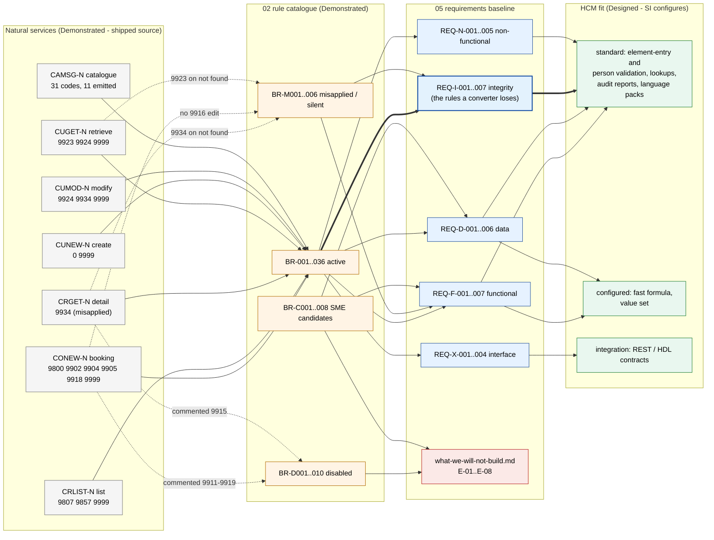
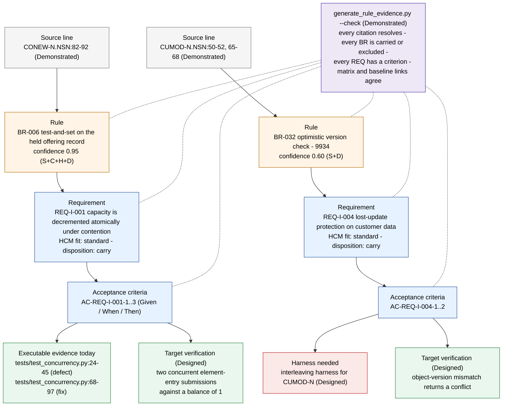

# Diagrams — requirements baseline

Mermaid source is the artifact of record; each `.mmd` file is reproduced below so the diagrams render on any Markdown viewer with Mermaid support. Rendered `.svg`/`.png` files, where present, were produced with `npx -y @mermaid-js/mermaid-cli -i <file>.mmd -o <file>.svg` from the same source. Labels carry the maturity tag: Demonstrated for what runs in this repository, Designed for the target-side steps an SI performs.

| File | Shows | Maturity |
|---|---|---|
| `requirement-coverage.mmd` | Which services feed which rule sections, which requirement classes carry them, which exclusions absorb the rest, and the HCM fit each class lands in | Demonstrated for source → rules → requirements; Designed for the HCM fit column |
| `traceability-view.mmd` | One thread each for the two integrity differentiators (capacity race, lost update): source line → rule → requirement → acceptance criteria → evidence today → target verification, with the generated check that binds them | Demonstrated for the booking thread (`tests/test_concurrency.py`); the customer thread is Designed until a `CUMOD-N` harness exists |

## Requirement coverage (`requirement-coverage.mmd`)

Reading left to right: seven Natural services produce four rule sections; the rule sections are carried by five requirement classes or by the exclusion list; each requirement class resolves to an HCM fit. Bold edges mark the integrity path — the requirements that exist only because the concurrency refactor was read as a requirement rather than as code to convert.



## Traceability view (`traceability-view.mmd`)

Two threads through the same chain. The first is fully Demonstrated: the defect and the fix both execute in `../../../tests/test_concurrency.py`. The second stops at "harness needed": the rule and the requirement are cited to source, the acceptance criteria are written, but no interleaving harness exists for `CUMOD-N` yet. The dotted node is `../../02-business-rule-extraction/generate_rule_evidence.py --check`, which fails if any link in either thread is broken.



## Reproduce the renders

```bash
cd fpps-hcm-modernization-deliverable/05-requirements-baseline/diagrams
for f in *.mmd; do
  npx -y @mermaid-js/mermaid-cli -i "$f" -o "${f%.mmd}.svg"
  npx -y @mermaid-js/mermaid-cli -i "$f" -o "${f%.mmd}.png"
done
```

## Synthetic data and scope

Both diagrams describe the Sunny Islands Cruise sample and the artifacts in this deliverable; no production system or production data is involved. The HCM-fit column is the analogy an SI applies, not an observation.

← [Back to the directory README](../README.md) · [Navigation hub](../../README.md)
