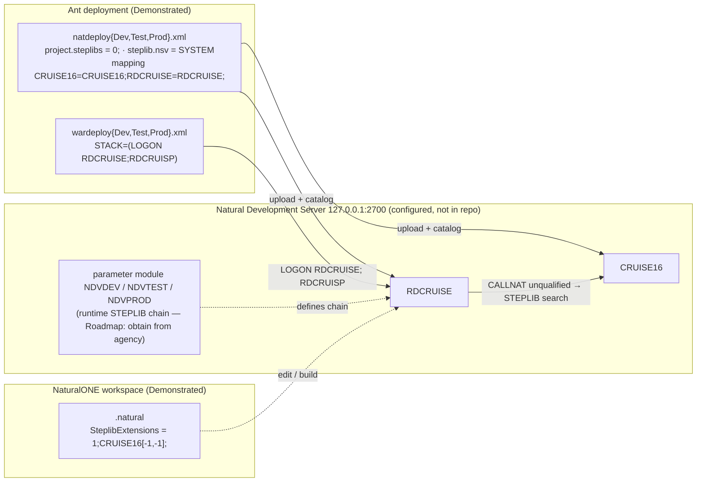
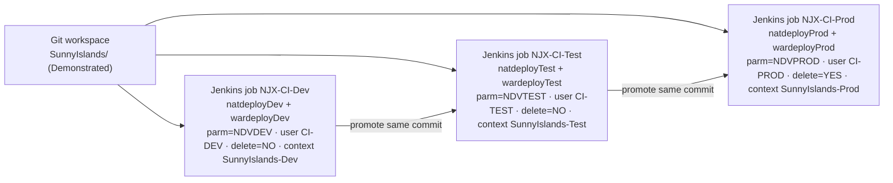

# Deployment configuration — what actually exists under `SunnyIslands/`

This document reads the deployment and project files that ship with the sample, states what each one configures, and explains the two things an SI needs from them: how Natural resolves objects across libraries (STEPLIB chaining) and how the same code base is promoted through development, test and production. Every value below was read from the cited file and line; nothing is inferred from documentation.

| | |
|---|---|
| **Maturity** | **Demonstrated** for every cited value. The FPPS column of the last section is analogy / Roadmap and is marked so. |
| **No credentials** | The deployment files carry empty `password` properties. `SunnyIslands/webconfig/web-inf/sessions.xml` is intentionally not read or quoted in this deliverable. |

## Files present

| File | Lines | Role | Exists |
|---|---|---|---|
| `SunnyIslands/deploy/natdeployDev.xml` | 480 | Ant script deploying the two Natural libraries to the **development** Natural Development Server | yes |
| `SunnyIslands/deploy/natdeployTest.xml` | 480 | same, **test** | yes |
| `SunnyIslands/deploy/natdeployProd.xml` | 480 | same, **production** | yes |
| `SunnyIslands/deploy/wardeployDev.xml` | 1275 | Ant script packaging the NJX user-interface component `CruisePages` as a WAR for **development** | yes |
| `SunnyIslands/deploy/wardeployTest.xml` | 1275 | same, **test** | yes |
| `SunnyIslands/deploy/wardeployProd.xml` | 1275 | same, **production** | yes |
| `SunnyIslands/.natural` | 74 | NaturalONE project properties: parser mode, environment (STEPLIB) settings, build sequence | yes |
| `SunnyIslands/.project` | 30 | Eclipse project descriptor: NaturalONE, NJX and testing builders | yes |

The three `natdeploy*.xml` files are identical except for five properties; the three `wardeploy*.xml` files are identical except for five properties (`diff` output summarised in the promotion tables below).

## Natural library deployment (`natdeploy*.xml`)

The generated Ant script has one `-setProperties` target whose property block is the entire environment definition (`SunnyIslands/deploy/natdeployDev.xml:45-87`). The properties an SI needs:

| Property | Dev value | Meaning | Evidence (Dev file) |
|---|---|---|---|
| `natural.ant.server.parameters` | `webio=on parm=NDVDEV` | Natural session parameters for the target Development Server; `parm=` names the Natural parameter module for that environment | `natdeployDev.xml:49` |
| `natural.ant.deploy.scope` | `3` | deployment scope selector (help text at `:26`) | `natdeployDev.xml:53` |
| `natural.ant.deploy.full` | `NO` | incremental deployment (help text at `:24-25`) | `natdeployDev.xml:57` |
| `natural.ant.library.steplib.nsv` | *(empty)* | no per-library STEPLIB system file override | `natdeployDev.xml:59` |
| `natural.ant.project.name` | `SunnyIslands` | | `natdeployDev.xml:68` |
| `natural.ant.project.rootdir` | `/var/lib/jenkins/workspace/NJX-CI-Dev/` | CI workspace the script builds from | `natdeployDev.xml:70` |
| `natural.ant.mapping.enable` / `natural.ant.mapping.string` | `NO` / `CRUISE16=CRUISE16;RDCRUISE=RDCRUISE;` | source library → target library mapping; disabled, so libraries keep their names | `natdeployDev.xml:72`, `:76` |
| `natural.ant.project.deploy.file.name` | `deploy/natdeployDev.xml` | the script names itself; used to build a per-environment cache/timestamp file (`cache_natdeployDev_SunnyIslands.properties`) | `natdeployDev.xml:73`, `:422-426` |
| `natural.ant.deploy.delete` | `NO` | do **not** delete server objects missing from the workspace | `natdeployDev.xml:74` |
| `natural.ant.server.hostname` / `port` / `environment` | `127.0.0.1` / `2700` / `127.0.0.1-2700` | the Development Server the Ant task connects to | `natdeployDev.xml:75`, `:67`, `:83` |
| `natural.ant.project.steplibs` | `0;` | project-level STEPLIB list is empty (count `0`) | `natdeployDev.xml:78` |
| `natural.ant.deploy.catalog` | `YES` | catalog (compile) on the server after upload | `natdeployDev.xml:81` |
| `natural.ant.library.steplibs` | *(empty)* | no library-level STEPLIB list | `natdeployDev.xml:82` |
| `natural.ant.server.username` / `password` | `CI-DEV` / *(empty)* | CI service user; password supplied at run time, not in the file | `natdeployDev.xml:85`, `:84` |
| `natural.ant.project.steplib.nsv` | `SYSTEM` | STEPLIB system file for the project | `natdeployDev.xml:86` |
| `natural.ant.repository.type` / `version` / `module` | `SVN` / `master` / `SunnyIslands` | the script can also check the project out of a repository before building (`checkout` / `update` targets at `:236`, `:319`) | `natdeployDev.xml:66`, `:62`, `:80` |

The `build` target (`natdeployDev.xml:386`) runs the `natantbuild` task (`:437-461`) and fails the job on a non-zero task exit code (`:462`).

## User-interface deployment (`wardeploy*.xml`)

| Property | Dev value | Meaning | Evidence (Dev file) |
|---|---|---|---|
| `natural.ant.ajax.appserver` | `Tomcat` | target servlet container | `wardeployDev.xml:36` |
| `natural.ant.ajax.project.rootdir` | `/var/lib/jenkins/workspace/NJX-CI-Dev` | CI workspace | `wardeployDev.xml:37` |
| `natural.ant.ajax.njx.licensefile` / `application` | `/var/lib/jenkins/sagnjx/njx84.xml` / `/var/lib/jenkins/sagnjx/njx84.war` | NJX runtime the page component is packaged into | `wardeployDev.xml:38`, `:45` |
| `natural.ant.ajax.web.context` | `SunnyIslands-Dev` | web context of the produced WAR | `wardeployDev.xml:47` |
| `natural.ant.ajax.project.uicomps` | `CruisePages=true;` | the single UI component deployed | `wardeployDev.xml:55-56` |
| `natural.ant.ajax.session.nwoparms` | `PARM=NDVDEV STACK=(LOGON RDCRUISE;RDCRUISP)` | **the runtime entry point**: log on to library `RDCRUISE` and start program `RDCRUISP` | `wardeployDev.xml:58` |
| `natural.ant.ajax.session.nwohost` / `nwoport` / `nwoapp` | `localhost` / `2900` / `nwo.sh` | Natural Web I/O server the web tier connects to | `wardeployDev.xml:40`, `:61`, `:50` |
| `natural.ant.ajax.njx.deploy.as.war` | `YES` | package as WAR (not export) | `wardeployDev.xml:51`, `:60` |

The `STACK=(LOGON RDCRUISE;RDCRUISP)` value is the configuration-side confirmation of the UI root used by `tools/analyze_disposition.py` (`UI_ROOT = "RDCRUISP"`, `tools/analyze_disposition.py:54`).

## STEPLIB chaining — how `RDCRUISE` finds `CRUISE16`

`RDCRUISP` issues `CALLNAT 'CUGET-N'` and its siblings without a library qualifier (`SunnyIslands/Natural-Libraries/RDCRUISE/Programs/RDCRUISP.NSP:514`). Natural resolves such a name by searching the current library, then each library in the session's STEPLIB chain, then `SYSTEM`. The sample configures this chain in **two** places that serve two moments:

| Moment | Where | Value | Evidence | What it means |
|---|---|---|---|---|
| Development-time (NaturalONE workspace) | `SunnyIslands/.natural` → `EnvironmentProperties/SteplibExtensions` | `1;CRUISE16[-1,-1];` | `SunnyIslands/.natural:55-61` | one extension entry: library `CRUISE16` with database/file `-1,-1` (resolve on the connected server) is appended to the STEPLIB chain, so objects in `RDCRUISE` can call `CRUISE16` objects while editing and building in the IDE. `SteplibNSV` and `LibrariesSteplibs` are empty. |
| Deployment-time (Ant) | `natdeploy*.xml` → `natural.ant.project.steplibs`, `natural.ant.project.steplib.nsv`, `natural.ant.library.steplibs`, `natural.ant.library.steplib.nsv` | `0;`, `SYSTEM`, *(empty)*, *(empty)* | `natdeployDev.xml:78`, `:86`, `:82`, `:59` | the deployment does **not** push a STEPLIB chain to the server; it uploads and catalogs both libraries and relies on the server-side environment (`parm=NDVDEV` / `NDVTEST` / `NDVPROD`) to define the runtime chain. |
| Run-time (web tier) | `wardeploy*.xml` → `natural.ant.ajax.session.nwoparms` | `PARM=NDVDEV STACK=(LOGON RDCRUISE;RDCRUISP)` | `wardeployDev.xml:58` | the session logs on to `RDCRUISE`; the `PARM=` module is where the runtime STEPLIB chain that includes `CRUISE16` lives. That parameter module is server-side and is **not in this repository**. |

Consequence for extraction: the cross-library edge list in [`dependency-map.md`](dependency-map.md) ("Cross-library edges") is complete for the *code*; the *runtime* chain that makes those calls resolvable is environment configuration. At FPPS scale the equivalent is the set of Natural parameter modules and Natural Security STEPLIB definitions per library, which have to be exported from the agency's servers (Roadmap; see [`fpps-interface-model.md`](fpps-interface-model.md)).

## Environment promotion — dev → test → prod

Promotion is *the same script with five property values changed*. The differences are the whole environment definition.

### Natural libraries

| Property | Dev | Test | Prod | Line (same in all three files) |
|---|---|---|---|---|
| `natural.ant.server.parameters` | `webio=on parm=NDVDEV` | `webio=on parm=NDVTEST` | `webio=on parm=NDVPROD` | `:49` |
| `natural.ant.project.rootdir` | `/var/lib/jenkins/workspace/NJX-CI-Dev/` | `/var/lib/jenkins/workspace/NJX-CI-Test/` | `/var/lib/jenkins/workspace/NJX-CI-Prod/` | `:70` |
| `natural.ant.project.deploy.file.name` | `deploy/natdeployDev.xml` | `deploy/natdeployTest.xml` | `deploy/natdeployProd.xml` | `:73` |
| `natural.ant.deploy.delete` | `NO` | `NO` | **`YES`** | `:74` |
| `natural.ant.server.username` | `CI-DEV` | `CI-TEST` | `CI-PROD` | `:85` |

Everything else — host `127.0.0.1`, port `2700`, mapping string, STEPLIB properties, catalog `YES`, incremental deployment — is identical across the three files (`diff` of `natdeployDev.xml` against `natdeployTest.xml` and `natdeployProd.xml` reports only the lines above).

Two facts an SI should carry into the HCM environment strategy:

1. **Environments are distinguished by the Natural parameter module and the CI user, not by host or port.** In the sample all three point at `127.0.0.1:2700`; the parameter module (`NDVDEV`/`NDVTEST`/`NDVPROD`) selects the environment. The analog in an HCM landscape is the pod/instance plus its configuration set, and the acceptance plan must state which instance each test runs against.
2. **Only production deletes.** `natural.ant.deploy.delete=YES` in `natdeployProd.xml:74` removes server objects that no longer exist in the workspace, so the production library is an exact image of the repository. Dev and test accumulate. For disposition work this means production is the environment whose object list can be trusted as "what is deployed" (Demonstrated for the sample; Roadmap for FPPS, where the equivalent evidence is the production Natural library listing).

### Web tier

| Property | Dev | Prod | Line |
|---|---|---|---|
| `natural.ant.ajax.project.rootdir` | `/var/lib/jenkins/workspace/NJX-CI-Dev` | `/var/lib/jenkins/workspace/NJX-CI-Prod` | `:37` |
| `natural.ant.ajax.deploy.file.name` | `wardeployDev.xml` | `deploy/wardeployProd.xml` | `:39` |
| `natural.ant.ajax.web.context` | `SunnyIslands-Dev` | `SunnyIslands-Prod` | `:47` |
| `natural.ant.ajax.project.description` | `SunnyIslands-Dev` | `SunnyIslands-Prod` | `:57` |
| `natural.ant.ajax.session.nwoparms` | `PARM=NDVDEV STACK=(LOGON RDCRUISE;RDCRUISP)` | `PARM=NDVPROD STACK=(LOGON RDCRUISE;RDCRUISP)` | `:58` |

(`wardeployTest.xml` follows the same pattern with `Test`/`NDVTEST`.) Note the inconsistency in `natural.ant.ajax.deploy.file.name`: Dev names the file without the `deploy/` prefix while Prod includes it (`wardeployDev.xml:39` vs `wardeployProd.xml:39`). It is harmless for the Ant run (the value is only used to derive cache file names) but is the kind of drift a promotion checklist should catch.

The Jenkins job names are taken from the workspace paths (`natdeployDev.xml:70` and siblings); no Jenkins job definition is in the repository, so the promotion *trigger* (manual, gated, scheduled) is not evidenced here.

## Project files (`.natural`, `.project`)

| Setting | Value | Evidence | Why it matters |
|---|---|---|---|
| Parser mode | `MAINFRAME_MODE`, `StructuredMode=true` | `SunnyIslands/.natural:26`, `:31` | The sample is parsed with mainframe rules and structured mode — the same dialect FPPS runs on z/OS, so the harness's source-parsing assumptions transfer |
| Keyword check | `true` | `.natural:22` | Object names cannot collide with keywords; relevant when generating inventories |
| Date format / decimal char | `INTERNATIONAL` / `.` | `.natural:18`, `:17` | Affects how dates and prices in the DDMs are interpreted by the harness |
| Data-area transformation | `INIT` | `.natural:50` | Data areas are stored in the newer text format (`natural.ant.generate.old.data.area.format=NO`, `natdeployDev.xml:58`) |
| STEPLIB extension | `1;CRUISE16[-1,-1];` | `.natural:57` | see STEPLIB chaining above |
| Private mode | `true` | `.natural:59` | each developer's workspace has a private server library; no shared-library edits |
| Build sequence | `D,G,L,A,4,M,8,3,S,N,7,H,P` | `.natural:69` | Object-type build order: DDMs, GDAs, LDAs, PDAs … subprograms, programs — the same dependency order the extraction waves follow (data areas before the code that `USING`s them) |
| Builders | `CISBuilder`, `naturalBuilder`, `testingBuilder` | `SunnyIslands/.project:9-23` | The project is built by the NJX page builder, the Natural builder and the NaturalONE unit-testing builder; the testing nature (`:28`) indicates the sample was set up for Natural unit tests |
| Referenced project | `ConstructRuntime` | `.project:6` | Eclipse project reference; not present in this repository |

### Discrepancy against the research report

The attached research report states that no `.natural` project file exists under `SunnyIslands/`. Direct inspection shows `SunnyIslands/.natural` (74 lines) **does** exist and carries the STEPLIB extension quoted above. This document follows the repository; the integrating session should correct the research report.

## What this means for FPPS (analogy — requires agency inputs)

| Sample evidence (Demonstrated) | FPPS equivalent (Roadmap) | Input the SI must obtain |
|---|---|---|
| `parm=NDVDEV/NDVTEST/NDVPROD` selects the environment | Natural parameter modules per LPAR / environment on z/OS 2.5 | NATPARM listings for each environment |
| `.natural` STEPLIB extension `CRUISE16` | Natural Security library definitions with STEPLIB chains across the 100k+ module estate | Natural Security export (SYSSEC) or Predict/XRef library cross-reference |
| `STACK=(LOGON RDCRUISE;RDCRUISP)` | Online entry transactions (LOGON + program) and the ~7,800 JCL jobs' `CMSYNIN` stacks for batch entry points | JCL library and Control-M job definitions |
| Jenkins jobs `NJX-CI-Dev/Test/Prod`, delete only in production | Change-management / promotion path (for example an SCM tool's promotion levels) | Promotion procedure and production library listing |
| `natural.ant.deploy.catalog=YES` | Catalog/STOW policy per environment | Build procedures |

None of these FPPS artifacts are in this repository; the tables above show exactly which sample fact each roadmap item generalises.

← [Back to the directory README](README.md) · [Navigation hub](../README.md)
