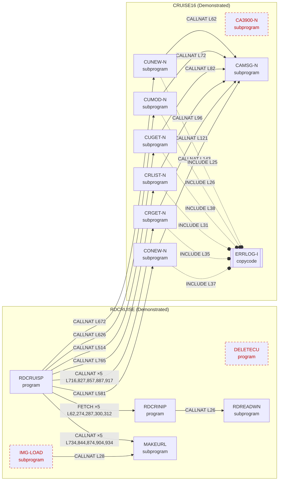
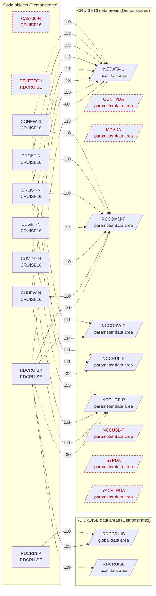

# Diagrams (generated)

Generated by `python3 fpps-hcm-modernization-deliverable/06-interface-dependency-mapping/generate_dependency_map.py` from `tools/analyze_disposition.py` and `tests/harness/source_parser.py`. **Do not edit by hand** — run the generator; `--check` fails if this file drifts.

The three generated diagrams are **Demonstrated** (rendered from analyzer output). Dashed red nodes are static candidates (unreferenced in analyzed scope or no UI path), not assertions of runtime deadness. Hand-authored diagrams for STEPLIB chaining, environment promotion and the FPPS interface model are embedded in `../deployment-config.md` and `../fpps-interface-model.md`; their Mermaid source and exports are copied here as `steplib-chain`, `environment-promotion` and `fpps-interface-model` when a renderer was available. The FPPS interface model diagram is labelled Roadmap on its right-hand side.

Exported images (generated diagrams): `dependency-graph.svg`, `dependency-graph.png`, `data-area-usage.svg`, `data-area-usage.png`, `event-contract.svg`, `event-contract.png`.

Authored diagram files: `steplib-chain.mmd`, `steplib-chain.svg`, `steplib-chain.png`, `environment-promotion.mmd`, `environment-promotion.svg`, `environment-promotion.png`, `fpps-interface-model.mmd`, `fpps-interface-model.svg`, `fpps-interface-model.png`.

## Dependency graph — CALLNAT / FETCH / INCLUDE (`dependency-graph.mmd`)

## Data-area usage — USING (`data-area-usage.mmd`)

## NJX event contract (`event-contract.mmd`)

```mermaid
%% Generated by generate_dependency_map.py — NJX page events → adapter → services (Demonstrated)
flowchart LR
  subgraph page["rdcruisx.xml — declared events (Demonstrated)"]
    ev_onBookingClose(["onBookingClose"])
    ev_onBookingSave(["onBookingSave"])
    ev_onFav1button(["onFav1button"])
    ev_onFav2button(["onFav2button"])
    ev_onFav3button(["onFav3button"])
    ev_onFav4button(["onFav4button"])
    ev_onFavorites(["onFavorites"])
    ev_onHome(["onHome"])
    ev_onHotcruises(["onHotcruises"])
    ev_onLoginClose(["onLoginClose"])
    ev_onLoginbutton(["onLoginbutton"])
    ev_onLoginicon(["onLoginicon"])
    ev_onLogouticon(["onLogouticon"])
    ev_onMydataClose(["onMydataClose"])
    ev_onMydataSave(["onMydataSave"])
    ev_onMydataicon(["onMydataicon"])
    ev_onNewdataicon(["onNewdataicon"])
    ev_onSeten(["onSeten"])
    ev_onSetge(["onSetge"])
    ev_onSetpo(["onSetpo"])
    ev_onSetsp(["onSetsp"])
    ev_onShowAll(["onShowAll"])
    ev_onShowdetails1(["onShowdetails1"])
    ev_onShowdetails2(["onShowdetails2"])
    ev_onShowdetails3(["onShowdetails3"])
    ev_onShowdetails4(["onShowdetails4"])
    ev_onpvLineClick(["onpvLineClick"])
  end
  subgraph adapter["RDCRUISP handlers (Demonstrated)"]
    sub_CUSTLOGIN["PERFORM CUSTLOGIN"]
    sub_CUSTLOGOUT["PERFORM CUSTLOGOUT"]
    sub_FILL_CRUISEDETAILS["PERFORM FILL-CRUISEDETAILS"]
    sub_GDA2PV["PERFORM GDA2PV"]
    sub_INI_OFFERS["PERFORM INI-OFFERS"]
    sub_INIMENUTEXT["PERFORM INIMENUTEXT"]
    sub_MAKE_ALLUNVISIBLE["PERFORM MAKE-ALLUNVISIBLE"]
    sub_SHOWALL["PERFORM SHOWALL"]
    sub_UPDATEBOOKING["PERFORM UPDATEBOOKING"]
    sub_UPDATEMYDATA["PERFORM UPDATEMYDATA"]
    direct["inline handler logic"]
  end
  subgraph services["Services reached"]
    svc_CONEW_N["CONEW-N"]
    svc_CRGET_N["CRGET-N"]
    svc_CRLIST_N["CRLIST-N"]
    svc_CUGET_N["CUGET-N"]
    svc_CUMOD_N["CUMOD-N"]
    svc_CUNEW_N["CUNEW-N"]
    svc_MAKEURL["MAKEURL"]
    svc_RDCRINIP["RDCRINIP"]
  end
  ev_onBookingClose -->|L232| sub_MAKE_ALLUNVISIBLE
  ev_onBookingSave -->|L171| sub_UPDATEBOOKING
  ev_onFav1button -->|L331| sub_SHOWALL
  ev_onFav1button -->|L331| sub_MAKE_ALLUNVISIBLE
  ev_onFav2button -->|L340| sub_SHOWALL
  ev_onFav2button -->|L340| sub_MAKE_ALLUNVISIBLE
  ev_onFav3button -->|L349| sub_SHOWALL
  ev_onFav3button -->|L349| sub_MAKE_ALLUNVISIBLE
  ev_onFav4button -->|L358| sub_SHOWALL
  ev_onFav4button -->|L358| sub_MAKE_ALLUNVISIBLE
  ev_onFavorites -->|L197| sub_MAKE_ALLUNVISIBLE
  ev_onHome -->|L123| sub_MAKE_ALLUNVISIBLE
  ev_onHotcruises -->|L189| sub_INI_OFFERS
  ev_onHotcruises -->|L189| sub_MAKE_ALLUNVISIBLE
  ev_onLoginClose -->|L177| sub_CUSTLOGOUT
  ev_onLoginbutton -->|L159| sub_CUSTLOGIN
  ev_onLoginicon -->|L138| direct
  ev_onLogouticon -->|L240| sub_CUSTLOGOUT
  ev_onLogouticon -->|L240| sub_MAKE_ALLUNVISIBLE
  ev_onMydataClose -->|L204| sub_MAKE_ALLUNVISIBLE
  ev_onMydataSave -->|L165| sub_UPDATEMYDATA
  ev_onMydataicon -->|L253| sub_MAKE_ALLUNVISIBLE
  ev_onNewdataicon -->|L148| sub_CUSTLOGOUT
  ev_onNewdataicon -->|L148| sub_MAKE_ALLUNVISIBLE
  ev_onSeten -->|L284| sub_GDA2PV
  ev_onSeten -->|L284| sub_INIMENUTEXT
  ev_onSeten ==>|FETCH inline| svc_RDCRINIP
  ev_onSetge -->|L271| sub_GDA2PV
  ev_onSetge -->|L271| sub_INIMENUTEXT
  ev_onSetge ==>|FETCH inline| svc_RDCRINIP
  ev_onSetpo -->|L297| sub_GDA2PV
  ev_onSetpo -->|L297| sub_INIMENUTEXT
  ev_onSetpo ==>|FETCH inline| svc_RDCRINIP
  ev_onSetsp -->|L309| sub_GDA2PV
  ev_onSetsp -->|L309| sub_INIMENUTEXT
  ev_onSetsp ==>|FETCH inline| svc_RDCRINIP
  ev_onShowAll -->|L321| sub_SHOWALL
  ev_onShowAll -->|L321| sub_MAKE_ALLUNVISIBLE
  ev_onShowdetails1 -->|L367| sub_FILL_CRUISEDETAILS
  ev_onShowdetails1 -->|L367| sub_MAKE_ALLUNVISIBLE
  ev_onShowdetails2 -->|L378| sub_FILL_CRUISEDETAILS
  ev_onShowdetails2 -->|L378| sub_MAKE_ALLUNVISIBLE
  ev_onShowdetails3 -->|L388| sub_FILL_CRUISEDETAILS
  ev_onShowdetails3 -->|L388| sub_MAKE_ALLUNVISIBLE
  ev_onShowdetails4 -->|L398| sub_FILL_CRUISEDETAILS
  ev_onShowdetails4 -->|L398| sub_MAKE_ALLUNVISIBLE
  ev_onpvLineClick -->|L408| sub_FILL_CRUISEDETAILS
  ev_onpvLineClick -->|L408| sub_MAKE_ALLUNVISIBLE
  sub_CUSTLOGIN -->|CALLNAT| svc_CUGET_N
  sub_FILL_CRUISEDETAILS -->|CALLNAT| svc_CRGET_N
  sub_FILL_CRUISEDETAILS -->|CALLNAT| svc_MAKEURL
  sub_INI_OFFERS -->|CALLNAT| svc_CRGET_N
  sub_INI_OFFERS -->|CALLNAT| svc_MAKEURL
  sub_SHOWALL -->|CALLNAT| svc_CRLIST_N
  sub_UPDATEBOOKING -->|CALLNAT| svc_CONEW_N
  sub_UPDATEMYDATA -->|CALLNAT| svc_CUMOD_N
  sub_UPDATEMYDATA -->|CALLNAT| svc_CUNEW_N
```

