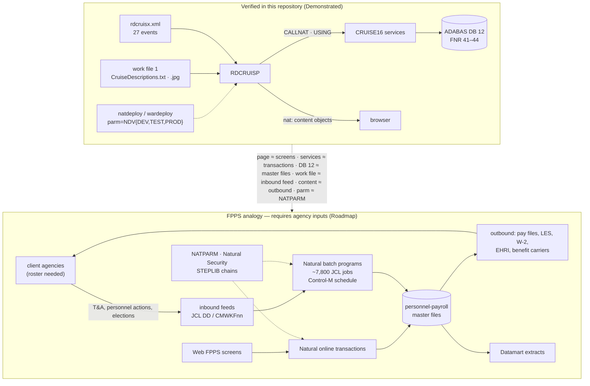

# FPPS interface model — from the sample's touch-points to an agency-scale interface inventory

The sample has a small, fully enumerable set of places where control or data crosses a boundary: page events, cross-library service calls, ADABAS files, work files, content objects, and per-environment deployment parameters. FPPS has the same *kinds* of boundary, thousands of times over, plus ones the sample does not have (agency feeds, datamarts, scheduled batch). This document keeps the two strictly apart.

| Column | Meaning |
|---|---|
| **Verified in this repository (Demonstrated)** | A fact about the Sunny Islands sources or configuration, with a citation you can open |
| **FPPS analogy / requires agency inputs (Roadmap)** | How the same category presents in FPPS and which agency artifact is needed before the SI can enumerate it. Nothing in this column is evidenced in this repository |
| **Designed** | A method specified against the sample and runnable here, not yet executed at FPPS scale |

Public context used: the Interior Business Center describes itself as a shared service provider of payroll operations for the Department of the Interior and other federal agencies, and lists FPPS, Datamart, webTA, Quicktime, EODS and EHRI requirements among its HR systems (https://ibc.doi.gov/HRD/payroll, opened in this authoring session). Scale figures (Natural 9.x / ADABAS 8.6 / z/OS 2.5, ~7M lines of Natural, 100k+ modules, ~7,800 JCL jobs) are the framing given in the hub README, not derived here.

## 1. Interface categories, side by side

| Category | Verified in this repository (Demonstrated) | FPPS analogy / requires agency inputs (Roadmap) |
|---|---|---|
| **Online entry point** | One page contract: `rdcruisx.xml` declares 27 events, all handled in `RDCRUISP` (`dependency-map.md` → "NJX event contract"); session started by `STACK=(LOGON RDCRUISE;RDCRUISP)` (`SunnyIslands/deploy/wardeployDev.xml:58`) | Web FPPS screens and their Natural transaction programs; the list comes from Natural Security / menu definitions and the web tier's session configuration. **Input:** Natural Security export, web application configuration |
| **Service contract between libraries** | every cross-library edge `RDCRUISE → CRUISE16` (`USING` of the shared PDAs/LDA and `CALLNAT` of the services), listed with source lines in `dependency-map.md` → "Cross-library edges"; parameter shapes in `NCCOMM-P.NSA:9-16`, `NCCUGE-P.NSA:11-29`, `NCCRUL-P.NSA:10-30`, `NCCONW-P.NSA:10-18` | Same pattern across 100k+ modules: which library calls which, through which PDAs. **Input:** Predict/XRef "objects referenced" data (the Predict *Verify Application Integrity* functions enumerate referenced-but-not-implemented and implemented-but-not-referenced objects: https://documentation.softwareag.com/natural/prd852/webhelp/prd-webhelp/reference/natxref_verify_9.htm, opened in this authoring session) |
| **Database** | 4 ADABAS files on DB 12 (FNR 41–44), 3 writers, all verbs per object in `../01-discoverability-comprehension-baseline/module-inventory.md` → "ADABAS files" | Personnel-payroll master files, history files, tables. **Input:** Predict file/DDM export, ADABAS FDTs, file-usage cross-reference |
| **Inbound files (work files)** | `RDREADWN` reads a language-tagged text file as work file 1 (`RDREADWN.NSN:35-36`); `IMG-LOAD` reads `.jpg` files as unformatted work file 1 (`IMG-LOAD.NSN:23-26`). Both paths are hard-coded, one of them a Windows developer path | Agency → FPPS feeds: time and attendance, personnel actions, benefits elections, address and banking changes, arriving as datasets read by Natural batch programs under JCL. **Input:** JCL `DD` statements for `CMWKF01`–`CMWKF32`, record layouts, sending-system list per agency |
| **Outbound content / files** | `MAKEURL` emits binary content objects to the browser as `nat:` URLs (`MAKEURL.NSN:40-46`); no `WRITE WORK` on any executable line (the only ones are commented out in `ERRLOG-I.NSC:11-21`) | FPPS → agency and FPPS → Treasury/OPM/benefit-carrier outputs: pay files, leave and earnings statements, W-2, retirement and EHRI submissions. **Input:** JCL output `DD`s, transmission job definitions, recipient list |
| **Datamarts / reporting extracts** | none — the sample has no reporting extract | FPPS → Datamart loads (the IBC HR systems list includes a Datamart). **Input:** extract job definitions, target schema, refresh schedule |
| **Batch orchestration** | none — no JCL and no scheduler definition is in the repository; the only schedule-like artifacts are the three Jenkins workspace paths in `natdeploy*.xml:70` | ~7,800 JCL jobs orchestrated by Control-M: job → step → program → datasets, with predecessor conditions and calendars. **Input:** JCL libraries, Control-M job definitions / XML export, run-history logs |
| **Environment configuration** | `parm=NDVDEV/NDVTEST/NDVPROD`, CI users, delete-on-production (`deployment-config.md`) | NATPARM modules, Natural Security, STEPLIB chains per environment. **Input:** NATPARM listings, SYSSEC export |
| **Logging / audit** | `ERRLOG-I` would write an error log to `/tmp/err.log` but every line is commented out (`ERRLOG-I.NSC:8-21`) | Payroll audit trails, error and exception logs, SLA reporting. **Input:** log dataset definitions, retention rules |
| **Client agencies** | none — the sample has one tenant | Many client agencies, each with its own feeds, pay-period calendar, and output set. **Input:** agency roster with interface variants |

## 2. Why the sample's touch-points are a valid template

Each sample touch-point is one instance of a boundary type the agency-scale inventory must enumerate. The analyzer in this repository already extracts the sample instances mechanically; the same extraction, pointed at Natural sources at scale, yields the code side of every row above. The configuration side (JCL, Control-M, NATPARM) has no counterpart in the repository and has to be supplied.

## 3. What the analyzer already does that transfers (Designed)

| Capability | Runs here today on | At FPPS scale needs |
|---|---|---|
| Static edge extraction: `CALLNAT`, `FETCH`, `INCLUDE`, `USING` with source lines (`tools/analyze_disposition.py` → `references`) | the 15 code objects and every static edge in `dependency-map.md` | the Natural source export (or Predict XRef data as an alternative source of the same edges) |
| Reachability from a root (`UI_ROOT = "RDCRUISP"`, `tools/analyze_disposition.py:54`) | one root, from the web-tier `STACK=` | one root per online transaction **and** one per JCL step `PGM=`/`CMSYNIN` stack — the JCL supplies the batch roots |
| Dynamic-invocation count (`CALLNAT #VAR`) | 0 in the sample | the same count is the ceiling on how much of the estate static analysis can resolve; Predict's guidance to avoid dynamic invocation applies |
| Page-event contract: declared vs handled events | every declared event in `rdcruisx.xml` (no unhandled events; see `dependency-map.md`) | screen-map or Natural map definitions per transaction |
| External touch-point scan: `DEFINE WORK FILE`, `READ/WRITE WORK`, `XCIOBJECTS` (`generate_dependency_map.py`) | the work-file statements in `RDREADWN` / `IMG-LOAD` and content-object statements in `MAKEURL` / `IMG-LOAD` / `RDCRUISP` tabulated in `dependency-map.md` | the same scan plus the JCL `DD` names that bind `CMWKFnn` to datasets — the code side is Demonstrated, the dataset side is Roadmap |
| Environment diff (`natdeployDev/Test/Prod.xml`) | the five differing properties per environment (`deployment-config.md`) | NATPARM and Control-M definitions per environment |

## 4. Interface inventory the SI should produce (Roadmap)

The output format below is what the sample tables already look like; the rows come from agency inputs.

| Column | Sample example (Demonstrated) | FPPS source |
|---|---|---|
| Interface id | `rdcruisx.xml#onBookingSave` | JCL job + step, or transaction code |
| Direction | inbound (page → adapter) | inbound / outbound / bidirectional |
| Counterparty | browser | agency, Treasury, OPM, carrier, Datamart |
| Carrier | NJX page event | dataset, MQ, file transfer, screen |
| Natural entry object | `RDCRUISP` handler line 171 → `UPDATEBOOKING` → `CONEW-N` | `PGM=` / `CMSYNIN` stack → program |
| Data contract | `NCCONW-P.NSA:10-18` | PDA / record layout / copybook-equivalent LDA |
| Files touched | `NCCUSTOMER`, `NCCRUISE`, `NCCONTRACT` | Predict file usage |
| Schedule | on demand | Control-M calendar / predecessor |
| Environment variants | `NDVDEV/NDVTEST/NDVPROD` | per LPAR / environment |
| HCM target | booking → HCM transaction with approval | HCM Data Loader object, integration flow, or report |

For HCM Data Loader targets, the load order and key strategy follow Oracle's documented practice: one object type per `.zip`, referenced data loaded before referencing data, source keys preferred so records can be updated later (https://docs.oracle.com/en/cloud/saas/human-resources/fahdl/hcm-data-loader-best-practices.html and https://docs.oracle.com/en/cloud/saas/human-resources/fahdl/guidelines-for-preparing-the-source-data.html, both opened in this authoring session). The extraction waves in `../01-discoverability-comprehension-baseline/discoverability-report.md` already order the sample's objects the same way (data areas and leaf services before writers).

## 5. Open inputs

| Needed from the agency | Unblocks |
|---|---|
| JCL libraries for the ~7,800 jobs | batch roots for reachability; inbound/outbound dataset inventory |
| Control-M job definitions and calendars | schedule column; predecessor graph |
| Predict / XRef export (or Natural source export) | full edge list at scale; implemented-but-not-referenced candidates |
| NATPARM listings and Natural Security export | STEPLIB chains per environment; online roots |
| Client agency roster with interface variants | counterparty column; per-agency acceptance scenarios |
| Datamart target schemas and refresh jobs | reporting extract mapping |

Until these arrive, everything in the right-hand columns above stays labelled Roadmap.

← [Back to the directory README](README.md) · [Navigation hub](../README.md)
