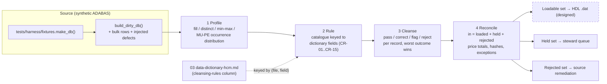
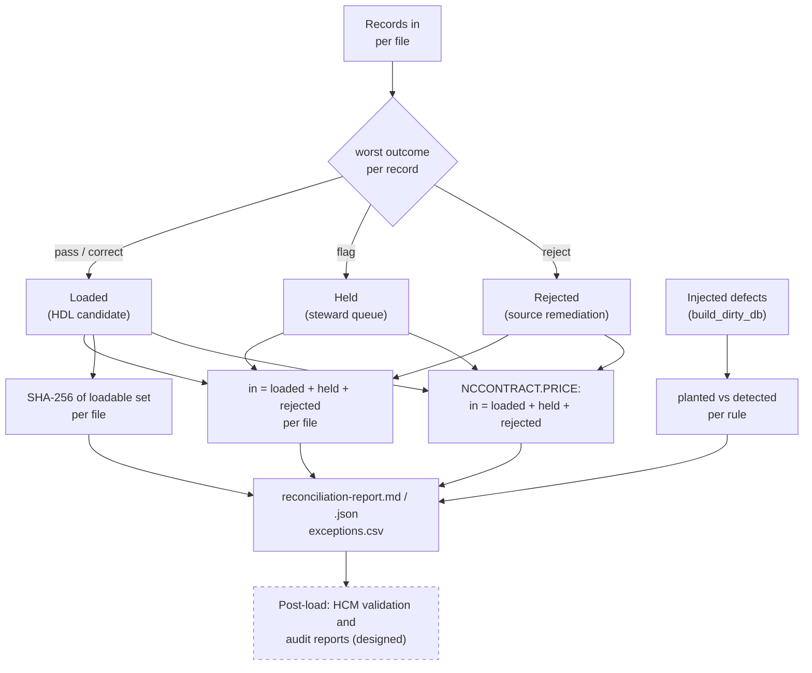

# Cleansing approach: profile → rule → cleanse → reconcile

The purpose of this page is to give a payroll SI a method for legacy master data that can be executed before a single HCM Data Loader file is built, and to show that method running on the Sunny Islands Cruise sample. Everything demonstrated here runs from `harness/cleanse_reconcile.py` on synthetic data; every step that needs FPPS-scale inputs is labelled (designed) or (roadmap). Python appears only as the validation and cleansing harness. It is not, and must not become, a rewrite target: the cleansed rules are implemented as HCM configuration, HDL transformations and steward procedures, and the harness exists to prove those rules are right.

## The four steps

Mermaid source: `diagrams/cleansing-pipeline.mmd` (exports `.png`, `.svg`).

| Step | What happens | Demonstrated in the harness | FPPS-scale form (designed) |
|---|---|---|---|
| 1 Profile | Every field of every file is measured before any rule runs: fill count, distinct count, min/max, and for multiple-value (MU) and periodic (PE) fields the distribution of occurrence counts | `profile()` → `sample-output/profile.md`. Shows, for example, that `CRUISE-STATUS` carries more distinct values than the ten-digit domain allows, and how `EMAIL` occurrence counts are distributed | Same measures per DDM, run on a full extract; the MU/PE distributions decide the target row explosion (how many `PersonEmail` / `PersonPhone` rows) before mapping |
| 2 Rule | A catalogue of rules, each keyed to one or more `(file, field)` pairs of the dictionary, with a category, a default action, source evidence and a payroll analog | `RULES` in `harness/cleanse_reconcile.py` → `sample-output/rule-catalogue.md`; `cleansing-rules.md` explains each; `--check` fails if the two disagree on rule IDs, and the 03 generator fails if a rule names a field the DDMs do not have | Rules authored per dictionary field from code evidence (edit paths, message codes) and SME review; the same three-way tie (dictionary ↔ rule ↔ document) is kept mechanically |
| 3 Cleanse | Each record is evaluated by every rule of its file; each rule returns `pass`, `correct` (value changed, logged), `flag` (loadable in principle but held for a steward) or `reject` (not loadable). A record's disposition is its worst outcome | `apply_rules()`; corrections are applied to a copy so the source is never mutated; every non-pass outcome is one exception row | Corrections become HDL transformation rules or pre-load SQL; flags become steward work items; rejects go back to the source owner with the exception list |
| 4 Reconcile | Counts and totals prove nothing was lost or invented: per file `in = loaded + held + rejected`; per rule evaluated/passed/corrected/flagged/rejected; control totals on the transaction file; a content hash of each loadable set; the injected-defect list versus detections | `reconcile()` → `sample-output/reconciliation-report.md` / `.json`, `exceptions.csv` | Same report per wave, plus post-load verification with the HCM-side validation and audit reports (see "Post-load verification") |

## Source keys and crosswalks

| Source key | File | How the source generates it | HDL treatment (designed) | Crosswalk artefact (designed) |
|---|---|---|---|---|
| `PERSON-ID` | `NCCUSTOMER` | MAX+1 under record hold (`CUNEW-N.NSN:41-46`); uniqueness is a code-path convention, not an ADABAS constraint | `Worker.SourceSystemId` with one `SourceSystemOwner` for the estate; `PersonNumber` either carried or generated per client policy | `PERSON-ID` → `SourceSystemId` → `PersonId` / `PersonNumber` after load; the harness emits the loaded key list and count per file |
| `CONTRACT-ID` | `NCCONTRACT` | MAX+1 under record hold (`CONEW-N.NSN:96-102`) | `ElementEntry.SourceSystemId` | `CONTRACT-ID` → `SourceSystemId`; parent resolved via `ID-CUSTOMER` crosswalk |
| `CRUISE-ID` | `NCCRUISE` | Catalogue data; looked up by `FIND` and `READ BY` | `Position.SourceSystemId` (or Element) | `CRUISE-ID` → `SourceSystemId`; parent via `ID-YACHT` |
| `YACHT-ID` | `NCYACHT` | Catalogue data | `Organization.SourceSystemId` | `YACHT-ID` → `SourceSystemId` |
| ISN | all | Assigned by ADABAS on store; reused after delete | Never loaded, never a key | Row handle inside one harness run only |

Oracle's HDL guidance recommends source keys for all implementations because they remain usable for updates when user-key attributes change (the very attribute being corrected is often the one that identifies the record). The harness keeps ISN and business key apart on purpose: `reconcile()` reports `isn_is_not_a_business_key: true` per file in the JSON, and the duplicate rules (CR-12, CR-14) are the proof that business-key uniqueness has to be tested rather than assumed.

## Relationship checks

The sample has three foreign keys and no ADABAS-enforced referential integrity; validation lives in `CONEW-N` and only for the two keys a booking supplies. The payroll analogs are the checks Oracle lists first in its source-data guidance: every worker has a manager, every job and position exists, and history is accurate.

| Check | Sample rule (demonstrated) | Payroll analog (designed) | What the harness proves |
|---|---|---|---|
| Transaction → person | CR-01: `NCCONTRACT.ID-CUSTOMER` must exist as `NCCUSTOMER.PERSON-ID` | Pay transaction / element entry keyed to an employee who is not in the person master | Every planted orphan (including the row with both keys orphaned) is rejected and its price is carried in the control total; counts in `reconciliation-report.md` |
| Transaction → position / element | CR-02: `NCCONTRACT.ID-CRUISE` must exist as `NCCRUISE.CRUISE-ID` | Element entry referencing a retired element or an unknown position | Every planted orphan is rejected; counts in `reconciliation-report.md` |
| Position → organisation / department | CR-03: `NCCRUISE.ID-YACHT` must exist as `NCYACHT.YACHT-ID` | Position whose department was merged or renamed | The planted orphan is held, not rejected: a catalogue row with a resolvable parent is not lost |
| Manager / supervisor | Not present in the sample: no `NCCUSTOMER` field references another customer | Every worker needs a supervisor assignment; broken supervisor chains fail the load or create headless organisations | (designed) Same shape as CR-01: a self-referencing key on the person file checked against the loaded person set, with cycle detection added |
| Organisation / department hierarchy | Not present: `NCYACHT` is flat | Department tree must be acyclic and rooted; every position points at a leaf or an allowed node | (designed) Parent-key check plus tree walk on the organisation file, run before positions |
| Job / position | `NCCRUISE` stands in for position; `CRUISE-STATUS` is the open-headcount counter (CR-04) | Position must exist, be active on the assignment effective date, and have headcount | (designed) Add the effective-date window check once positions carry dates; the sample's `START-DATE` / `END-DATE` are the fields it would use |

## Effective-dated history

The sample stores a single current row per customer with a `TIMESTAMP` that serves as an optimistic-lock token (`CUMOD-N.NSN:50-67`); it keeps no history. Payroll master data in the target is effective-dated, so the SI has to decide what history to construct and how to prove it.

| Aspect | Sample evidence | Approach (designed) |
|---|---|---|
| What the source records | `NCCUSTOMER.TIMESTAMP` = last update instant (`*TIMESTMP`); `NCCONTRACT.DATE-BOOKING` = transaction date from `*DATN` (`CONEW-N.NSN:105-106`) | Use `DATE-BOOKING` as `EffectiveStartDate` of the transaction row; use the extract cut-off (max `TIMESTAMP`) as the effective date of the initial person snapshot |
| Missing audit token | CR-11 flags rows whose `TIMESTAMP` is absent (the source could not have run its own concurrency check on them) | Held for a steward; they indicate rows written outside the maintained code path |
| Future or invalid dates | CR-10 (birth date), CR-15 (booking date) reject non-calendar values and treat dates after the as-of date as rejects (birth) or flags (booking) | Same rules on hire, termination, and element effective dates; HDL rejects overlapping date-effective rows, so the harness should reject them first |
| Whether to load history at all | Not applicable to the sample | Decide per object whether to load full history or key events (hire, promotion, termination), following Oracle's source-data guidance; the harness's per-rule counts become the acceptance evidence for the chosen option |

## Field-lineage checks

A lineage check asks whether the column the DDM offers is the column the code writes. The sample has one clear case and the harness executes it.

| Field pair | Evidence | Rule | Cleansing decision |
|---|---|---|---|
| `FIRST-NAME-OLD` versus `FIRST-NAME-1` | `FIRST-NAME-OLD` is written by `CUNEW-N.NSN:48` and `CUMOD-N.NSN:53` and read by `CUGET-N.NSN:96`; `FIRST-NAME-1` is filled by the adapter (`RDCRUISP.NSP:619`, `:663`) into the PDA (`NCCUGE-P.NSA:29`) but never moved to the DB view, whose declaration is commented out (`NCDATA-L.NSL:56`) | CR-13 | Target `FirstName` = `FIRST-NAME-OLD`; when blank, derive from `FIRST-NAME-1` (correct); when both present and different, hold (flag); when `SURNAME` blank, reject |
| `COUNTRY`, `SEX` | Read by `CUGET-N.NSN:94`, `:99`; never written by `CUNEW-N` / `CUMOD-N` | CR-05, CR-09 | Values can only have arrived outside the maintained UI path; profile fill rate before deciding whether the attribute is mapped or defaulted |
| `EMAIL(1..n)` | Only occurrence 1 is read or written | CR-06 | Occurrence 1 is the primary e-mail; other occurrences are exploded to rows but held for a steward because no code ever validated them |
| `PHONE` group | No Natural object references it; occurrence meaning comes from the DDM remark alone | CR-07 | Map by position (1 home, 2 work) only if profiling shows the group is populated; otherwise route to 10 for disposition |

On the FPPS analogy (designed), the same check is run for every attribute pair that survived more than one screen generation: the survivor is the column the current edit path writes, established from source, and the other column becomes a fallback with an explicit rule rather than a silent second mapping.

## Reconciliation

Mermaid source: `diagrams/reconciliation.mmd` (exports `.png`, `.svg`).

| Control | Why it is there | Where it is in the output |
|---|---|---|
| Record balance per file | Nothing lost, nothing invented between extract and load | `reconciliation-report.md` "Record counts per file" (column "In = loaded + held + rejected") |
| Per-rule counts | Each rule's effect is visible and can be compared wave over wave | "Outcome per rule" |
| Transaction amount total | Booking ≈ pay transaction: the amount in must equal loaded + held + rejected to the third decimal | "Control totals" |
| Distinct person count | Duplicate handling is visible: distinct `PERSON-ID` in versus loaded | "Control totals" |
| Bookings per position | Position-level count that the target can reproduce after load | `reconciliation-report.json` `control_totals.bookings_per_cruise_loaded` |
| Loadable-set hash | Two runs on the same extract must produce identical loadable sets; a changed hash means a changed rule or changed data | "Loadable-set content hashes" |
| Planted versus detected | The harness is only trustworthy if it finds what was planted and nothing unplanned | "Injected defects versus detections" against "Outcome per rule" |
| Exception list | The steward's work list: file, ISN, business key, rule, field, outcome, message | `exceptions.csv` and the report's last section |

### Post-load verification (designed)

After the HDL load, the target side has its own reports that close the loop on the same controls: a payroll data validation report for missing or non-compliant statutory person data, a worker validation report per legal employer, and balance exception reports once a payroll is calculated. The acceptance-test plan pairs each harness control with one of these: record balance ↔ worker validation counts; transaction amount total ↔ balance exception report on the first parallel run; steward queue ↔ data validation report exceptions. Source: Oracle, *Summary of Data Validation and Audit Reports*, https://docs.oracle.com/en/cloud/saas/human-resources/fapua/data-validation-and-audit-reports.html (opened 2026-09-03; the page is written for one legislation but the report family is generic).

## Sample-to-FPPS analogy (designed)

| Sample | FPPS | Consequence for the method |
|---|---|---|
| A few hundred synthetic customers and bookings (counts in `sample-output/reconciliation-report.md`), fifteen rules | Person and transaction files at agency scale, hundreds of rules | The harness's per-rule counts and hashes are the unit of wave-over-wave comparison; the structure does not change with volume |
| Rules keyed to `(file, field)` pairs in the dictionary | Rules keyed to the DDM dictionary generated for the estate | The three-way tie (dictionary ↔ rule ↔ document) is mechanical, so no rule can silently reference a field that was retired |
| Booking validates two foreign keys at store time only | Online edits validate; batch loads may not | Orphan profiling is always run on the extract, never inferred from the edit path |
| `TIMESTAMP` as optimistic-lock token | Last-update audit fields | Extract cut-off and "rows written outside the maintained path" detection |
| Two first-name columns | Attributes maintained through successive screen generations | Survivor selection from code evidence with an explicit fallback rule |

## Traceability

| Claim | Evidence | Evidence class |
|---|---|---|
| Foreign-key validation happens only in `CONEW-N`, for `ID-CUSTOMER` and `ID-CRUISE` | `SunnyIslands/Natural-Libraries/CRUISE16/Subprograms/CONEW-N.NSN:79-83`, `:109-110`, `:157-162` | Source statement |
| Yacht join resolved on read only | `SunnyIslands/Natural-Libraries/CRUISE16/Subprograms/CRLIST-N.NSN:80-83` | Source statement |
| `CRUISE-STATUS` decremented under hold; listing skips zero | `CONEW-N.NSN:82-92`; `CRLIST-N.NSN:53-57` | Source statement |
| Optimistic-lock check on `TIMESTAMP` | `SunnyIslands/Natural-Libraries/CRUISE16/Subprograms/CUMOD-N.NSN:50-67` | Source statement |
| Booking date from `*DATN` | `CONEW-N.NSN:105-106` | Source statement |
| Birth date handling differs between new and modify paths | `SunnyIslands/Natural-Libraries/CRUISE16/Subprograms/CUNEW-N.NSN:54`; `CUMOD-N.NSN:59-61` | Source statement |
| First-name lineage | `RDCRUISE/Programs/RDCRUISP.NSP:619`, `:663`; `CRUISE16/Parameter Data Areas/NCCUGE-P.NSA:21`, `:29`; `CRUISE16/Local Data Areas/NCDATA-L.NSL:44-45`, `:56`; `CUNEW-N.NSN:48`; `CUMOD-N.NSN:53`; `CUGET-N.NSN:96` | Source statement |
| `COUNTRY` and `SEX` read but never written by the maintained path | `CUGET-N.NSN:94`, `:99`; absence in `CUNEW-N.NSN:46-56` and `CUMOD-N.NSN:53-62` | Source statement |
| `PHONE` group unreferenced in analyzed scope | `tools/analyze_disposition.py` `ddm_field_usage`; `../10-migration-disposition-dead-code/evidence/disposition-evidence.md` | Static analysis (candidates only) |
| Harness results quoted above | `harness/sample-output/reconciliation-report.md` (regenerate with `harness/cleanse_reconcile.py`; `--check` proves no drift) | Executable harness on synthetic data |
| Source keys recommended; one object type per file; load order; fix errors before the next file | Oracle, *HCM Data Loader Best Practices*, https://docs.oracle.com/en/cloud/saas/human-resources/fahdl/hcm-data-loader-best-practices.html | Vendor documentation (opened 2026-09-03) |
| Review and cleanse source data first: manager for every worker, valid job/position codes, accurate history; validate before upload | Oracle, *Guidelines for Preparing the Source Data*, https://docs.oracle.com/en/cloud/saas/human-resources/fahdl/guidelines-for-preparing-the-source-data.html | Vendor documentation (opened 2026-09-03) |

← [Back to the directory README](README.md) · [Back to the navigation hub](../README.md)
