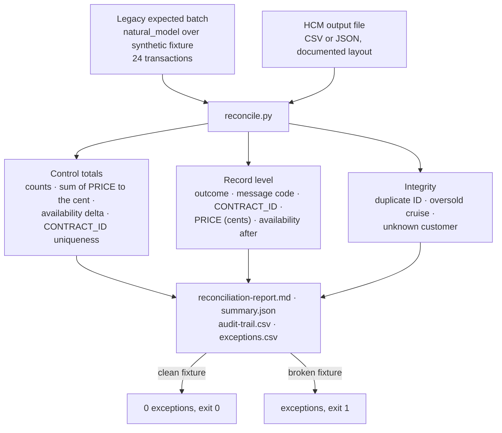

# Equivalence testing and penny-level reconciliation

Harnesses that compare HCM outputs to legacy behaviour: clean batch versus broken batch, control totals, penny-level amount reconciliation, record-level audit trail, and exception review — on synthetic data. The legacy expected results come from the repository's behavioural model of `CONEW-N`; the HCM side is a documented CSV/JSON layout the SI fills from the HCM's own reports. The Python here is a validation harness, not a rewrite target.

| | |
|---|---|
| **Capability** | Equivalence testing and penny-level reconciliation |
| **Why it matters to an SI implementing an HCM** | Proof of correctness is the deliverable. The SI loads HCM output back into the harness and gets a signed reconciliation, not an assertion. |
| **Builds on** | `../../tests/harness/natural_model.py`, `../../tests/harness/source_parser.py`, `../../tests/harness/adabas_sim.py`, `../../tests/harness/fixtures.py`, `../../tests/test_conew_booking.py`, `../../tests/test_concurrency.py` |
| **Maturity** | Demonstrated (harness output is checked in and reproducible with `--check`); the FPPS-side capture of legacy expected results is designed |

## Contents

| Path | What it is | Maturity |
|---|---|---|
| `equivalence-approach.md` | What is compared, how the legacy batch is generated, the HCM output layout, the check catalogue, what a pass means, legacy behaviours to adjudicate, FPPS application | Demonstrated / designed (labelled per section) |
| `harness/legacy_batch.py` | Generator: runs `tests/harness/natural_model.conew_refactored` (oracle) and `conew_original` (cross-check) over 24 synthetic transactions and emits records plus control totals | Demonstrated |
| `harness/reconcile.py` | Reconciler and CLI: validates the HCM output file, compares control totals, records and cross-record integrity, writes the four report files, `--check` drift gate | Demonstrated |
| `harness/fixtures/hcm-output-clean.csv`, `.json` | HCM output that reconciles to zero (both layouts) | Demonstrated |
| `harness/fixtures/hcm-output-broken.csv`, `SEEDED-DEFECTS.md` | HCM output with four seeded defects: off-by-one-cent price, duplicate `CONTRACT_ID`, booking accepted for an unavailable cruise, booking accepted for a missing customer | Demonstrated |
| `sample-output/legacy-expected.json`, `legacy-expected.md` | The legacy expected batch and its control totals | Demonstrated |
| `sample-output/clean/`, `sample-output/broken/` | `reconciliation-report.md`, `summary.json`, `audit-trail.csv`, `exceptions.csv` for each fixture | Demonstrated |
| `diagrams/reconciliation-flow.mmd` (+ exported image) | Reconciliation flow, Mermaid source also embedded in `equivalence-approach.md` | Demonstrated |

## What the harness proves today



| Fixture | Result | Evidence |
|---|---|---|
| `hcm-output-clean.csv` | Every control total and every record reconciles; zero exceptions | `sample-output/clean/reconciliation-report.md` |
| `hcm-output-broken.csv` | The four seeded defects surface as control-total breaks, record mismatches and integrity exceptions, each tagged with a check identifier | `sample-output/broken/reconciliation-report.md` |

Reproduce from the repository root:

```bash
python3 fpps-hcm-modernization-deliverable/08-equivalence-testing-reconciliation/harness/reconcile.py run-all
python3 fpps-hcm-modernization-deliverable/08-equivalence-testing-reconciliation/harness/reconcile.py --check
```

## Sample ↔ FPPS analogy

| Sunny Islands Cruise (fact) | FPPS / payroll (analogy) |
|---|---|
| Booking transaction (`CONEW-N`) | Pay/personnel transaction |
| Message codes 9800 / 9902 / 9904 / 9905 / 9918 | Payroll validation edits and error catalogue |
| `CRUISE-STATUS` decrement under record hold | Entitlement or balance consumption that must not double-count |
| `CONTRACT-ID` MAX+1 under record hold | Unique pay-result identifiers |
| `PRICE` (`P 10.3`) compared to the cent | Gross, deduction and net amounts |
| Control totals over the batch | Payroll register totals per pay group |

## How an SI consumes this

1. Take the masters and the 24 transactions from `sample-output/legacy-expected.md` (or the analogous batch generated for FPPS rules) and load them into the HCM test environment — masters through HCM Data Loader, transactions through the configured element-entry or booking analog.
2. Run the HCM calculation and export the results with the HCM's own reports (Oracle's Element Results Register is documented for reconciling run results against legacy payroll during implementation; see `equivalence-approach.md`).
3. Map the export to the layout in `equivalence-approach.md` → *HCM output layout* (one row per transaction, message codes mapped through the rule ↔ HCM validation matrix in `../02-business-rule-extraction/`).
4. Run `harness/reconcile.py reconcile --hcm <file> --out <dir>`; exit 0 with `"result": "RECONCILED"` is the acceptance evidence. Attach `reconciliation-report.md` and `audit-trail.csv` to the acceptance-test evidence pack.
5. For every exception, record whether it is an HCM configuration defect or an adjudicated legacy behaviour (table *Legacy behaviours the batch surfaces for adjudication*), fix or document, and re-run. Nothing here is a rewrite target: Python is the validation harness only.

## Synthetic data and scope

All evidence in this directory is produced from the Sunny Islands Cruise sample sources and synthetic data in `../../tests/harness/`. No production system, production data, or FPPS source is used or required. FPPS statements are analogies to a Software AG Natural 9.x / ADABAS 8.6 estate (~7M lines of Natural, 100k+ modules, ~7,800 JCL jobs); nothing here proposes a language rewrite.

← [Back to the navigation hub](../README.md)
