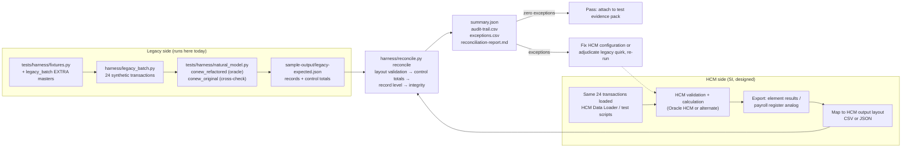

# Equivalence approach: legacy expected results versus HCM output

This document defines what "the HCM reproduces the legacy behaviour" means for the booking transaction of the Sunny Islands Cruise sample, how the legacy expected results are produced, how an HCM's output enters the harness, and what a pass is. Everything runs today on synthetic data in this repository; the closing section states how the same method is applied to FPPS (designed).

The Python under `harness/` is a **validation harness and generator only**. It never becomes part of the target system, it re-implements nothing for production, and it is not a rewrite target. The implementation target is the HCM configuration the SI builds from directories 02–07; the harness exists to prove that configuration produces the same answers as the legacy Natural logic.

## What is compared

One booking transaction stands for one pay/personnel transaction. For every transaction in a batch the harness compares five outcome dimensions, and for the batch as a whole it compares control totals before it looks at any record.

| Dimension | Legacy source of truth | HCM output field | Checks | Pass criterion |
|---|---|---|---|---|
| Record outcome (accepted or rejected) | `STORE NCCONTRACT` + `END TRANSACTION` versus `BACKOUT TRANSACTION` — `SunnyIslands/Natural-Libraries/CRUISE16/Subprograms/CONEW-N.NSN:114-136` | `OUTCOME` | RL-03, CT-02 | Identical for every transaction; accepted and rejected counts equal |
| Message code | `MSG-NR` set in `CONEW-N.NSN:54-71` (9904, 9905), `:126-136` (9902) and `:157-162` (9918); `9800` set in `CONEW-N.NSN:153`; translation of success codes to response code 0 in `CAMSG-N.NSN:101-106` | `MESSAGE_CODE` | RL-04, CT-03 | Identical code per transaction; identical count per code |
| Availability decrement | `GET ... *ISN` under hold, `LOCAL-AVAIL - 1`, `UPDATE (G1.)` — `CONEW-N.NSN:80-92` | `AVAILABILITY_AFTER` and the per-cruise delta implied by accepted rows | RL-07, CT-06, IN-03 | Same availability after each transaction; same delta per cruise; no cruise oversold against its starting availability |
| Contract identifier | `READ (1) NCCONTRACT DESCENDING BY CONTRACT-ID`, fake `UPDATE (R2.)`, `CONTRACT-ID + 1` — `CONEW-N.NSN:96-102` | `CONTRACT_ID` | RL-05, CT-05, IN-01, IN-02 | Same identifier per transaction; identifiers unique across the batch; no collision with pre-batch identifiers |
| Price to the cent | `MOVE NCCRUISE.PRICE-1W TO NCCONTRACT.PRICE` — `CONEW-N.NSN:103`; `PRICE` is `P 10.3` in `SunnyIslands/Natural-Libraries/CRUISE16/DDMs/NCCONTRA.NSD:13` | `PRICE` | RL-06, CT-04 | Absolute difference per record and on the batch sum within `--tolerance-cents` (default 0) |
| Batch completeness | The transaction list itself | Presence of `TXN_ID` | RL-01, RL-02, CT-01 | Every expected transaction present exactly once; no unexpected transactions |
| Referential integrity | `FIND NCCUSTOMER PERSON-ID = ...` / `9918` — `CONEW-N.NSN:157-162` | `CUSTOMER_ID` on accepted rows | IN-04 | No accepted booking for a customer absent from the customer master |

Message **text** is deliberately not compared. The text lives in `CAMSG-N.NSN` in two languages and is presentation; the code is the rule. An HCM will render its own messages, so equivalence is asserted on the code an SI maps each HCM validation to (see `../02-business-rule-extraction/`).

## How the legacy expected batch is generated

The harness does not read production data and does not execute Natural. It runs the behavioural model of `CONEW-N` that the repository's regression suite already trusts, against the repository's shared synthetic ADABAS fixture, and records what the legacy logic does for each transaction.

| Step | Component | Notes |
|---|---|---|
| 1 | `tests/harness/fixtures.py` `make_db(cruise_status="5")` | Shared synthetic masters: cruises 196 / 1484 / 696, customers 10000001 / 10000002, contract 500100 |
| 2 | `harness/legacy_batch.py` `EXTRA_CRUISES`, `EXTRA_CUSTOMERS` | Adds cruises 2201 / 2202 with cent-bearing prices (1349.99, 2075.50) and customers 10000003–10000005 so penny-level comparison is meaningful |
| 3 | `harness/legacy_batch.py` `TRANSACTIONS` | 24 transactions covering every message code `CONEW-N` can emit today (9800, 9902, 9904, 9905, 9918), blank and non-numeric inputs, an unknown cruise, and sell-out of every cruise |
| 4 | `tests/harness/natural_model.py` `conew_refactored` (`tests/harness/natural_model.py:172-236`) | The oracle: mirrors the shipped source including held re-read (`:196`), test-and-set (`:199-203`), fake update before MAX+1 (`:214-216`), customer check inside the availability branch (`:221-223`), ET (`:232`) and BT paths |
| 5 | `tests/harness/natural_model.py` `conew_original` (`:122-169`) | Cross-check: the pre-refactor model is run on the same batch and must produce identical outcomes; a sequential single-session batch cannot expose the concurrency defects that separate the two models (`tests/test_concurrency.py`), so disagreement would mean the oracle is ambiguous and the generator stops |
| 6 | `harness/legacy_batch.py` `control_totals` | Record count, accepted / rejected, count per message code, sum of `PRICE` over accepted records, contract-identifier uniqueness, availability delta per cruise |
| 7 | `sample-output/legacy-expected.json`, `sample-output/legacy-expected.md` | Checked-in result; `--check` regenerates and fails on any drift |

The batch is a **synthetic pay-period input file**: the customers are the population, the cruises are the pay elements with limited entitlement, and the contract store is the pay result. Nothing in it is production data.

## HCM output layout

The SI exports the HCM's result for the same 24 transactions in one of two layouts. Both are validated on load with a whitelist of columns, exact header match, type and range checks, and unique `TXN_ID`; a file that violates the layout is rejected with exit code 2 before any comparison runs.

| Column (CSV) / key (JSON) | Type and rule | Legacy counterpart |
|---|---|---|
| `TXN_ID` / `txn_id` | Required; `^[A-Za-z0-9._-]{1,32}$`; unique | Batch position supplied with the input |
| `CUSTOMER_ID` / `customer_id` | 0–8 alphanumeric characters, echo of the input as received (blanks and non-numeric values are legitimate) | `P-CONTRACT-DATA.ID-CUSTOMER-IN` (`A8`) |
| `CRUISE_ID` / `cruise_id` | 0–8 alphanumeric characters, echo of the input as received | `P-CONTRACT-DATA.ID-CRUISE-IN` (`A8`) |
| `BOOKING_DATE` / `booking_date` | Integer `YYYYMMDD` in 19000101–99991231, or blank | `NCCONTRACT.DATE-BOOKING` (`N 8.0`) |
| `OUTCOME` / `outcome` | `ACCEPTED` or `REJECTED` | Contract stored (ET) or not (BT / no store) |
| `MESSAGE_CODE` / `message_code` | Required integer 0–9999 | `MSG-GROUP-PARA.MSG-NR` before `CAMSG-N` remaps success to 0 |
| `CONTRACT_ID` / `contract_id` | Integer 0–999999 or blank | `NCCONTRACT.CONTRACT-ID` (`P 6.0`) |
| `PRICE` / `price` | Decimal, at most 10 integer and 3 fraction digits, or blank | `NCCONTRACT.PRICE` (`P 10.3`) |
| `AVAILABILITY_AFTER` / `availability_after` | Integer 0–9 or blank | `NCCRUISE.CRUISE-STATUS` (`A1`) after the transaction |

CSV files carry exactly the header `TXN_ID,CUSTOMER_ID,CRUISE_ID,BOOKING_DATE,OUTCOME,MESSAGE_CODE,CONTRACT_ID,PRICE,AVAILABILITY_AFTER`. JSON files are an object `{"batch_id": ..., "records": [...]}` whose records use the lower-case keys; unknown keys are rejected. `harness/fixtures/hcm-output-clean.csv` and `.json` are the reference examples and both reconcile identically (the harness asserts this on every `run-all`).

## Check catalogue

| Check | Level | Detects | Blocking |
|---|---|---|---|
| CT-01 | Control total | Record count differs | Yes |
| CT-02 | Control total | Accepted or rejected count differs | Yes |
| CT-03 | Control total | Count per message code differs | Yes |
| CT-04 | Control total | Sum of `PRICE` over accepted records differs by more than the tolerance (cents reported) | Yes |
| CT-05 | Control total | `CONTRACT_ID` values in the HCM output are not unique | Yes |
| CT-06 | Control total | Availability delta per cruise implied by accepted rows differs from legacy | Yes |
| RL-01 | Record | Expected transaction absent from HCM output | Yes |
| RL-02 | Record | HCM output transaction with no legacy counterpart | Yes |
| RL-03 | Record | Outcome differs | Yes |
| RL-04 | Record | Message code differs | Yes |
| RL-05 | Record | `CONTRACT_ID` differs | Yes |
| RL-06 | Record | `PRICE` differs by more than the tolerance, or present on one side only (difference in cents reported) | Yes |
| RL-07 | Record | `AVAILABILITY_AFTER` differs | Yes |
| IN-01 | Integrity | Same `CONTRACT_ID` assigned to more than one accepted transaction | Yes |
| IN-02 | Integrity | `CONTRACT_ID` collides with a contract that existed before the batch | Yes |
| IN-03 | Integrity | More bookings accepted for a cruise than its starting availability (oversold) | Yes |
| IN-04 | Integrity | Booking accepted for a customer who is not in the customer master | Yes |

Every check is blocking by default because the acceptance criterion for a pay run is zero difference; `--tolerance-cents N` exists so an SI can document an agreed rounding tolerance explicitly rather than by omission. Precision defaults to 2 decimals; `--decimals 3` compares at the DDM precision of `P 10.3`.

## What a pass means

| Condition | Where it is visible |
|---|---|
| Exit code 0 from `reconcile` | Shell |
| `summary.json` → `"result": "RECONCILED"`, `"exception_count": 0` | `sample-output/<run>/summary.json` |
| Every control-total row reads `reconciled` | `reconciliation-report.md` → Control totals |
| `records_matched` equals `records_expected`; missing, mismatched and unexpected are 0 | `summary.json`, audit trail `status` column |
| `exceptions.csv` has a header row only | `sample-output/<run>/exceptions.csv` |
| `--check` exits 0 | Proves the committed reports are what the harness produces today |

A pass is a statement about **this batch**. It asserts that, for the transactions and masters in the batch, the HCM produced the same outcome, message code, identifier, availability and amount as the legacy logic — no more. Coverage of the rule set is the job of directory 09's regression suite map; the two together let an SI say "every extracted rule has a test, and the HCM passed the equivalence batch that exercises them".

## Seeded defects and how they surface

`harness/fixtures/hcm-output-broken.csv` is the clean file with four rows altered (`harness/fixtures/SEEDED-DEFECTS.md`). The table shows which checks each defect trips; one defect typically surfaces at all three levels, which is intentional — an SI reading the report top-down sees the control-total break first, then the record, then the integrity consequence.

| Defect | Transaction | Alteration | Checks tripped |
|---|---|---|---|
| D1 | T-0004 | `PRICE` 1349.99 → 1349.98 | RL-06 (−1 cent), CT-04 |
| D2 | T-0018 | `CONTRACT_ID` 500108 → 500107 (already assigned to T-0017) | RL-05, IN-01, CT-05 |
| D3 | T-0016 | Legacy 9902 rejection recorded as `ACCEPTED` 9800 with `CONTRACT_ID` 500112 | RL-03, RL-04, RL-05, RL-06, IN-03 (cruise 2201 oversold), CT-02, CT-03, CT-04, CT-06 |
| D4 | T-0011 | Legacy 9918 rejection (customer 99999999 not in master) recorded as `ACCEPTED` 9800 with `CONTRACT_ID` 500113 | RL-03, RL-04, RL-05, RL-06, RL-07, IN-04, IN-03 (cruise 196 oversold, because the legacy batch already sells cruise 196 out), CT-02, CT-03, CT-04, CT-06 |

The committed evidence is `sample-output/broken/reconciliation-report.md` (24 exceptions across 13 checks) and `sample-output/clean/reconciliation-report.md` (zero exceptions).

## HCM output back into the harness



| Step | Owner | Activity | Maturity |
|---|---|---|---|
| 1 | Harness | `reconcile.py generate-expected` produces the legacy expected batch | Demonstrated |
| 2 | SI | Load the same masters and transactions into the HCM test pod (HCM Data Loader for masters; the transaction batch through the configured element entry / booking analog) | Designed |
| 3 | SI | Run the HCM calculation for the batch and export results — Oracle documents the Element Results Register as the report to reconcile against legacy payroll results during implementation ([Payroll Calculation Reports for the US](https://docs.oracle.com/en/cloud/saas/human-resources/fauti/payroll-calculation-reports-for-the-us.html)); the Balance Exception Report and Payroll Data Validation Report cover variance and missing-attribute review ([Summary of Data Validation and Audit Reports](https://docs.oracle.com/en/cloud/saas/human-resources/fapua/data-validation-and-audit-reports.html)) | Designed |
| 4 | SI | Map the export to the HCM output layout (one row per transaction; codes mapped per the rule ↔ HCM validation matrix from directory 02) | Designed |
| 5 | Harness | `reconcile.py reconcile --hcm <file> --out <dir>`; exit 0 with zero exceptions is the acceptance evidence | Demonstrated |
| 6 | SI + SME | Any exception is either an HCM configuration defect or a legacy quirk to adjudicate (next section); either way the decision is recorded against the transaction and the batch is re-run | Designed |

## Legacy behaviours the batch surfaces for adjudication

The expected batch is what the legacy logic does, including behaviours an SI may decide the HCM should not reproduce. Each must be adjudicated explicitly; the harness records the legacy answer and the decision is documented in the acceptance-test plan.

| Transaction(s) | Legacy behaviour | Source | Adjudication question |
|---|---|---|---|
| T-0014 | A well-formed booking for a cruise that does not exist returns `MSG-NR 0`, response code 0, empty text and stores nothing | `CONEW-N.NSN:79-140` (no `END-FIND` branch sets a code when `FIND NCCRUISE` finds no record); `CAMSG-N.NSN:185-189` types code 0 as `S` | Should the HCM raise an explicit "not found" edit (code 9916 exists in `CAMSG-N.NSN:158` but is set only in disabled logic at `CONEW-N.NSN:184-190`)? |
| T-0012 | A non-numeric customer identifier with a valid cruise reaches the customer lookup and returns 9918 rather than a format edit | `CONEW-N.NSN:66-70` (`ID-CUSTOMER-IN-N` stays 0 when the input is not `N8`) | Should the HCM distinguish format from not-found (9919 is catalogued at `CAMSG-N.NSN:164` but never set in active logic)? |
| T-0024 | An unknown customer on a sold-out cruise receives 9902, not 9918, because the availability edit runs first | `CONEW-N.NSN:86-136` | Preserve edit precedence or reorder? Either choice changes the expected batch and must be recorded |
| All accepted | `PRICE` is always the one-week price regardless of duration | `CONEW-N.NSN:103`; duration-based selection exists only in disabled logic at `CONEW-N.NSN:217-225` and in `CRGET-N` for display | Confirm which price rule the HCM implements; the harness compares whatever rule the adjudicated expected batch encodes |
| All accepted | Amounts are stored with three decimals (`P 10.3`) | `NCCONTRA.NSD:13` | Agree the comparison precision (`--decimals 2` or `3`) and any tolerance up front |

## Sample ↔ FPPS analogy

| Sunny Islands Cruise (fact) | FPPS / payroll (analogy) |
|---|---|
| Booking transaction batch of 24 | Pay-period transaction file for a synthetic population |
| `MSG-NR` 9800 / 9902 / 9904 / 9905 / 9918 | Payroll validation edit codes and their error catalogue |
| `CRUISE-STATUS` decrement under hold | Entitlement / balance consumption that must not be double-counted |
| `CONTRACT-ID` MAX+1 under hold | Unique pay-result or action identifiers |
| `PRICE` to the cent | Gross, deduction and net amounts to the cent |
| Control totals (counts, sum of `PRICE`, availability delta) | Register totals: population, gross, deductions, net, employer cost |
| Clean versus broken fixture | Parallel-run pass versus a pay run with seeded defects for tester training |

## Reproduce

Run from the repository root.

```bash
python3 fpps-hcm-modernization-deliverable/08-equivalence-testing-reconciliation/harness/reconcile.py run-all
python3 fpps-hcm-modernization-deliverable/08-equivalence-testing-reconciliation/harness/reconcile.py --check
python3 fpps-hcm-modernization-deliverable/08-equivalence-testing-reconciliation/harness/reconcile.py reconcile \
  --hcm fpps-hcm-modernization-deliverable/08-equivalence-testing-reconciliation/harness/fixtures/hcm-output-broken.csv \
  --out /tmp/broken-run
```

## Applying the method to FPPS (designed)

| Element | Sample today (Demonstrated) | FPPS (designed) |
|---|---|---|
| Oracle for expected results | `natural_model.conew_refactored` on synthetic fixture | Legacy FPPS pay-calculate output for a frozen synthetic or masked population, captured from the existing batch (the run-compare design in `../09-unit-test-regression-jcl-runcompare/jcl-runcompare-design.md`) |
| Transaction batch | 24 bookings | Pay-period input covering every extracted rule at least once, generated from the rule catalogue in `../02-business-rule-extraction/` |
| Control totals | Counts, sum of `PRICE`, availability delta, identifier uniqueness | Population, gross, deductions and taxes, employer cost, net, costing totals per pay group |
| Record-level comparison | Outcome, code, identifier, price, availability | Per-employee element results, balances and messages |
| Integrity checks | Duplicate identifier, oversold, unknown customer | Duplicate pay result, entitlement exceeded, person absent from master |
| Evidence | `sample-output/` checked in with `--check` | Reconciliation pack per parallel run, versioned with the HCM configuration it validated |

The harness code itself scales only in the trivial sense (it is standard-library Python over CSV/JSON); what is designed rather than demonstrated is the FPPS-side capture of legacy expected results, which requires access to FPPS batch outputs that are not in this repository.
