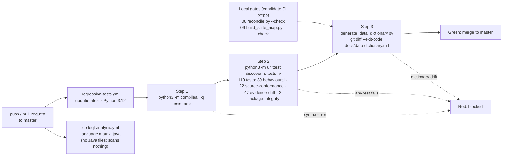

# Unit-test, regression, and JCL run-compare generation

Unit tests derived from extracted rules, a regression suite gated in CI, a generated map of every test to the rule and message code it protects, and a design for comparing legacy batch outputs with HCM outputs at the ~7,800-job scale of the FPPS scheduler stream. This is the test-automation ask of the IBC HRD RFI — test automation, not migration. The Python in this directory is a generator that parses `tests/`; it is validation tooling, not a rewrite target.

| | |
|---|---|
| **Capability** | Unit-test, regression, and JCL run-compare generation |
| **Why it matters to an SI implementing an HCM** | Regression coverage protects the pay run during and after cut-over and is the fastest way to demonstrate that a rule extracted in 02 still holds after HCM configuration. |
| **Builds on** | `../../tests/` (110 tests), `../../.github/workflows/regression-tests.yml`, `../../.github/workflows/codeql-analysis.yml`, `../../docs/testing-and-ci.md`, `../08-equivalence-testing-reconciliation/harness/` |
| **Maturity** | Demonstrated for unit/regression on the sample (the suite, CI workflow and generated map run here today); JCL run-compare is designed, and its Control-M/JCL inventory data is roadmap (no FPPS JCL in this repository) |

## Contents

| Path | What it is | Maturity |
|---|---|---|
| `test-generation-approach.md` | Rule class → test pattern derivation with a worked example; the three test layers; what `regression-tests.yml` and `codeql-analysis.yml` actually run; FPPS-scale generation plan | Demonstrated (CI description, derivation); designed/roadmap sections labelled |
| `regression-suite-map.md` | Generated inventory: 72 test methods mapped to 25 local rules and 11 source-emitted message codes, with coverage gaps flagged | Demonstrated (generated, drift-checked) |
| `generator/build_suite_map.py` | Parses `tests/*.py` with `ast`, cross-checks against `unittest` discovery, derives emitted codes from `tools.analyze_disposition`, extracts CI commands from the workflow file; `--check` exits non-zero on drift | Demonstrated |
| `jcl-runcompare-design.md` | Run-compare of batch outputs, pay-run control totals, before/after pay-calculate comparison, Control-M/JCL inventory ingestion; every element labelled designed or roadmap | Designed / roadmap |
| `diagrams/ci-flow.mmd` (+ `.png`, `.svg`) | What the CI gate runs and where the deliverable's local `--check` gates sit | Demonstrated |
| `diagrams/runcompare-flow.mmd` (+ `.png`, `.svg`) | Legacy run → normalise → run-compare engine → pack → sign-off / adjudication | Designed / roadmap labels in the diagram |

## What runs here today



| Figure | Value | Where it is generated |
|---|---|---|
| Test methods | 72 (parsed = discovered) | `regression-suite-map.md` → *Inventory totals* |
| Rules in the local catalogue, all protected by at least one test | 25 | `regression-suite-map.md` → *Rule catalogue and coverage* |
| Message codes emitted by the Natural sources | 11 | `tools.analyze_disposition` via the generator |
| Emitted codes with no referencing test (extraction backlog) | 3 (9923, 9924, 9934 — customer-maintenance and optimistic-lock codes outside the booking scope) | `regression-suite-map.md` → *Message-code coverage* |

Reproduce and check:

```bash
python3 fpps-hcm-modernization-deliverable/09-unit-test-regression-jcl-runcompare/generator/build_suite_map.py          # rewrite the map
python3 fpps-hcm-modernization-deliverable/09-unit-test-regression-jcl-runcompare/generator/build_suite_map.py --check  # exit 1 if tests/ and the map disagree
```

## Sample ↔ FPPS analogy

| Sunny Islands Cruise (fact) | FPPS / payroll (analogy) |
|---|---|
| `tests/test_conew_booking.py` validation cases | Unit tests for payroll validation edits |
| `tests/test_concurrency.py` interleavings | Pay-run integrity tests under concurrent updates |
| `regression-tests.yml` on `master` | Promotion gate between HCM test, staging and production pods |
| `regression-suite-map.md` gaps | The SI's rule-extraction and test-generation backlog |
| `natdeploy*.xml` deployment targets | Control-M/JCL stream configuration (inventory is roadmap) |

## How an SI consumes this

1. Take the rule ↔ test ↔ message-code map in `regression-suite-map.md` as the backbone of the acceptance-test plan: each rule row becomes an acceptance-test case group; each gap row becomes a backlog item for rule extraction in 02 and a test in the HCM test pod.
2. Apply the derivation patterns in `test-generation-approach.md` to every rule in `../02-business-rule-extraction/`; give each generated test its rule identifier so the map regenerates instead of being maintained.
3. Configure the HCM test pod from directories 02–07 (validation matrix, data model mapping via HCM Data Loader, approvals in BPM); execute the generated cases through the HCM's transaction entry or payroll flow; export results.
4. Reconcile exported results against the legacy expected batch with the 08 harness (`equivalence-approach.md` gives the layout); adopt the same gate shape as `regression-tests.yml` — syntax → suite → drift → equivalence `--check` — as the promotion gate between pods.
5. When Control-M exports and JCL libraries are available, build the inventory described in `jcl-runcompare-design.md`, derive the output-class layouts from its outbound datasets, and run the before/after and legacy-vs-HCM run-compares per pay period until the parallel-run sign-off criterion (zero exceptions or every exception adjudicated) is met.

## Synthetic data and scope

All evidence in this directory is produced from the Sunny Islands Cruise sample sources and synthetic data in `../../tests/harness/`. No production system, production data, or FPPS source is used or required. FPPS statements are analogies to a Software AG Natural 9.x / ADABAS 8.6 estate (~7M lines of Natural, 100k+ modules, ~7,800 JCL jobs); nothing here proposes a language rewrite. The generator in `generator/` and the harness it points to in 08 are validation tooling only.

← [Back to the navigation hub](../README.md)
