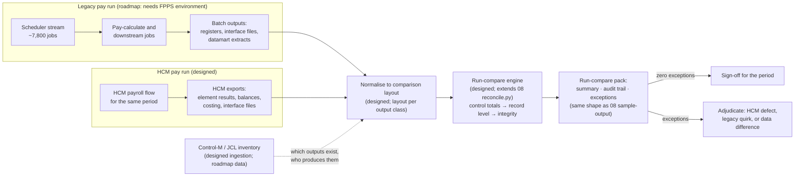

# JCL run-compare design

FPPS runs roughly 7,800 JCL jobs under a scheduler; this repository contains no FPPS JCL, no Control-M definitions and no batch outputs. Everything in this document is therefore **designed** (specified against the sample and the demonstrated harnesses, not executed at FPPS scale) or **roadmap** (depends on FPPS inputs that are not here). Each element carries its label in the tables and in the diagram. The single demonstrated component the design builds on is the reconciliation engine in `../08-equivalence-testing-reconciliation/harness/reconcile.py`, whose control-total / record-level / integrity structure is reused unchanged.

The Python named here is validation tooling. Nothing in this design converts JCL, Natural or any batch program into another language; the comparison target is the HCM's batch output.

## What run-compare is

| Term | Meaning here | Label |
|---|---|---|
| Run-compare | Comparing the outputs of one legacy batch run and one HCM run for the same input period, record-by-record with control totals | designed |
| Before/after comparison | Comparing two legacy runs of the same period (before and after a change) to prove the change altered only what it should | designed |
| Control-M/JCL inventory | The list of jobs, steps, programs, datasets and predecessors that define the batch stream | designed ingestion; roadmap data |
| Output class | A family of batch outputs with one comparison layout (register, interface file, extract, report) | designed |

## Run-compare of batch outputs (designed)

The 08 harness compares one output class today: the booking transaction result (`TXN_ID`, outcome, code, identifier, amount, availability). Run-compare generalises the same three tiers to each batch output class.

| Tier | 08 today (Demonstrated) | Run-compare (designed) |
|---|---|---|
| Layout validation | Exact header, whitelisted columns, typed and range-checked fields, unique key, size limits | One layout definition per output class (key columns, amount columns, code columns, informational columns); same whitelist / type / range / uniqueness rules |
| Control totals | Record count, accepted/rejected, count per code, sum of `PRICE` to the cent, identifier uniqueness, availability delta per cruise | Record count per output; sum of every amount column to the cent; count per code column value; key uniqueness; per-group subtotals (pay group, agency, element) |
| Record level | Join on `TXN_ID`; compare outcome, code, identifier, amount, availability | Join on the output class key (person + period + element, or interface record key); compare every non-informational column; amounts in cents with an explicit tolerance per column (default 0) |
| Integrity | Duplicate identifier, oversold cruise, unknown customer | Duplicate key, balance exceeded, person absent from master, employee present in one run only |
| Reports | `summary.json`, `audit-trail.csv`, `exceptions.csv`, `reconciliation-report.md` | Same four files per output class, plus a run-level roll-up |
| Exit status | 0 reconciled, 1 exceptions, 2 layout rejected | Same, per output class and for the run |

Design constraints carried from the sample:

| Constraint | Why | Source of the lesson |
|---|---|---|
| Compare codes, not message text | Text is presentation in two languages; the code is the rule | `CAMSG-N.NSN` holds texts; `CONEW-N.NSN` sets codes |
| Amounts as decimal cents, never floats | `PRICE` is `P 10.3`; a float compare can hide or invent a cent | `SunnyIslands/Natural-Libraries/CRUISE16/DDMs/NCCONTRA.NSD:13`; 08 seeded defect D1 |
| Control totals first, then records | A total that breaks tells the reviewer where to look; the record list tells them what | 08 broken-fixture report ordering |
| Integrity checks independent of the join | A duplicate identifier or an oversold entitlement can exist even when every joined record matches | 08 checks IN-01..IN-04 |
| Every legacy quirk is adjudicated, not silently reproduced | Some legacy answers (code 0 for an unknown cruise; edit precedence) may be wrong by policy | `../08-equivalence-testing-reconciliation/equivalence-approach.md` → adjudication table |

## Control totals for a pay run (designed)

| Control total | Legacy side | HCM side | Match rule | Label |
|---|---|---|---|---|
| Population processed | Employees on the pay-calculate input | Persons in the HCM payroll relationship for the period | Equal counts; set difference listed | designed |
| Transactions accepted / rejected | Register counts | HCM validation report counts | Equal counts per outcome | designed |
| Count per validation code | Legacy edit report | HCM messages mapped through the rule ↔ HCM validation matrix | Equal count per mapped code | designed |
| Gross, each deduction class, employer contributions, net | Register totals | Element results / balance totals | Equal to the cent, per pay group | designed |
| Interface file totals | Trailer records of each outbound file | HCM outbound extract trailers | Equal record counts and hash totals | designed |
| Identifier uniqueness | Unique pay-result identifiers | Unique HCM run result identifiers | No duplicates within the run | designed |
| Entitlement / balance deltas | Balance before minus after | HCM balance before minus after | Equal delta per person and balance | designed |

## Before/after pay-calculate comparison (designed)

Used when the legacy system changes (maintenance release, table update, refactor such as the one in `docs/concurrency-refactor.md`) and when the HCM configuration changes between test cycles.

| Step | Activity | Sample analogue (Demonstrated) | Label |
|---|---|---|---|
| 1 | Freeze the input period and masters | `tests/harness/fixtures.make_db` plus `legacy_batch.EXTRA_*` | designed |
| 2 | Run "before" and capture outputs | `legacy_batch.run_batch(nm.conew_original)` | designed |
| 3 | Apply the change | `conew_refactored` replaces `conew_original` | designed |
| 4 | Run "after" and capture outputs | `legacy_batch.run_batch(nm.conew_refactored)` | designed |
| 5 | Run-compare before vs after | The 08 generator already performs this cross-check and stops if the two models disagree on a sequential batch | designed |
| 6 | Expected differences are declared up front; anything else is an exception | Concurrency fixes must not change any single-session outcome; `tests/test_concurrency.py` holds the intended differences | designed |

The sample demonstrates the shape of step 5 at unit scale: the two `CONEW-N` variants produce identical sequential results (the equivalence generator asserts it), and differ only under interleaving (the concurrency tests assert that).

## Control-M / JCL inventory ingestion at ~7,800-job scale (designed; roadmap data)

Run-compare needs to know which outputs exist, which job produces each, and in what order. The inventory is the dependency map of the batch stream; it is to batch what `docs/call-map.md` is to the online Natural objects.

| Element | Design | Label |
|---|---|---|
| Inputs | Control-M job definitions (XML export) and the JCL library members they submit; PROC libraries; dataset naming standards | roadmap (not in this repository) |
| Parser | Extract per job: job name, application/group, steps, `EXEC PGM=` / `EXEC PROC=`, `DD` datasets with disposition, predecessor conditions, calendar/schedule, in-conditions/out-conditions. The repository's `tests/harness/source_parser.py` and `tools/analyze_disposition.py` establish the pattern: standard-library parsers, set-based results, control totals pinned by tests | designed |
| Graph | Jobs as nodes; dataset producer→consumer and Control-M conditions as edges; Natural batch steps resolved to the Natural objects they execute so the batch graph joins the online call map | designed |
| Control totals | Jobs parsed, steps, programs, datasets, unresolved PROCs, unresolved conditions, jobs with no predecessor and no schedule (candidate unreferenced in analysed scope) | designed |
| Output classes | Datasets that leave the stream (interfaces, extracts, reports) become the output classes for run-compare; each gets a layout definition | designed |
| Scale handling | ~7,800 jobs × tens of steps is a few hundred thousand records: in-memory graph on one machine; the evidence pack is generated with a `--check` drift gate like every other generator in this deliverable | designed |
| Evidence | `jcl-inventory.json`, `jcl-inventory.md` (control totals, per-application job counts, output-class list, unresolved items) in this directory once inputs exist | roadmap |

What the sample offers as an analogue is the deployment configuration in `SunnyIslands/deploy/natdeploy*.xml` (Ant-driven NaturalONE deployment targets), which directory 06 maps to STEPLIB and scheduler configuration; there is no sample JCL to parse, so no parser is shipped here — a parser with nothing to parse would be fabricated evidence.

## Roll-out sequence

| Phase | Deliverable | Depends on | Label |
|---|---|---|---|
| A | Reconciliation engine generalised to a layout-per-output-class configuration | 08 harness (exists) | designed |
| B | Control-M/JCL inventory parser and evidence pack | Control-M export and JCL library access | roadmap |
| C | Output-class layouts derived from the inventory's outbound datasets | B | roadmap |
| D | Legacy expected results captured for a frozen synthetic or masked population | FPPS test environment | roadmap |
| E | HCM outputs exported for the same population and reconciled per output class | HCM test pod configured from directories 02–07 | designed |
| F | Run-compare pack in the acceptance-test plan; parallel-run sign-off criteria: zero exceptions or every exception adjudicated | D, E | designed |

Oracle's documentation describes the HCM-side artefacts phase E consumes: the Element Results Register is documented for reconciling run results against legacy payroll during implementation ([Payroll Calculation Reports for the US](https://docs.oracle.com/en/cloud/saas/human-resources/fauti/payroll-calculation-reports-for-the-us.html)), and the Balance Exception Report and Payroll Data Validation Report cover variance and missing-attribute review ([Summary of Data Validation and Audit Reports](https://docs.oracle.com/en/cloud/saas/human-resources/fapua/data-validation-and-audit-reports.html)). For an alternate HCM the equivalent register and validation exports fill the same role.

## Sample ↔ FPPS analogy

| Sunny Islands Cruise (fact) | FPPS / payroll (analogy) |
|---|---|
| 24-transaction synthetic booking batch | One pay period's transaction input |
| `conew_original` vs `conew_refactored` sequential agreement | Before/after pay-calculate comparison |
| Control totals: counts, sum of `PRICE`, availability delta | Register totals: population, gross, deductions, net, balances |
| `natdeploy*.xml` deployment targets | Control-M/JCL stream configuration |
| `tools/analyze_disposition.py` object inventory with pinned control totals | Control-M/JCL inventory with pinned control totals |
