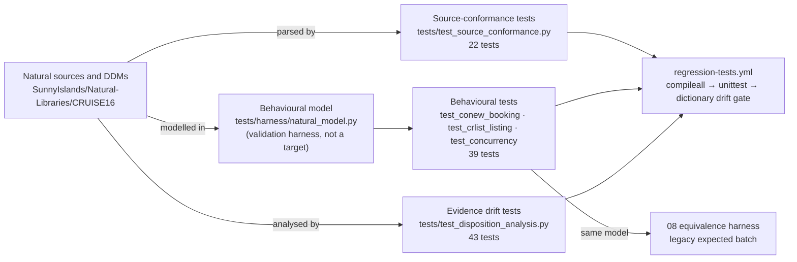

# Test generation approach: from extracted rule to gated regression test

This document explains how an extracted business rule becomes an executable test, how the repository's existing suite already embodies that derivation, and what the two GitHub Actions workflows in `.github/workflows/` actually run. The subject is test automation for an HCM implementation — the ask in the IBC HRD RFI — not migration of code. Every Python file referenced here is a test harness, behavioural model, parser or generator; none is a rewrite target.

## Rule → test derivation

A rule in `../02-business-rule-extraction/` has a class (validation edit, integrity, derivation, message, workflow), a source citation and a confidence score. Each class has a fixed derivation into test cases; the pattern is the same whether the test runs against the repository's behavioural model today or against an HCM test pod later.

| Rule class | Test pattern | Inputs the test needs | Assertion | Example in `tests/` |
|---|---|---|---|---|
| Validation edit | One positive case per condition that raises the code; one negative case that passes the edit; precedence cases where several edits could fire | Input record with the field blank / invalid / valid | Message code equals the rule's code; on rejection nothing is stored | `tests/test_conew_booking.py:65-108` (`InputValidationTests`) |
| Integrity | State-before / state-after comparison around the transaction; a rejected path must leave state unchanged; interleaved sessions at the statement boundary the rule protects | Fixture with known counters and identifiers; a second session | Counter moves by exactly the rule's amount; identifiers unique; ET/BT observed; no holds left | `tests/test_conew_booking.py:110-120`, `tests/test_concurrency.py:21-142` |
| Derivation | Table-driven cases across the input domain, including boundaries and the fall-back branch | Input values; expected amount or field to the cent | Exact equality (no tolerance unless the acceptance-test plan grants one) | `tests/test_crlist_listing.py:80-101` (`PriceSelectionTests`), `tests/test_conew_booking.py:42-50` |
| Message | Code emitted equals catalogued code; success codes remap to response 0; every emitted code is translatable | Model output; parsed message catalogue | Set equality in both directions | `tests/test_source_conformance.py:25-33`, `:115-124` |
| Workflow | Sequence of calls reproducing the user path; state visible to the next step | Fixture; ordered calls | Later step sees the earlier step's effect | `tests/test_crlist_listing.py:71-77` |
| Data model | Field names, formats, descriptors and counts parsed from the DDMs | `.NSD` files | Equality with the documented dictionary; regenerated docs identical | `tests/test_source_conformance.py:126-196` |

The complete mapping of every existing test to the rule it protects is generated, not typed, in `regression-suite-map.md` (106 tests, 27 rules, 11 emitted message codes with 3 coverage gaps).

### Worked derivation: rule EDIT-9902

| Step | Content |
|---|---|
| Rule (from source) | If `CRUISE-STATUS` is 0 after the held re-read, back out and report 9902 — `SunnyIslands/Natural-Libraries/CRUISE16/Subprograms/CONEW-N.NSN:86-136` |
| Positive case | Cruise 696 (availability 0): expect 9902, no contract — `test_fully_booked_cruise_returns_9902` |
| Boundary case | Cruise with availability 1: first booking 9800, second 9902 — `test_booking_last_available_slot_succeeds_then_9902` |
| Precedence case | Unknown customer on a sold-out cruise still gets 9902 because the availability edit runs first — `test_unknown_customer_on_sold_out_cruise_returns_9902` |
| Integrity case | Two sessions on the last slot: second is queued on the hold and gets 9902 after the first commits — `test_competitor_blocks_until_first_booking_commits` |
| Source-conformance case | The `ELSE` branch performs `BACKOUT TRANSACTION` before `MOVE 9902` — `test_sold_out_path_backs_out_before_9902` |
| Equivalence case | Transactions T-0006, T-0007, T-0016, T-0020, T-0023 and T-0024 in `../08-equivalence-testing-reconciliation/sample-output/legacy-expected.md` carry 9902 into the reconciliation batch |
| HCM acceptance case (designed) | The same six inputs are loaded to the HCM test pod; the HCM must reject with the validation mapped to 9902 and leave the entitlement balance unchanged |

## Three layers that keep the tests honest



| Layer | What it proves | What it cannot prove |
|---|---|---|
| Source conformance | The shipped `.NSN`/`.NSD` still contain the idioms and code sets the rules cite | That the idiom behaves as intended at run time |
| Behavioural | The rule, as modelled, produces the documented outcome for each case, including interleaved sessions | That the model equals the compiled Natural object; a live Natural/ADABAS run is the only proof of that |
| Evidence drift | Extraction evidence and generated documents are reproducible from source | Business correctness of the extraction |

The counts (22 / 39 / 11) come from `regression-suite-map.md`, which the generator's `--check` mode ties to `unittest` discovery.

## What CI actually runs

Both files under `.github/workflows/` were read for this section; the table states what executes, not what the file names suggest.

### `regression-tests.yml`

| Attribute | Value (from the file) |
|---|---|
| Triggers | `push` to `master`; `pull_request` targeting `master` |
| Runner | `ubuntu-latest`, `actions/checkout@v4`, `actions/setup-python@v5` with Python 3.12 |
| Step 1 | `python3 -m compileall -q tests tools` — byte-compiles every Python file under `tests/` and `tools/`; fails on syntax errors |
| Step 2 | `python3 -m unittest discover -s tests -v` — runs all 106 tests (behavioural, source-conformance, evidence-drift, package-integrity) |
| Step 3 | `python3 tools/generate_data_dictionary.py` then `git diff --exit-code docs/data-dictionary.md` — regenerates the data dictionary from the DDMs and fails if the committed copy differs |
| Not present | No coverage measurement, no linting, no Natural compile, no ADABAS nucleus (the runner has neither), no execution of the deliverable's own `--check` generators |

Because the workflow triggers only on `master`, work on feature branches such as this deliverable branch is gated locally by the commands in *Verify before pushing* below and by the pull-request run when the branch is merged toward `master`.

### `codeql-analysis.yml`

| Attribute | Value (from the file) |
|---|---|
| Triggers | `push` to `master`; `pull_request` targeting `master`; `schedule` cron `27 3 * * 0` (weekly, Sunday 03:27 UTC) |
| Language matrix | `['java']` only |
| Steps | `actions/checkout@v2` → `github/codeql-action/init@v1` → `github/codeql-action/autobuild@v1` → `github/codeql-action/analyze@v1` |
| Effect on this repository | The repository contains no Java files (`find . -name '*.java'` returns nothing), so the Java autobuild and analysis have nothing to scan; the workflow does not analyse the Python harness or the Natural sources. CodeQL has no Natural language pack. |
| Observation | Action versions `v1`/`v2` are the template defaults; the file is a GitHub-generated template and has not been tailored to this repository |

### Gating summary

| Gate | Runs where | Blocks merge to `master` | Covers |
|---|---|---|---|
| Syntax check | CI step 1 | Yes | `tests/`, `tools/` |
| Regression suite (106 tests) | CI step 2 | Yes | Rules in `regression-suite-map.md` |
| Data-dictionary drift | CI step 3 | Yes | `docs/data-dictionary.md` ↔ DDMs |
| Disposition evidence drift | Inside step 2 (`tests/test_disposition_analysis.py`) | Yes | `10-migration-disposition-dead-code/evidence/` |
| Equivalence harness drift | `08/harness/reconcile.py --check` | Not wired into CI (local gate; candidate CI step) | `08/sample-output/`, `08/harness/fixtures/` |
| Regression-map drift | `09/generator/build_suite_map.py --check` | Not wired into CI (local gate; candidate CI step) | `09/regression-suite-map.md` ↔ `tests/` |
| CodeQL | `codeql-analysis.yml` | Configured, but scans no files | — |

## From the sample to FPPS-scale test generation

| Element | Sample today (Demonstrated) | FPPS (designed) | FPPS (roadmap) |
|---|---|---|---|
| Rule catalogue | Directory 02 rules with `.NSN` line citations | Rule catalogue extracted from the ~7M-line Natural estate with the same classes and citations | — |
| Test derivation | Patterns in the first table, applied by hand in `tests/` | Same patterns applied per rule class, with table-driven cases generated from the rule's input domain; each test carries its rule identifier so the map is generated, not maintained | Generation of case tables from Natural Predict/XRef field domains (requires FPPS Predict exports) |
| Oracle | `tests/harness/natural_model.py` (behavioural model of `CONEW-N`) | Legacy FPPS batch outputs captured from the existing pay-calculate (see `jcl-runcompare-design.md`) | Runtime traces of the Natural estate to derive edit precedence where source order is ambiguous |
| Execution target | Model + simulated ADABAS on GitHub-hosted runners | HCM test pod (Oracle HCM or alternate) driven by HCM Data Loader for masters and the configured transaction entry for cases; results exported and reconciled with the 08 harness | Live Natural/ADABAS test environment for side-by-side runs of the same cases |
| Gating | `regression-tests.yml` on `master` | The same workflow shape: syntax → suite → drift gates → equivalence `--check`; failures block promotion of HCM configuration between environments | — |
| Coverage report | `regression-suite-map.md` (rules ↔ tests ↔ codes, gaps flagged) | Same generator pattern over the FPPS rule catalogue; the gap list is the SI's backlog | — |

The IBC HRD RFI asks for test automation; the demonstrated path is: rule catalogue → derived tests with rule identifiers → CI gate → generated coverage map with gaps → equivalence batch reconciled against HCM output. The undemonstrated parts are those that need FPPS inputs the repository does not contain.

## Verify before pushing

Run from the repository root; every command must exit 0.

```bash
python3 -m unittest discover -s tests -v
python3 -m compileall -q tests tools fpps-hcm-modernization-deliverable
python3 tools/generate_data_dictionary.py && git diff --exit-code docs/
python3 fpps-hcm-modernization-deliverable/08-equivalence-testing-reconciliation/harness/reconcile.py --check
python3 fpps-hcm-modernization-deliverable/09-unit-test-regression-jcl-runcompare/generator/build_suite_map.py --check
```

## Sample ↔ FPPS analogy

| Sunny Islands Cruise (fact) | FPPS / payroll (analogy) |
|---|---|
| `InputValidationTests` on `CONEW-N` edits | Unit tests for payroll validation edits |
| `RefactoredLogicSafetyTests` interleaving two sessions | Pay-run integrity tests under concurrent time-and-attendance updates |
| `PriceSelectionTests` table-driven over duration | Table-driven tests for a pay-rate or entitlement derivation |
| `DdmDictionaryTests` and the dictionary drift gate | Data-model conformance tests for the personnel-payroll model |
| `regression-tests.yml` on `master` | Promotion gate for HCM configuration between test, staging and production pods |
