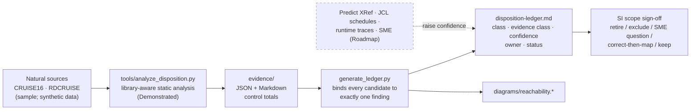

# Migration disposition: dead, unreachable, and obsolete logic

Evidence-backed ledger of everything in the legacy sources that should **not** be carried into an HCM — unreferenced objects, unreachable branches, never-emitted messages, never-populated interface fields, never-referenced data fields, commented-out logic, training scaffolding, presentation infrastructure, and administrative utilities — with confidence, evidence class, SME flag, and decision status. The same ledger also carries the one class of logic an HCM *must* preserve and a naive converter loses.

| | |
|---|---|
| **Capability** | Migration disposition: dead, unreachable, and obsolete logic |
| **Why it matters to an SI implementing an HCM** | Blindly preserving legacy logic is how programmes re-implement bugs and dead paths at HCM prices. A defensible disposition ledger shrinks scope, turns "is this still used?" into a discovery question with evidence attached, and de-risks sign-off. |
| **Builds on** | `../../tools/analyze_disposition.py` (static analyzer over `../../SunnyIslands/Natural-Libraries/`), `../../tests/test_disposition_analysis.py` (fixture and drift tests), `../../tests/harness/source_parser.py`, `../../tests/test_concurrency.py`, [`evidence/`](evidence/) (generated), Software AG Predict XRef verification concepts |
| **Maturity** | Demonstrated (evidence, ledger, and diagram generated from source and drift-tested); runtime and SME confirmation columns are Roadmap by nature — see [`fpps-scale-evidence-plan.md`](fpps-scale-evidence-plan.md) |

## How the evidence becomes a decision



The analyzer produces *candidates* with an evidence class; the generator refuses to build if any candidate it reports is unclaimed, or claimed twice, so a new finding in the source cannot disappear silently. Counts and code lists in the ledger are never typed by hand.

## Contents

| File | Purpose | Maturity |
|---|---|---|
| [`disposition-ledger.md`](disposition-ledger.md) | One row per finding with generated evidence, confidence, disposition, owner, status, and payroll analog; control totals and bidirectional coverage line at the top | Demonstrated (generated) |
| [`copy-it-wrong-gallery.md`](copy-it-wrong-gallery.md) | The defects and obsolete logic a naive conversion would faithfully reproduce, with the source lines and the requirement that replaces them | Demonstrated |
| [`taxonomy.md`](taxonomy.md) | Finding classes and evidence classes, and how they map to consistency / completeness / correctness verification | Demonstrated |
| [`fpps-scale-evidence-plan.md`](fpps-scale-evidence-plan.md) | What raises confidence at FPPS scale and in what order | Roadmap (method Demonstrated) |
| [`evidence/`](evidence/) | Generated reachability, message-catalogue, field-usage, interface-population, and comment-scan evidence (`disposition-evidence.json`, `disposition-evidence.md`) | Demonstrated (generated) |
| [`diagrams/`](diagrams/README.md) | Reachability graph from the UI adapter with ledger IDs on every object that has a row (`reachability.mmd` plus `.svg` / `.png`) | Demonstrated (generated) |
| [`generate_ledger.py`](generate_ledger.py) | Generator for the ledger and the diagram; `--check` fails on drift | Demonstrated |

## Sample ↔ FPPS analogy

| Sunny Islands finding class | FPPS / payroll analog |
|---|---|
| Credentials and language code passed to every service, never set | Legacy userid/password parameters and locale flags on batch interfaces |
| Catalogued message codes never emitted | Orphaned pay-edit codes in the edit-message table |
| Year range hard-coded to 2015–2020 in a disabled edit | Pay-year and rate tables compiled into programs |
| First name captured on the page but persisted from another field | Half-migrated field renames leaving dark columns |
| Interactive physical-ISN delete with no caller or audit | DBA fix-it utilities outside the edit chain |
| Training gate compiled into five services | Training-region toggles in production code |
| Held test-and-set on availability and serialised MAX+1 identifier | Pay-run integrity: balances and identifiers under concurrent update |

## Regenerating

```bash
python3 tools/analyze_disposition.py                                                        # evidence/
python3 fpps-hcm-modernization-deliverable/10-migration-disposition-dead-code/generate_ledger.py          # ledger + diagram source
python3 fpps-hcm-modernization-deliverable/10-migration-disposition-dead-code/generate_ledger.py --check  # drift gate (also run by tests/)
cd fpps-hcm-modernization-deliverable/10-migration-disposition-dead-code/diagrams && \
  npx -y @mermaid-js/mermaid-cli -i reachability.mmd -o reachability.svg -b white && \
  npx -y @mermaid-js/mermaid-cli -i reachability.mmd -o reachability.png -b white -w 2200
```

Python here is an analyzer and generator only; nothing in this directory is a rewrite target.

## How an SI consumes this

1. Take [`disposition-ledger.md`](disposition-ledger.md) into scope sign-off. Rows whose disposition is *retire*, *exclude*, *ignore*, *out of scope*, or *replace with platform* leave the requirements baseline in [`../05-requirements-baseline/`](../05-requirements-baseline/).
2. Rows marked *SME required* become discovery questions with the generated evidence attached; the decision owner column names who answers.
3. Rows marked *correct, then map* are configured to the corrected requirement, never to the legacy behaviour ([`copy-it-wrong-gallery.md`](copy-it-wrong-gallery.md) shows why).
4. The *keep* row is the integrity requirement the HCM satisfies natively (REQ-I-001 / REQ-I-002 in the baseline) and the acceptance test in [`../08-equivalence-testing-reconciliation/`](../08-equivalence-testing-reconciliation/) proves.
5. As FPPS-scale evidence arrives (XRef, schedules, traces), attach it to the row and change its status; the ledger format does not change.

## Synthetic data and scope

All evidence in this directory is produced from the Sunny Islands Cruise sample sources and synthetic data in `../../tests/harness/`. No production system, production data, or FPPS source is used or required. FPPS statements are analogies to a Software AG Natural 9.x / ADABAS 8.6 estate (~7M lines of Natural, 100k+ modules, ~7,800 JCL jobs); nothing here proposes a language rewrite. Static absence from a partial call graph is a candidate, not runtime proof of dead code.

← [Back to the navigation hub](../README.md)
